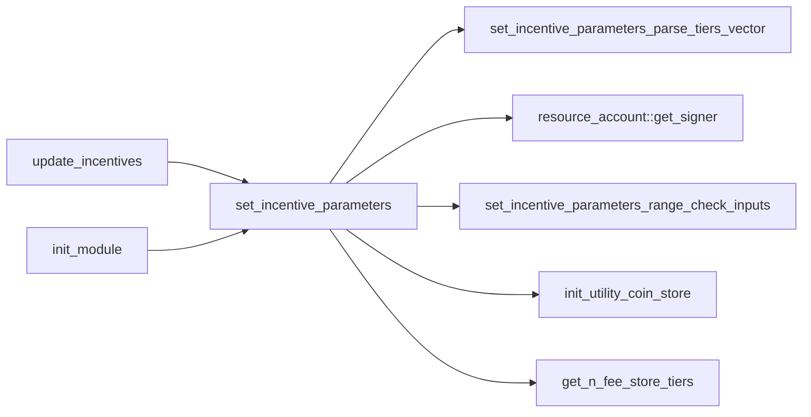
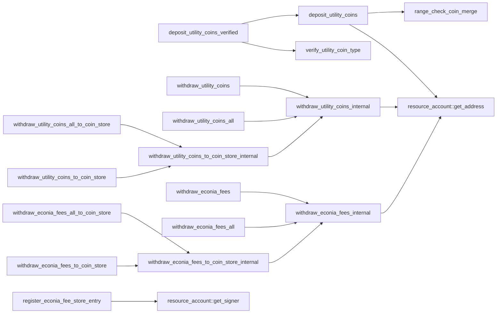
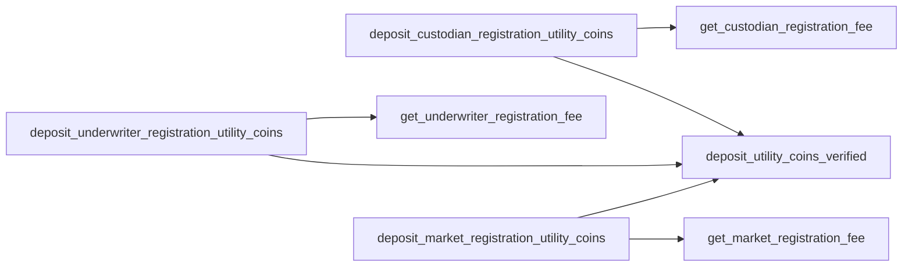
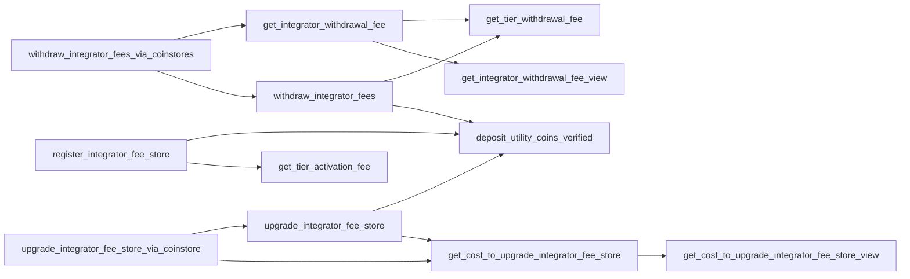
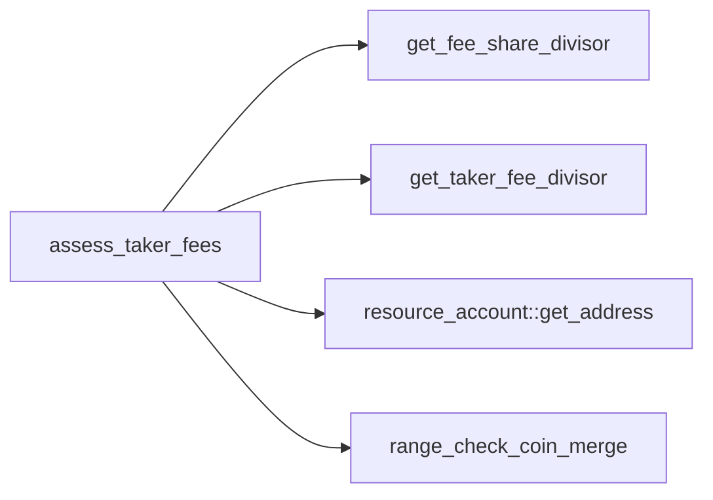

# Module `0x7b00569d23c3edd4538d0b6d8db15dd9f9c07e5d830f35b46afbaa670923b450::incentives`

Incentive-associated parameters and data structures.

Contains hard-coded "genesis parameters" that are are set
upon module publication per <code><a href="incentives.md#0x7b00569d23c3edd4538d0b6d8db15dd9f9c07e5d830f35b46afbaa670923b450_incentives_init_module">init_module</a>()</code>, and which can be
updated later per <code><a href="incentives.md#0x7b00569d23c3edd4538d0b6d8db15dd9f9c07e5d830f35b46afbaa670923b450_incentives_set_incentive_parameters">set_incentive_parameters</a>()</code>.

## General overview sections

[Incentive model](#incentive-model)

[Functions](#functions)

* [View functions](#view-functions)
* [Public getters](#public-getters)
* [Other public functions](#other-public-functions)
* [Public entry functions](#public-entry-functions)
* [Public friend functions](#public-friend-functions)

[Dependency charts](#dependency-charts)

* [Incentive parameters setters](#incentive-parameter-setters)
* [Econia fee account operations](#econia-fee-account-operations)
* [Registrant operations](#registrant-operations)
* [Integrator operations](#integrator-operations)
* [Match operations](#match-operations)

[Complete DocGen index](#complete-docgen-index)

## Incentive model

As a permissionless system, Econia mitigates denial-of-service (DoS)
attacks by charging utility coins for assorted operations. Econia
also charges taker fees, denominated in the quote coin for a given
market, which are distributed between integrators and Econia. The
share of taker fees distributed between an integrator and Econia,
for a given market, is determined by the "tier" to which the
integrator has "activated" their fee store: when the matching engine
fills a taker order, the integrator who facilitated the transaction
has a portion of taker fees deposited to their fee store, and Econia
gets the rest, with the split thereof determined by the integrator's
fee store tier for the given market. Econia does not charge maker
fees.

Hence Econia involves 5 major incentive parameters, defined at
<code><a href="incentives.md#0x7b00569d23c3edd4538d0b6d8db15dd9f9c07e5d830f35b46afbaa670923b450_incentives_IncentiveParameters">IncentiveParameters</a></code>:

1. The utility coin type.
2. The fee, denominated in the utility coin, to register a market.
3. The fee, denominated in the utility coin, to register as an
underwriter for a generic market.
4. The fee, denominated in the utility coin, to register as
custodian.
5. The taker fee divisor, denoting the portion of quote coins for a
particular trade, paid by the taker, to be split between the
integrator who facilitated the trade, and Econia.

<code><a href="incentives.md#0x7b00569d23c3edd4538d0b6d8db15dd9f9c07e5d830f35b46afbaa670923b450_incentives_IncentiveParameters">IncentiveParameters</a></code> also includes a vector of
<code><a href="incentives.md#0x7b00569d23c3edd4538d0b6d8db15dd9f9c07e5d830f35b46afbaa670923b450_incentives_IntegratorFeeStoreTierParameters">IntegratorFeeStoreTierParameters</a></code>, which define 3 parameters per
tier:

1. The taker fee divisor, denoting the portion of quote coins for a
particular trade, paid by the taker, to be collected by an
integrator whose fee store is activated to the given tier.
2. The cumulative fee, denominated in the utility coin, to activate
to the given tier.
3. The fee, denominated in the utility coin, to withdraw quote coins
collected as fees, from an integrator's fee store.

Upon module publication, the Econia "genesis parameters" are
set according to hard-coded values via <code><a href="incentives.md#0x7b00569d23c3edd4538d0b6d8db15dd9f9c07e5d830f35b46afbaa670923b450_incentives_init_module">init_module</a>()</code>. Later, the
parameters can be updated via <code><a href="incentives.md#0x7b00569d23c3edd4538d0b6d8db15dd9f9c07e5d830f35b46afbaa670923b450_incentives_set_incentive_parameters">set_incentive_parameters</a>()</code>, so long
as the number of tiers is not reduced and other minor restrictions
are met. For an implementation-exact description of restrictions and
corresponding abort codes, see:

* <code><a href="incentives.md#0x7b00569d23c3edd4538d0b6d8db15dd9f9c07e5d830f35b46afbaa670923b450_incentives_set_incentive_parameters">set_incentive_parameters</a>()</code>
* <code><a href="incentives.md#0x7b00569d23c3edd4538d0b6d8db15dd9f9c07e5d830f35b46afbaa670923b450_incentives_set_incentive_parameters_range_check_inputs">set_incentive_parameters_range_check_inputs</a>()</code>
* <code><a href="incentives.md#0x7b00569d23c3edd4538d0b6d8db15dd9f9c07e5d830f35b46afbaa670923b450_incentives_set_incentive_parameters_parse_tiers_vector">set_incentive_parameters_parse_tiers_vector</a>()</code>

## Functions

### View functions

* <code><a href="incentives.md#0x7b00569d23c3edd4538d0b6d8db15dd9f9c07e5d830f35b46afbaa670923b450_incentives_get_cost_to_upgrade_integrator_fee_store_view">get_cost_to_upgrade_integrator_fee_store_view</a>()</code>
* <code><a href="incentives.md#0x7b00569d23c3edd4538d0b6d8db15dd9f9c07e5d830f35b46afbaa670923b450_incentives_get_custodian_registration_fee">get_custodian_registration_fee</a>()</code>
* <code><a href="incentives.md#0x7b00569d23c3edd4538d0b6d8db15dd9f9c07e5d830f35b46afbaa670923b450_incentives_get_fee_share_divisor">get_fee_share_divisor</a>()</code>
* <code><a href="incentives.md#0x7b00569d23c3edd4538d0b6d8db15dd9f9c07e5d830f35b46afbaa670923b450_incentives_get_integrator_withdrawal_fee_view">get_integrator_withdrawal_fee_view</a>()</code>
* <code><a href="incentives.md#0x7b00569d23c3edd4538d0b6d8db15dd9f9c07e5d830f35b46afbaa670923b450_incentives_get_market_registration_fee">get_market_registration_fee</a>()</code>
* <code><a href="incentives.md#0x7b00569d23c3edd4538d0b6d8db15dd9f9c07e5d830f35b46afbaa670923b450_incentives_get_n_fee_store_tiers">get_n_fee_store_tiers</a>()</code>
* <code><a href="incentives.md#0x7b00569d23c3edd4538d0b6d8db15dd9f9c07e5d830f35b46afbaa670923b450_incentives_get_taker_fee_divisor">get_taker_fee_divisor</a>()</code>
* <code><a href="incentives.md#0x7b00569d23c3edd4538d0b6d8db15dd9f9c07e5d830f35b46afbaa670923b450_incentives_get_tier_activation_fee">get_tier_activation_fee</a>()</code>
* <code><a href="incentives.md#0x7b00569d23c3edd4538d0b6d8db15dd9f9c07e5d830f35b46afbaa670923b450_incentives_get_tier_withdrawal_fee">get_tier_withdrawal_fee</a>()</code>
* <code><a href="incentives.md#0x7b00569d23c3edd4538d0b6d8db15dd9f9c07e5d830f35b46afbaa670923b450_incentives_get_underwriter_registration_fee">get_underwriter_registration_fee</a>()</code>
* <code><a href="incentives.md#0x7b00569d23c3edd4538d0b6d8db15dd9f9c07e5d830f35b46afbaa670923b450_incentives_is_utility_coin_type">is_utility_coin_type</a>()</code>

### Public getters

* <code><a href="incentives.md#0x7b00569d23c3edd4538d0b6d8db15dd9f9c07e5d830f35b46afbaa670923b450_incentives_get_cost_to_upgrade_integrator_fee_store">get_cost_to_upgrade_integrator_fee_store</a>()</code>
* <code><a href="incentives.md#0x7b00569d23c3edd4538d0b6d8db15dd9f9c07e5d830f35b46afbaa670923b450_incentives_get_integrator_withdrawal_fee">get_integrator_withdrawal_fee</a>()</code>
* <code><a href="incentives.md#0x7b00569d23c3edd4538d0b6d8db15dd9f9c07e5d830f35b46afbaa670923b450_incentives_verify_utility_coin_type">verify_utility_coin_type</a>()</code>

### Other public functions

* <code><a href="incentives.md#0x7b00569d23c3edd4538d0b6d8db15dd9f9c07e5d830f35b46afbaa670923b450_incentives_upgrade_integrator_fee_store">upgrade_integrator_fee_store</a>()</code>
* <code><a href="incentives.md#0x7b00569d23c3edd4538d0b6d8db15dd9f9c07e5d830f35b46afbaa670923b450_incentives_withdraw_econia_fees">withdraw_econia_fees</a>()</code>
* <code><a href="incentives.md#0x7b00569d23c3edd4538d0b6d8db15dd9f9c07e5d830f35b46afbaa670923b450_incentives_withdraw_econia_fees_all">withdraw_econia_fees_all</a>()</code>
* <code><a href="incentives.md#0x7b00569d23c3edd4538d0b6d8db15dd9f9c07e5d830f35b46afbaa670923b450_incentives_withdraw_integrator_fees">withdraw_integrator_fees</a>()</code>
* <code><a href="incentives.md#0x7b00569d23c3edd4538d0b6d8db15dd9f9c07e5d830f35b46afbaa670923b450_incentives_withdraw_utility_coins">withdraw_utility_coins</a>()</code>
* <code><a href="incentives.md#0x7b00569d23c3edd4538d0b6d8db15dd9f9c07e5d830f35b46afbaa670923b450_incentives_withdraw_utility_coins_all">withdraw_utility_coins_all</a>()</code>

### Public entry functions

* <code><a href="incentives.md#0x7b00569d23c3edd4538d0b6d8db15dd9f9c07e5d830f35b46afbaa670923b450_incentives_update_incentives">update_incentives</a>()</code>
* <code><a href="incentives.md#0x7b00569d23c3edd4538d0b6d8db15dd9f9c07e5d830f35b46afbaa670923b450_incentives_upgrade_integrator_fee_store_via_coinstore">upgrade_integrator_fee_store_via_coinstore</a>()</code>
* <code><a href="incentives.md#0x7b00569d23c3edd4538d0b6d8db15dd9f9c07e5d830f35b46afbaa670923b450_incentives_withdraw_econia_fees_all_to_coin_store">withdraw_econia_fees_all_to_coin_store</a>()</code>
* <code><a href="incentives.md#0x7b00569d23c3edd4538d0b6d8db15dd9f9c07e5d830f35b46afbaa670923b450_incentives_withdraw_econia_fees_to_coin_store">withdraw_econia_fees_to_coin_store</a>()</code>
* <code><a href="incentives.md#0x7b00569d23c3edd4538d0b6d8db15dd9f9c07e5d830f35b46afbaa670923b450_incentives_withdraw_integrator_fees_via_coinstores">withdraw_integrator_fees_via_coinstores</a>()</code>
* <code><a href="incentives.md#0x7b00569d23c3edd4538d0b6d8db15dd9f9c07e5d830f35b46afbaa670923b450_incentives_withdraw_utility_coins_all_to_coin_store">withdraw_utility_coins_all_to_coin_store</a>()</code>
* <code><a href="incentives.md#0x7b00569d23c3edd4538d0b6d8db15dd9f9c07e5d830f35b46afbaa670923b450_incentives_withdraw_utility_coins_to_coin_store">withdraw_utility_coins_to_coin_store</a>()</code>

### Public friend functions

* <code><a href="incentives.md#0x7b00569d23c3edd4538d0b6d8db15dd9f9c07e5d830f35b46afbaa670923b450_incentives_assess_taker_fees">assess_taker_fees</a>()</code>
* <code><a href="incentives.md#0x7b00569d23c3edd4538d0b6d8db15dd9f9c07e5d830f35b46afbaa670923b450_incentives_calculate_max_quote_match">calculate_max_quote_match</a>()</code>
* <code><a href="incentives.md#0x7b00569d23c3edd4538d0b6d8db15dd9f9c07e5d830f35b46afbaa670923b450_incentives_deposit_custodian_registration_utility_coins">deposit_custodian_registration_utility_coins</a>()</code>
* <code><a href="incentives.md#0x7b00569d23c3edd4538d0b6d8db15dd9f9c07e5d830f35b46afbaa670923b450_incentives_deposit_market_registration_utility_coins">deposit_market_registration_utility_coins</a>()</code>
* <code><a href="incentives.md#0x7b00569d23c3edd4538d0b6d8db15dd9f9c07e5d830f35b46afbaa670923b450_incentives_deposit_underwriter_registration_utility_coins">deposit_underwriter_registration_utility_coins</a>()</code>
* <code><a href="incentives.md#0x7b00569d23c3edd4538d0b6d8db15dd9f9c07e5d830f35b46afbaa670923b450_incentives_register_econia_fee_store_entry">register_econia_fee_store_entry</a>()</code>
* <code><a href="incentives.md#0x7b00569d23c3edd4538d0b6d8db15dd9f9c07e5d830f35b46afbaa670923b450_incentives_register_integrator_fee_store">register_integrator_fee_store</a>()</code>

## Dependency charts

The below dependency charts use <code>mermaid.js</code> syntax, which can be
automatically rendered into a diagram (depending on the browser)
when viewing the documentation file generated from source code. If
a browser renders the diagrams with coloring that makes it difficult
to read, try a different browser.

### Incentive parameter setters

### Econia fee account operations

### Registrant operations

### Integrator operations

### Match operations

## Complete DocGen index

The below index is automatically generated from source code:

-  [General overview sections](#@General_overview_sections_0)
-  [Incentive model](#@Incentive_model_1)
-  [Functions](#@Functions_2)
    -  [View functions](#@View_functions_3)
    -  [Public getters](#@Public_getters_4)
    -  [Other public functions](#@Other_public_functions_5)
    -  [Public entry functions](#@Public_entry_functions_6)
    -  [Public friend functions](#@Public_friend_functions_7)
-  [Dependency charts](#@Dependency_charts_8)
    -  [Incentive parameter setters](#@Incentive_parameter_setters_9)
    -  [Econia fee account operations](#@Econia_fee_account_operations_10)
    -  [Registrant operations](#@Registrant_operations_11)
    -  [Integrator operations](#@Integrator_operations_12)
    -  [Match operations](#@Match_operations_13)
-  [Complete DocGen index](#@Complete_DocGen_index_14)
-  [Resource `EconiaFeeStore`](#0x7b00569d23c3edd4538d0b6d8db15dd9f9c07e5d830f35b46afbaa670923b450_incentives_EconiaFeeStore)
-  [Resource `IncentiveParameters`](#0x7b00569d23c3edd4538d0b6d8db15dd9f9c07e5d830f35b46afbaa670923b450_incentives_IncentiveParameters)
-  [Struct `IntegratorFeeStore`](#0x7b00569d23c3edd4538d0b6d8db15dd9f9c07e5d830f35b46afbaa670923b450_incentives_IntegratorFeeStore)
-  [Resource `IntegratorFeeStores`](#0x7b00569d23c3edd4538d0b6d8db15dd9f9c07e5d830f35b46afbaa670923b450_incentives_IntegratorFeeStores)
-  [Struct `IntegratorFeeStoreTierParameters`](#0x7b00569d23c3edd4538d0b6d8db15dd9f9c07e5d830f35b46afbaa670923b450_incentives_IntegratorFeeStoreTierParameters)
-  [Resource `UtilityCoinStore`](#0x7b00569d23c3edd4538d0b6d8db15dd9f9c07e5d830f35b46afbaa670923b450_incentives_UtilityCoinStore)
-  [Constants](#@Constants_15)
-  [Function `get_custodian_registration_fee`](#0x7b00569d23c3edd4538d0b6d8db15dd9f9c07e5d830f35b46afbaa670923b450_incentives_get_custodian_registration_fee)
    -  [Testing](#@Testing_16)
-  [Function `get_fee_share_divisor`](#0x7b00569d23c3edd4538d0b6d8db15dd9f9c07e5d830f35b46afbaa670923b450_incentives_get_fee_share_divisor)
    -  [Testing](#@Testing_17)
-  [Function `get_market_registration_fee`](#0x7b00569d23c3edd4538d0b6d8db15dd9f9c07e5d830f35b46afbaa670923b450_incentives_get_market_registration_fee)
    -  [Testing](#@Testing_18)
-  [Function `get_n_fee_store_tiers`](#0x7b00569d23c3edd4538d0b6d8db15dd9f9c07e5d830f35b46afbaa670923b450_incentives_get_n_fee_store_tiers)
    -  [Testing](#@Testing_19)
-  [Function `get_taker_fee_divisor`](#0x7b00569d23c3edd4538d0b6d8db15dd9f9c07e5d830f35b46afbaa670923b450_incentives_get_taker_fee_divisor)
    -  [Testing](#@Testing_20)
-  [Function `get_tier_activation_fee`](#0x7b00569d23c3edd4538d0b6d8db15dd9f9c07e5d830f35b46afbaa670923b450_incentives_get_tier_activation_fee)
    -  [Testing](#@Testing_21)
-  [Function `get_tier_withdrawal_fee`](#0x7b00569d23c3edd4538d0b6d8db15dd9f9c07e5d830f35b46afbaa670923b450_incentives_get_tier_withdrawal_fee)
    -  [Testing](#@Testing_22)
-  [Function `get_underwriter_registration_fee`](#0x7b00569d23c3edd4538d0b6d8db15dd9f9c07e5d830f35b46afbaa670923b450_incentives_get_underwriter_registration_fee)
    -  [Testing](#@Testing_23)
-  [Function `is_utility_coin_type`](#0x7b00569d23c3edd4538d0b6d8db15dd9f9c07e5d830f35b46afbaa670923b450_incentives_is_utility_coin_type)
    -  [Testing](#@Testing_24)
-  [Function `get_cost_to_upgrade_integrator_fee_store`](#0x7b00569d23c3edd4538d0b6d8db15dd9f9c07e5d830f35b46afbaa670923b450_incentives_get_cost_to_upgrade_integrator_fee_store)
    -  [Testing](#@Testing_25)
-  [Function `get_integrator_withdrawal_fee`](#0x7b00569d23c3edd4538d0b6d8db15dd9f9c07e5d830f35b46afbaa670923b450_incentives_get_integrator_withdrawal_fee)
-  [Function `upgrade_integrator_fee_store`](#0x7b00569d23c3edd4538d0b6d8db15dd9f9c07e5d830f35b46afbaa670923b450_incentives_upgrade_integrator_fee_store)
    -  [Type parameters](#@Type_parameters_26)
    -  [Parameters](#@Parameters_27)
-  [Function `verify_utility_coin_type`](#0x7b00569d23c3edd4538d0b6d8db15dd9f9c07e5d830f35b46afbaa670923b450_incentives_verify_utility_coin_type)
    -  [Aborts](#@Aborts_28)
    -  [Testing](#@Testing_29)
-  [Function `withdraw_econia_fees`](#0x7b00569d23c3edd4538d0b6d8db15dd9f9c07e5d830f35b46afbaa670923b450_incentives_withdraw_econia_fees)
-  [Function `withdraw_econia_fees_all`](#0x7b00569d23c3edd4538d0b6d8db15dd9f9c07e5d830f35b46afbaa670923b450_incentives_withdraw_econia_fees_all)
-  [Function `withdraw_integrator_fees`](#0x7b00569d23c3edd4538d0b6d8db15dd9f9c07e5d830f35b46afbaa670923b450_incentives_withdraw_integrator_fees)
    -  [Type parameters](#@Type_parameters_30)
    -  [Parameters](#@Parameters_31)
    -  [Returns](#@Returns_32)
-  [Function `withdraw_utility_coins`](#0x7b00569d23c3edd4538d0b6d8db15dd9f9c07e5d830f35b46afbaa670923b450_incentives_withdraw_utility_coins)
    -  [Testing](#@Testing_33)
-  [Function `withdraw_utility_coins_all`](#0x7b00569d23c3edd4538d0b6d8db15dd9f9c07e5d830f35b46afbaa670923b450_incentives_withdraw_utility_coins_all)
    -  [Testing](#@Testing_34)
-  [Function `update_incentives`](#0x7b00569d23c3edd4538d0b6d8db15dd9f9c07e5d830f35b46afbaa670923b450_incentives_update_incentives)
    -  [Testing](#@Testing_35)
-  [Function `upgrade_integrator_fee_store_via_coinstore`](#0x7b00569d23c3edd4538d0b6d8db15dd9f9c07e5d830f35b46afbaa670923b450_incentives_upgrade_integrator_fee_store_via_coinstore)
    -  [Testing](#@Testing_36)
-  [Function `withdraw_econia_fees_all_to_coin_store`](#0x7b00569d23c3edd4538d0b6d8db15dd9f9c07e5d830f35b46afbaa670923b450_incentives_withdraw_econia_fees_all_to_coin_store)
    -  [Testing](#@Testing_37)
-  [Function `withdraw_econia_fees_to_coin_store`](#0x7b00569d23c3edd4538d0b6d8db15dd9f9c07e5d830f35b46afbaa670923b450_incentives_withdraw_econia_fees_to_coin_store)
    -  [Testing](#@Testing_38)
-  [Function `withdraw_integrator_fees_via_coinstores`](#0x7b00569d23c3edd4538d0b6d8db15dd9f9c07e5d830f35b46afbaa670923b450_incentives_withdraw_integrator_fees_via_coinstores)
    -  [Type parameters](#@Type_parameters_39)
    -  [Parameters](#@Parameters_40)
-  [Function `withdraw_utility_coins_all_to_coin_store`](#0x7b00569d23c3edd4538d0b6d8db15dd9f9c07e5d830f35b46afbaa670923b450_incentives_withdraw_utility_coins_all_to_coin_store)
    -  [Testing](#@Testing_41)
-  [Function `withdraw_utility_coins_to_coin_store`](#0x7b00569d23c3edd4538d0b6d8db15dd9f9c07e5d830f35b46afbaa670923b450_incentives_withdraw_utility_coins_to_coin_store)
    -  [Testing](#@Testing_42)
-  [Function `assess_taker_fees`](#0x7b00569d23c3edd4538d0b6d8db15dd9f9c07e5d830f35b46afbaa670923b450_incentives_assess_taker_fees)
    -  [Type parameters](#@Type_parameters_43)
    -  [Parameters](#@Parameters_44)
    -  [Returns](#@Returns_45)
    -  [Aborts](#@Aborts_46)
    -  [Assumptions](#@Assumptions_47)
-  [Function `calculate_max_quote_match`](#0x7b00569d23c3edd4538d0b6d8db15dd9f9c07e5d830f35b46afbaa670923b450_incentives_calculate_max_quote_match)
    -  [Example buy](#@Example_buy_48)
    -  [Example sell](#@Example_sell_49)
    -  [Variables](#@Variables_50)
    -  [Equations](#@Equations_51)
        -  [Buy](#@Buy_52)
        -  [Sell](#@Sell_53)
    -  [Overflow correction](#@Overflow_correction_54)
    -  [Parameters](#@Parameters_55)
    -  [Returns](#@Returns_56)
    -  [Assumptions](#@Assumptions_57)
    -  [Testing](#@Testing_58)
-  [Function `deposit_custodian_registration_utility_coins`](#0x7b00569d23c3edd4538d0b6d8db15dd9f9c07e5d830f35b46afbaa670923b450_incentives_deposit_custodian_registration_utility_coins)
    -  [Testing](#@Testing_59)
-  [Function `deposit_market_registration_utility_coins`](#0x7b00569d23c3edd4538d0b6d8db15dd9f9c07e5d830f35b46afbaa670923b450_incentives_deposit_market_registration_utility_coins)
    -  [Testing](#@Testing_60)
-  [Function `deposit_underwriter_registration_utility_coins`](#0x7b00569d23c3edd4538d0b6d8db15dd9f9c07e5d830f35b46afbaa670923b450_incentives_deposit_underwriter_registration_utility_coins)
    -  [Testing](#@Testing_61)
-  [Function `register_econia_fee_store_entry`](#0x7b00569d23c3edd4538d0b6d8db15dd9f9c07e5d830f35b46afbaa670923b450_incentives_register_econia_fee_store_entry)
-  [Function `register_integrator_fee_store`](#0x7b00569d23c3edd4538d0b6d8db15dd9f9c07e5d830f35b46afbaa670923b450_incentives_register_integrator_fee_store)
    -  [Type parameters](#@Type_parameters_62)
    -  [Parameters](#@Parameters_63)

<pre><code><b>use</b> <a href="">0x1::coin</a>;
<b>use</b> <a href="">0x1::signer</a>;
<b>use</b> <a href="">0x1::supra_coin</a>;
<b>use</b> <a href="">0x1::type_info</a>;
<b>use</b> <a href="">0x1::vector</a>;
<b>use</b> <a href="resource_account.md#0x7b00569d23c3edd4538d0b6d8db15dd9f9c07e5d830f35b46afbaa670923b450_resource_account">0x7b00569d23c3edd4538d0b6d8db15dd9f9c07e5d830f35b46afbaa670923b450::resource_account</a>;
<b>use</b> <a href="tablist.md#0x7b00569d23c3edd4538d0b6d8db15dd9f9c07e5d830f35b46afbaa670923b450_tablist">0x7b00569d23c3edd4538d0b6d8db15dd9f9c07e5d830f35b46afbaa670923b450::tablist</a>;
</code></pre>

## Resource `EconiaFeeStore`

Portion of taker fees not claimed by an integrator, which are
reserved for Econia.

<pre><code><b>struct</b> <a href="incentives.md#0x7b00569d23c3edd4538d0b6d8db15dd9f9c07e5d830f35b46afbaa670923b450_incentives_EconiaFeeStore">EconiaFeeStore</a>&lt;QuoteCoinType&gt; <b>has</b> key
</code></pre>

## Resource `IncentiveParameters`

Incentive parameters for assorted operations.

<pre><code><b>struct</b> <a href="incentives.md#0x7b00569d23c3edd4538d0b6d8db15dd9f9c07e5d830f35b46afbaa670923b450_incentives_IncentiveParameters">IncentiveParameters</a> <b>has</b> drop, key
</code></pre>

## Struct `IntegratorFeeStore`

Fee store for a given integrator, on a given market.

<pre><code><b>struct</b> <a href="incentives.md#0x7b00569d23c3edd4538d0b6d8db15dd9f9c07e5d830f35b46afbaa670923b450_incentives_IntegratorFeeStore">IntegratorFeeStore</a>&lt;QuoteCoinType&gt; <b>has</b> store
</code></pre>

## Resource `IntegratorFeeStores`

All of an integrator's <code><a href="incentives.md#0x7b00569d23c3edd4538d0b6d8db15dd9f9c07e5d830f35b46afbaa670923b450_incentives_IntegratorFeeStore">IntegratorFeeStore</a></code>s for given
<code>QuoteCoinType</code>.

<pre><code><b>struct</b> <a href="incentives.md#0x7b00569d23c3edd4538d0b6d8db15dd9f9c07e5d830f35b46afbaa670923b450_incentives_IntegratorFeeStores">IntegratorFeeStores</a>&lt;QuoteCoinType&gt; <b>has</b> key
</code></pre>

## Struct `IntegratorFeeStoreTierParameters`

Integrator fee store tier parameters for a given tier.

<pre><code><b>struct</b> <a href="incentives.md#0x7b00569d23c3edd4538d0b6d8db15dd9f9c07e5d830f35b46afbaa670923b450_incentives_IntegratorFeeStoreTierParameters">IntegratorFeeStoreTierParameters</a> <b>has</b> drop, store
</code></pre>

## Resource `UtilityCoinStore`

Container for utility coin fees collected by Econia.

<pre><code><b>struct</b> <a href="incentives.md#0x7b00569d23c3edd4538d0b6d8db15dd9f9c07e5d830f35b46afbaa670923b450_incentives_UtilityCoinStore">UtilityCoinStore</a>&lt;CoinType&gt; <b>has</b> key
</code></pre>

## Constants

Caller is not Econia, but should be.

<pre><code><b>const</b> <a href="incentives.md#0x7b00569d23c3edd4538d0b6d8db15dd9f9c07e5d830f35b46afbaa670923b450_incentives_E_NOT_ECONIA">E_NOT_ECONIA</a>: u64 = 0;
</code></pre>

<code>u64</code> bitmask with all bits set, generated in Python via
<code>hex(int('1' * 64, 2))</code>.

<pre><code><b>const</b> <a href="incentives.md#0x7b00569d23c3edd4538d0b6d8db15dd9f9c07e5d830f35b46afbaa670923b450_incentives_HI_64">HI_64</a>: u64 = 18446744073709551615;
</code></pre>

Buy direction flag, as defined in <code><a href="market.md#0x7b00569d23c3edd4538d0b6d8db15dd9f9c07e5d830f35b46afbaa670923b450_market">market</a>.<b>move</b></code>.

<pre><code><b>const</b> <a href="incentives.md#0x7b00569d23c3edd4538d0b6d8db15dd9f9c07e5d830f35b46afbaa670923b450_incentives_BUY">BUY</a>: bool = <b>false</b>;
</code></pre>

Genesis parameter.

<pre><code><b>const</b> <a href="incentives.md#0x7b00569d23c3edd4538d0b6d8db15dd9f9c07e5d830f35b46afbaa670923b450_incentives_CUSTODIAN_REGISTRATION_FEE">CUSTODIAN_REGISTRATION_FEE</a>: u64 = 81967;
</code></pre>

The indicated tier activation fee is too small.

<pre><code><b>const</b> <a href="incentives.md#0x7b00569d23c3edd4538d0b6d8db15dd9f9c07e5d830f35b46afbaa670923b450_incentives_E_ACTIVATION_FEE_TOO_SMALL">E_ACTIVATION_FEE_TOO_SMALL</a>: u64 = 9;
</code></pre>

Custodian registration fee is less than the minimum.

<pre><code><b>const</b> <a href="incentives.md#0x7b00569d23c3edd4538d0b6d8db15dd9f9c07e5d830f35b46afbaa670923b450_incentives_E_CUSTODIAN_REGISTRATION_FEE_LESS_THAN_MIN">E_CUSTODIAN_REGISTRATION_FEE_LESS_THAN_MIN</a>: u64 = 6;
</code></pre>

Depositing to an Econia fee store would result in an overflow.

<pre><code><b>const</b> <a href="incentives.md#0x7b00569d23c3edd4538d0b6d8db15dd9f9c07e5d830f35b46afbaa670923b450_incentives_E_ECONIA_FEE_STORE_OVERFLOW">E_ECONIA_FEE_STORE_OVERFLOW</a>: u64 = 20;
</code></pre>

Passed fee store tiers vector is empty.

<pre><code><b>const</b> <a href="incentives.md#0x7b00569d23c3edd4538d0b6d8db15dd9f9c07e5d830f35b46afbaa670923b450_incentives_E_EMPTY_FEE_STORE_TIERS">E_EMPTY_FEE_STORE_TIERS</a>: u64 = 2;
</code></pre>

Indicated fee share divisor for given tier is too big.

<pre><code><b>const</b> <a href="incentives.md#0x7b00569d23c3edd4538d0b6d8db15dd9f9c07e5d830f35b46afbaa670923b450_incentives_E_FEE_SHARE_DIVISOR_TOO_BIG">E_FEE_SHARE_DIVISOR_TOO_BIG</a>: u64 = 3;
</code></pre>

The indicated fee share divisor for a given tier is less than
the indicated taker fee divisor.

<pre><code><b>const</b> <a href="incentives.md#0x7b00569d23c3edd4538d0b6d8db15dd9f9c07e5d830f35b46afbaa670923b450_incentives_E_FEE_SHARE_DIVISOR_TOO_SMALL">E_FEE_SHARE_DIVISOR_TOO_SMALL</a>: u64 = 4;
</code></pre>

An update to the incentive parameters set indicates a reduction
in fee store tiers.

<pre><code><b>const</b> <a href="incentives.md#0x7b00569d23c3edd4538d0b6d8db15dd9f9c07e5d830f35b46afbaa670923b450_incentives_E_FEWER_TIERS">E_FEWER_TIERS</a>: u64 = 16;
</code></pre>

The cost to activate to tier 0 is nonzero.

<pre><code><b>const</b> <a href="incentives.md#0x7b00569d23c3edd4538d0b6d8db15dd9f9c07e5d830f35b46afbaa670923b450_incentives_E_FIRST_TIER_ACTIVATION_FEE_NONZERO">E_FIRST_TIER_ACTIVATION_FEE_NONZERO</a>: u64 = 17;
</code></pre>

Depositing to an integrator fee store would result in an
overflow.

<pre><code><b>const</b> <a href="incentives.md#0x7b00569d23c3edd4538d0b6d8db15dd9f9c07e5d830f35b46afbaa670923b450_incentives_E_INTEGRATOR_FEE_STORE_OVERFLOW">E_INTEGRATOR_FEE_STORE_OVERFLOW</a>: u64 = 19;
</code></pre>

There is no tier with given number.

<pre><code><b>const</b> <a href="incentives.md#0x7b00569d23c3edd4538d0b6d8db15dd9f9c07e5d830f35b46afbaa670923b450_incentives_E_INVALID_TIER">E_INVALID_TIER</a>: u64 = 22;
</code></pre>

Type is not the utility coin type.

<pre><code><b>const</b> <a href="incentives.md#0x7b00569d23c3edd4538d0b6d8db15dd9f9c07e5d830f35b46afbaa670923b450_incentives_E_INVALID_UTILITY_COIN_TYPE">E_INVALID_UTILITY_COIN_TYPE</a>: u64 = 12;
</code></pre>

Market registration fee is less than the minimum.

<pre><code><b>const</b> <a href="incentives.md#0x7b00569d23c3edd4538d0b6d8db15dd9f9c07e5d830f35b46afbaa670923b450_incentives_E_MARKET_REGISTRATION_FEE_LESS_THAN_MIN">E_MARKET_REGISTRATION_FEE_LESS_THAN_MIN</a>: u64 = 5;
</code></pre>

Indicated tier is not higher than existing tier.

<pre><code><b>const</b> <a href="incentives.md#0x7b00569d23c3edd4538d0b6d8db15dd9f9c07e5d830f35b46afbaa670923b450_incentives_E_NOT_AN_UPGRADE">E_NOT_AN_UPGRADE</a>: u64 = 15;
</code></pre>

Type does not correspond to an initialized coin.

<pre><code><b>const</b> <a href="incentives.md#0x7b00569d23c3edd4538d0b6d8db15dd9f9c07e5d830f35b46afbaa670923b450_incentives_E_NOT_COIN">E_NOT_COIN</a>: u64 = 1;
</code></pre>

Not enough utility coins provided.

<pre><code><b>const</b> <a href="incentives.md#0x7b00569d23c3edd4538d0b6d8db15dd9f9c07e5d830f35b46afbaa670923b450_incentives_E_NOT_ENOUGH_UTILITY_COINS">E_NOT_ENOUGH_UTILITY_COINS</a>: u64 = 13;
</code></pre>

Taker fee divisor is less than the minimum.

<pre><code><b>const</b> <a href="incentives.md#0x7b00569d23c3edd4538d0b6d8db15dd9f9c07e5d830f35b46afbaa670923b450_incentives_E_TAKER_DIVISOR_LESS_THAN_MIN">E_TAKER_DIVISOR_LESS_THAN_MIN</a>: u64 = 7;
</code></pre>

Cumulative activation fee for new tier is not greater than that
of current tier.

<pre><code><b>const</b> <a href="incentives.md#0x7b00569d23c3edd4538d0b6d8db15dd9f9c07e5d830f35b46afbaa670923b450_incentives_E_TIER_COST_NOT_INCREASE">E_TIER_COST_NOT_INCREASE</a>: u64 = 23;
</code></pre>

The wrong number of fields are passed for a given tier.

<pre><code><b>const</b> <a href="incentives.md#0x7b00569d23c3edd4538d0b6d8db15dd9f9c07e5d830f35b46afbaa670923b450_incentives_E_TIER_FIELDS_WRONG_LENGTH">E_TIER_FIELDS_WRONG_LENGTH</a>: u64 = 8;
</code></pre>

Too many integrator fee store tiers indicated.

<pre><code><b>const</b> <a href="incentives.md#0x7b00569d23c3edd4538d0b6d8db15dd9f9c07e5d830f35b46afbaa670923b450_incentives_E_TOO_MANY_TIERS">E_TOO_MANY_TIERS</a>: u64 = 14;
</code></pre>

Custodian registration fee is less than the minimum.

<pre><code><b>const</b> <a href="incentives.md#0x7b00569d23c3edd4538d0b6d8db15dd9f9c07e5d830f35b46afbaa670923b450_incentives_E_UNDERWRITER_REGISTRATION_FEE_LESS_THAN_MIN">E_UNDERWRITER_REGISTRATION_FEE_LESS_THAN_MIN</a>: u64 = 18;
</code></pre>

Depositing to a utility coin store would result in an overflow.

<pre><code><b>const</b> <a href="incentives.md#0x7b00569d23c3edd4538d0b6d8db15dd9f9c07e5d830f35b46afbaa670923b450_incentives_E_UTILITY_COIN_STORE_OVERFLOW">E_UTILITY_COIN_STORE_OVERFLOW</a>: u64 = 21;
</code></pre>

The indicated withdrawal fee is too big.

<pre><code><b>const</b> <a href="incentives.md#0x7b00569d23c3edd4538d0b6d8db15dd9f9c07e5d830f35b46afbaa670923b450_incentives_E_WITHDRAWAL_FEE_TOO_BIG">E_WITHDRAWAL_FEE_TOO_BIG</a>: u64 = 10;
</code></pre>

The indicated withdrawal fee is too small.

<pre><code><b>const</b> <a href="incentives.md#0x7b00569d23c3edd4538d0b6d8db15dd9f9c07e5d830f35b46afbaa670923b450_incentives_E_WITHDRAWAL_FEE_TOO_SMALL">E_WITHDRAWAL_FEE_TOO_SMALL</a>: u64 = 11;
</code></pre>

Genesis parameter.

<pre><code><b>const</b> <a href="incentives.md#0x7b00569d23c3edd4538d0b6d8db15dd9f9c07e5d830f35b46afbaa670923b450_incentives_FEE_SHARE_DIVISOR_0">FEE_SHARE_DIVISOR_0</a>: u64 = 10000;
</code></pre>

Genesis parameter.

<pre><code><b>const</b> <a href="incentives.md#0x7b00569d23c3edd4538d0b6d8db15dd9f9c07e5d830f35b46afbaa670923b450_incentives_FEE_SHARE_DIVISOR_1">FEE_SHARE_DIVISOR_1</a>: u64 = 8333;
</code></pre>

Genesis parameter.

<pre><code><b>const</b> <a href="incentives.md#0x7b00569d23c3edd4538d0b6d8db15dd9f9c07e5d830f35b46afbaa670923b450_incentives_FEE_SHARE_DIVISOR_2">FEE_SHARE_DIVISOR_2</a>: u64 = 7692;
</code></pre>

Genesis parameter.

<pre><code><b>const</b> <a href="incentives.md#0x7b00569d23c3edd4538d0b6d8db15dd9f9c07e5d830f35b46afbaa670923b450_incentives_FEE_SHARE_DIVISOR_3">FEE_SHARE_DIVISOR_3</a>: u64 = 7143;
</code></pre>

Genesis parameter.

<pre><code><b>const</b> <a href="incentives.md#0x7b00569d23c3edd4538d0b6d8db15dd9f9c07e5d830f35b46afbaa670923b450_incentives_FEE_SHARE_DIVISOR_4">FEE_SHARE_DIVISOR_4</a>: u64 = 6667;
</code></pre>

Genesis parameter.

<pre><code><b>const</b> <a href="incentives.md#0x7b00569d23c3edd4538d0b6d8db15dd9f9c07e5d830f35b46afbaa670923b450_incentives_FEE_SHARE_DIVISOR_5">FEE_SHARE_DIVISOR_5</a>: u64 = 6250;
</code></pre>

Genesis parameter.

<pre><code><b>const</b> <a href="incentives.md#0x7b00569d23c3edd4538d0b6d8db15dd9f9c07e5d830f35b46afbaa670923b450_incentives_FEE_SHARE_DIVISOR_6">FEE_SHARE_DIVISOR_6</a>: u64 = 5882;
</code></pre>

Index of fee share in vectorized representation of an
<code><a href="incentives.md#0x7b00569d23c3edd4538d0b6d8db15dd9f9c07e5d830f35b46afbaa670923b450_incentives_IntegratorFeeStoreTierParameters">IntegratorFeeStoreTierParameters</a></code>.

<pre><code><b>const</b> <a href="incentives.md#0x7b00569d23c3edd4538d0b6d8db15dd9f9c07e5d830f35b46afbaa670923b450_incentives_FEE_SHARE_DIVISOR_INDEX">FEE_SHARE_DIVISOR_INDEX</a>: u64 = 0;
</code></pre>

Genesis parameter.

<pre><code><b>const</b> <a href="incentives.md#0x7b00569d23c3edd4538d0b6d8db15dd9f9c07e5d830f35b46afbaa670923b450_incentives_MARKET_REGISTRATION_FEE">MARKET_REGISTRATION_FEE</a>: u64 = 204918032;
</code></pre>

Maximum number of integrator fee store tiers is largest number
that can fit in a <code>u8</code>.

<pre><code><b>const</b> <a href="incentives.md#0x7b00569d23c3edd4538d0b6d8db15dd9f9c07e5d830f35b46afbaa670923b450_incentives_MAX_INTEGRATOR_FEE_STORE_TIERS">MAX_INTEGRATOR_FEE_STORE_TIERS</a>: u64 = 255;
</code></pre>

Minimum possible divisor for avoiding divide-by-zero error,
including during denominator calculation for a <code><a href="incentives.md#0x7b00569d23c3edd4538d0b6d8db15dd9f9c07e5d830f35b46afbaa670923b450_incentives_SELL">SELL</a></code> in
<code><a href="incentives.md#0x7b00569d23c3edd4538d0b6d8db15dd9f9c07e5d830f35b46afbaa670923b450_incentives_calculate_max_quote_match">calculate_max_quote_match</a>()</code>.

<pre><code><b>const</b> <a href="incentives.md#0x7b00569d23c3edd4538d0b6d8db15dd9f9c07e5d830f35b46afbaa670923b450_incentives_MIN_DIVISOR">MIN_DIVISOR</a>: u64 = 2;
</code></pre>

Minimum possible flat fee, required to disincentivize excessive
bogus transactions.

<pre><code><b>const</b> <a href="incentives.md#0x7b00569d23c3edd4538d0b6d8db15dd9f9c07e5d830f35b46afbaa670923b450_incentives_MIN_FEE">MIN_FEE</a>: u64 = 1;
</code></pre>

Number of fields in an <code><a href="incentives.md#0x7b00569d23c3edd4538d0b6d8db15dd9f9c07e5d830f35b46afbaa670923b450_incentives_IntegratorFeeStoreTierParameters">IntegratorFeeStoreTierParameters</a></code>.

<pre><code><b>const</b> <a href="incentives.md#0x7b00569d23c3edd4538d0b6d8db15dd9f9c07e5d830f35b46afbaa670923b450_incentives_N_TIER_FIELDS">N_TIER_FIELDS</a>: u64 = 3;
</code></pre>

Sell direction flag, as defined in <code><a href="market.md#0x7b00569d23c3edd4538d0b6d8db15dd9f9c07e5d830f35b46afbaa670923b450_market">market</a>.<b>move</b></code>.

<pre><code><b>const</b> <a href="incentives.md#0x7b00569d23c3edd4538d0b6d8db15dd9f9c07e5d830f35b46afbaa670923b450_incentives_SELL">SELL</a>: bool = <b>true</b>;
</code></pre>

Genesis parameter.

<pre><code><b>const</b> <a href="incentives.md#0x7b00569d23c3edd4538d0b6d8db15dd9f9c07e5d830f35b46afbaa670923b450_incentives_TAKER_FEE_DIVISOR">TAKER_FEE_DIVISOR</a>: u64 = 2000;
</code></pre>

Genesis parameter.

<pre><code><b>const</b> <a href="incentives.md#0x7b00569d23c3edd4538d0b6d8db15dd9f9c07e5d830f35b46afbaa670923b450_incentives_TIER_ACTIVATION_FEE_0">TIER_ACTIVATION_FEE_0</a>: u64 = 0;
</code></pre>

Genesis parameter.

<pre><code><b>const</b> <a href="incentives.md#0x7b00569d23c3edd4538d0b6d8db15dd9f9c07e5d830f35b46afbaa670923b450_incentives_TIER_ACTIVATION_FEE_1">TIER_ACTIVATION_FEE_1</a>: u64 = 1639344;
</code></pre>

Genesis parameter.

<pre><code><b>const</b> <a href="incentives.md#0x7b00569d23c3edd4538d0b6d8db15dd9f9c07e5d830f35b46afbaa670923b450_incentives_TIER_ACTIVATION_FEE_2">TIER_ACTIVATION_FEE_2</a>: u64 = 24590163;
</code></pre>

Genesis parameter.

<pre><code><b>const</b> <a href="incentives.md#0x7b00569d23c3edd4538d0b6d8db15dd9f9c07e5d830f35b46afbaa670923b450_incentives_TIER_ACTIVATION_FEE_3">TIER_ACTIVATION_FEE_3</a>: u64 = 327868852;
</code></pre>

Genesis parameter.

<pre><code><b>const</b> <a href="incentives.md#0x7b00569d23c3edd4538d0b6d8db15dd9f9c07e5d830f35b46afbaa670923b450_incentives_TIER_ACTIVATION_FEE_4">TIER_ACTIVATION_FEE_4</a>: u64 = 4098360655;
</code></pre>

Genesis parameter.

<pre><code><b>const</b> <a href="incentives.md#0x7b00569d23c3edd4538d0b6d8db15dd9f9c07e5d830f35b46afbaa670923b450_incentives_TIER_ACTIVATION_FEE_5">TIER_ACTIVATION_FEE_5</a>: u64 = 49180327868;
</code></pre>

Genesis parameter.

<pre><code><b>const</b> <a href="incentives.md#0x7b00569d23c3edd4538d0b6d8db15dd9f9c07e5d830f35b46afbaa670923b450_incentives_TIER_ACTIVATION_FEE_6">TIER_ACTIVATION_FEE_6</a>: u64 = 573770491803;
</code></pre>

Index of tier activation fee in vectorized representation of an
<code><a href="incentives.md#0x7b00569d23c3edd4538d0b6d8db15dd9f9c07e5d830f35b46afbaa670923b450_incentives_IntegratorFeeStoreTierParameters">IntegratorFeeStoreTierParameters</a></code>.

<pre><code><b>const</b> <a href="incentives.md#0x7b00569d23c3edd4538d0b6d8db15dd9f9c07e5d830f35b46afbaa670923b450_incentives_TIER_ACTIVATION_FEE_INDEX">TIER_ACTIVATION_FEE_INDEX</a>: u64 = 1;
</code></pre>

Genesis parameter.

<pre><code><b>const</b> <a href="incentives.md#0x7b00569d23c3edd4538d0b6d8db15dd9f9c07e5d830f35b46afbaa670923b450_incentives_UNDERWRITER_REGISTRATION_FEE">UNDERWRITER_REGISTRATION_FEE</a>: u64 = 81967;
</code></pre>

Genesis parameter.

<pre><code><b>const</b> <a href="incentives.md#0x7b00569d23c3edd4538d0b6d8db15dd9f9c07e5d830f35b46afbaa670923b450_incentives_WITHDRAWAL_FEE_0">WITHDRAWAL_FEE_0</a>: u64 = 1639344;
</code></pre>

Genesis parameter.

<pre><code><b>const</b> <a href="incentives.md#0x7b00569d23c3edd4538d0b6d8db15dd9f9c07e5d830f35b46afbaa670923b450_incentives_WITHDRAWAL_FEE_1">WITHDRAWAL_FEE_1</a>: u64 = 1557377;
</code></pre>

Genesis parameter.

<pre><code><b>const</b> <a href="incentives.md#0x7b00569d23c3edd4538d0b6d8db15dd9f9c07e5d830f35b46afbaa670923b450_incentives_WITHDRAWAL_FEE_2">WITHDRAWAL_FEE_2</a>: u64 = 1475409;
</code></pre>

Genesis parameter.

<pre><code><b>const</b> <a href="incentives.md#0x7b00569d23c3edd4538d0b6d8db15dd9f9c07e5d830f35b46afbaa670923b450_incentives_WITHDRAWAL_FEE_3">WITHDRAWAL_FEE_3</a>: u64 = 1393442;
</code></pre>

Genesis parameter.

<pre><code><b>const</b> <a href="incentives.md#0x7b00569d23c3edd4538d0b6d8db15dd9f9c07e5d830f35b46afbaa670923b450_incentives_WITHDRAWAL_FEE_4">WITHDRAWAL_FEE_4</a>: u64 = 1311475;
</code></pre>

Genesis parameter.

<pre><code><b>const</b> <a href="incentives.md#0x7b00569d23c3edd4538d0b6d8db15dd9f9c07e5d830f35b46afbaa670923b450_incentives_WITHDRAWAL_FEE_5">WITHDRAWAL_FEE_5</a>: u64 = 1229508;
</code></pre>

Genesis parameter.

<pre><code><b>const</b> <a href="incentives.md#0x7b00569d23c3edd4538d0b6d8db15dd9f9c07e5d830f35b46afbaa670923b450_incentives_WITHDRAWAL_FEE_6">WITHDRAWAL_FEE_6</a>: u64 = 1147540;
</code></pre>

Index of withdrawal fee in vectorized representation of an
<code><a href="incentives.md#0x7b00569d23c3edd4538d0b6d8db15dd9f9c07e5d830f35b46afbaa670923b450_incentives_IntegratorFeeStoreTierParameters">IntegratorFeeStoreTierParameters</a></code>.

<pre><code><b>const</b> <a href="incentives.md#0x7b00569d23c3edd4538d0b6d8db15dd9f9c07e5d830f35b46afbaa670923b450_incentives_WITHDRAWAL_FEE_INDEX">WITHDRAWAL_FEE_INDEX</a>: u64 = 2;
</code></pre>

## Function `get_custodian_registration_fee`

Return custodian registration fee.

### Testing

* <code>test_init_update_get_incentives()</code>

<pre><code>#[view]
<b>public</b> <b>fun</b> <a href="incentives.md#0x7b00569d23c3edd4538d0b6d8db15dd9f9c07e5d830f35b46afbaa670923b450_incentives_get_custodian_registration_fee">get_custodian_registration_fee</a>(): u64
</code></pre>

## Function `get_fee_share_divisor`

Return integrator fee share divisor for <code>tier</code>.

### Testing

* <code>test_get_fee_share_divisor_invalid_tier()</code>
* <code>test_init_update_get_incentives()</code>

<pre><code>#[view]
<b>public</b> <b>fun</b> <a href="incentives.md#0x7b00569d23c3edd4538d0b6d8db15dd9f9c07e5d830f35b46afbaa670923b450_incentives_get_fee_share_divisor">get_fee_share_divisor</a>(tier: u8): u64
</code></pre>

## Function `get_market_registration_fee`

Return market registration fee.

### Testing

* <code>test_init_update_get_incentives()</code>

<pre><code>#[view]
<b>public</b> <b>fun</b> <a href="incentives.md#0x7b00569d23c3edd4538d0b6d8db15dd9f9c07e5d830f35b46afbaa670923b450_incentives_get_market_registration_fee">get_market_registration_fee</a>(): u64
</code></pre>

## Function `get_n_fee_store_tiers`

Return number of fee store tiers.

### Testing

* <code>test_init_update_get_incentives()</code>

<pre><code>#[view]
<b>public</b> <b>fun</b> <a href="incentives.md#0x7b00569d23c3edd4538d0b6d8db15dd9f9c07e5d830f35b46afbaa670923b450_incentives_get_n_fee_store_tiers">get_n_fee_store_tiers</a>(): u64
</code></pre>

## Function `get_taker_fee_divisor`

Return taker fee divisor.

### Testing

* <code>test_init_update_get_incentives()</code>

<pre><code>#[view]
<b>public</b> <b>fun</b> <a href="incentives.md#0x7b00569d23c3edd4538d0b6d8db15dd9f9c07e5d830f35b46afbaa670923b450_incentives_get_taker_fee_divisor">get_taker_fee_divisor</a>(): u64
</code></pre>

## Function `get_tier_activation_fee`

Return fee to activate an <code><a href="incentives.md#0x7b00569d23c3edd4538d0b6d8db15dd9f9c07e5d830f35b46afbaa670923b450_incentives_IntegratorFeeStore">IntegratorFeeStore</a></code> to given <code>tier</code>.

### Testing

* <code>test_get_tier_activation_fee_invalid_tier()</code>
* <code>test_init_update_get_incentives()</code>

<pre><code>#[view]
<b>public</b> <b>fun</b> <a href="incentives.md#0x7b00569d23c3edd4538d0b6d8db15dd9f9c07e5d830f35b46afbaa670923b450_incentives_get_tier_activation_fee">get_tier_activation_fee</a>(tier: u8): u64
</code></pre>

## Function `get_tier_withdrawal_fee`

Return fee to withdraw from <code><a href="incentives.md#0x7b00569d23c3edd4538d0b6d8db15dd9f9c07e5d830f35b46afbaa670923b450_incentives_IntegratorFeeStore">IntegratorFeeStore</a></code> activated to
given <code>tier</code>.

### Testing

* <code>test_get_tier_withdrawal_fee_invalid_tier()</code>
* <code>test_init_update_get_incentives()</code>

<pre><code>#[view]
<b>public</b> <b>fun</b> <a href="incentives.md#0x7b00569d23c3edd4538d0b6d8db15dd9f9c07e5d830f35b46afbaa670923b450_incentives_get_tier_withdrawal_fee">get_tier_withdrawal_fee</a>(tier: u8): u64
</code></pre>

## Function `get_underwriter_registration_fee`

Return underwriter registration fee.

### Testing

* <code>test_init_update_get_incentives()</code>

<pre><code>#[view]
<b>public</b> <b>fun</b> <a href="incentives.md#0x7b00569d23c3edd4538d0b6d8db15dd9f9c07e5d830f35b46afbaa670923b450_incentives_get_underwriter_registration_fee">get_underwriter_registration_fee</a>(): u64
</code></pre>

## Function `is_utility_coin_type`

Return <code><b>true</b></code> if <code>T</code> is the utility coin type.

### Testing

* <code>test_init_update_get_incentives()</code>

<pre><code>#[view]
<b>public</b> <b>fun</b> <a href="incentives.md#0x7b00569d23c3edd4538d0b6d8db15dd9f9c07e5d830f35b46afbaa670923b450_incentives_is_utility_coin_type">is_utility_coin_type</a>&lt;T&gt;(): bool
</code></pre>

## Function `get_cost_to_upgrade_integrator_fee_store`

Public function wrapper for
<code><a href="incentives.md#0x7b00569d23c3edd4538d0b6d8db15dd9f9c07e5d830f35b46afbaa670923b450_incentives_get_cost_to_upgrade_integrator_fee_store_view">get_cost_to_upgrade_integrator_fee_store_view</a>()</code>, requiring
integrator signature to prevent runtime transaction collisions.

### Testing

* <code>test_get_cost_to_upgrade_integrator_fee_store_not_increase()</code>
* <code>test_get_cost_to_upgrade_integrator_fee_store_not_upgrade()</code>

<pre><code><b>public</b> <b>fun</b> <a href="incentives.md#0x7b00569d23c3edd4538d0b6d8db15dd9f9c07e5d830f35b46afbaa670923b450_incentives_get_cost_to_upgrade_integrator_fee_store">get_cost_to_upgrade_integrator_fee_store</a>&lt;QuoteCoinType, UtilityCoinType&gt;(integrator: &<a href="">signer</a>, market_id: u64, new_tier: u8): u64
</code></pre>

## Function `get_integrator_withdrawal_fee`

Public function wrapper for
<code><a href="incentives.md#0x7b00569d23c3edd4538d0b6d8db15dd9f9c07e5d830f35b46afbaa670923b450_incentives_get_integrator_withdrawal_fee_view">get_integrator_withdrawal_fee_view</a>()</code>, requiring integrator
signature to prevent runtime transaction collisions.

<pre><code><b>public</b> <b>fun</b> <a href="incentives.md#0x7b00569d23c3edd4538d0b6d8db15dd9f9c07e5d830f35b46afbaa670923b450_incentives_get_integrator_withdrawal_fee">get_integrator_withdrawal_fee</a>&lt;QuoteCoinType&gt;(integrator: &<a href="">signer</a>, market_id: u64): u64
</code></pre>

## Function `upgrade_integrator_fee_store`

Upgrade <code><a href="incentives.md#0x7b00569d23c3edd4538d0b6d8db15dd9f9c07e5d830f35b46afbaa670923b450_incentives_IntegratorFeeStore">IntegratorFeeStore</a></code> to a higher tier.

### Type parameters

* <code>QuoteCoinType</code>: The quote coin type for market.
* <code>UtilityCoinType</code>: The utility coin type.

### Parameters

* <code>integrator</code>: Integrator account.
* <code>market_id</code>: Market ID for corresponding market.
* <code>new_tier</code>: Tier to upgrade to.
* <code>utility_coins</code>: Utility coins paid for upgrade.

<pre><code><b>public</b> <b>fun</b> <a href="incentives.md#0x7b00569d23c3edd4538d0b6d8db15dd9f9c07e5d830f35b46afbaa670923b450_incentives_upgrade_integrator_fee_store">upgrade_integrator_fee_store</a>&lt;QuoteCoinType, UtilityCoinType&gt;(integrator: &<a href="">signer</a>, market_id: u64, new_tier: u8, utility_coins: <a href="_Coin">coin::Coin</a>&lt;UtilityCoinType&gt;)
</code></pre>

## Function `verify_utility_coin_type`

Assert <code>T</code> is utility coin type.

### Aborts

* <code><a href="incentives.md#0x7b00569d23c3edd4538d0b6d8db15dd9f9c07e5d830f35b46afbaa670923b450_incentives_E_INVALID_UTILITY_COIN_TYPE">E_INVALID_UTILITY_COIN_TYPE</a></code>: <code>T</code> is not utility coin type.

### Testing

* <code>test_verify_utility_coin_type()</code>

<pre><code><b>public</b> <b>fun</b> <a href="incentives.md#0x7b00569d23c3edd4538d0b6d8db15dd9f9c07e5d830f35b46afbaa670923b450_incentives_verify_utility_coin_type">verify_utility_coin_type</a>&lt;T&gt;()
</code></pre>

## Function `withdraw_econia_fees`

Withdraw <code>amount</code> of fee coins from an <code><a href="incentives.md#0x7b00569d23c3edd4538d0b6d8db15dd9f9c07e5d830f35b46afbaa670923b450_incentives_EconiaFeeStore">EconiaFeeStore</a></code> of given
<code>QuoteCoinType</code> and having <code>market_id</code>, under authority of
<code>econia</code>.

See inner function <code><a href="incentives.md#0x7b00569d23c3edd4538d0b6d8db15dd9f9c07e5d830f35b46afbaa670923b450_incentives_withdraw_econia_fees_internal">withdraw_econia_fees_internal</a>()</code>.

Testing

* <code>test_register_assess_withdraw()</code>
* <code>test_withdraw_econia_fees_not_econia()</code>

<pre><code><b>public</b> <b>fun</b> <a href="incentives.md#0x7b00569d23c3edd4538d0b6d8db15dd9f9c07e5d830f35b46afbaa670923b450_incentives_withdraw_econia_fees">withdraw_econia_fees</a>&lt;QuoteCoinType&gt;(econia: &<a href="">signer</a>, market_id: u64, amount: u64): <a href="_Coin">coin::Coin</a>&lt;QuoteCoinType&gt;
</code></pre>

## Function `withdraw_econia_fees_all`

Withdraw all fee coins from an <code><a href="incentives.md#0x7b00569d23c3edd4538d0b6d8db15dd9f9c07e5d830f35b46afbaa670923b450_incentives_EconiaFeeStore">EconiaFeeStore</a></code> of given
<code>QuoteCoinType</code> and having <code>market_id</code>, under authority of
<code>econia</code>.

See inner function <code><a href="incentives.md#0x7b00569d23c3edd4538d0b6d8db15dd9f9c07e5d830f35b46afbaa670923b450_incentives_withdraw_econia_fees_internal">withdraw_econia_fees_internal</a>()</code>.

Testing

* <code>test_register_assess_withdraw()</code>
* <code>test_withdraw_econia_fees_all_not_econia()</code>

<pre><code><b>public</b> <b>fun</b> <a href="incentives.md#0x7b00569d23c3edd4538d0b6d8db15dd9f9c07e5d830f35b46afbaa670923b450_incentives_withdraw_econia_fees_all">withdraw_econia_fees_all</a>&lt;QuoteCoinType&gt;(econia: &<a href="">signer</a>, market_id: u64): <a href="_Coin">coin::Coin</a>&lt;QuoteCoinType&gt;
</code></pre>

## Function `withdraw_integrator_fees`

Withdraw all fees from an <code><a href="incentives.md#0x7b00569d23c3edd4538d0b6d8db15dd9f9c07e5d830f35b46afbaa670923b450_incentives_IntegratorFeeStore">IntegratorFeeStore</a></code>.

### Type parameters

* <code>QuoteCoinType</code>: The quote coin type for market.
* <code>UtilityCoinType</code>: The utility coin type.

### Parameters

* <code>integrator</code>: Integrator account.
* <code>market_id</code>: Market ID for corresponding market.
* <code>utility_coins</code>: Utility coins paid in order to make
withdrawal, required to disincentivize excessively frequent
withdrawals and thus transaction collisions with the matching
engine.

### Returns

* <code><a href="_Coin">coin::Coin</a>&lt;QuoteCoinType&gt;</code>: Quote coin fees for given market.

<pre><code><b>public</b> <b>fun</b> <a href="incentives.md#0x7b00569d23c3edd4538d0b6d8db15dd9f9c07e5d830f35b46afbaa670923b450_incentives_withdraw_integrator_fees">withdraw_integrator_fees</a>&lt;QuoteCoinType, UtilityCoinType&gt;(integrator: &<a href="">signer</a>, market_id: u64, utility_coins: <a href="_Coin">coin::Coin</a>&lt;UtilityCoinType&gt;): <a href="_Coin">coin::Coin</a>&lt;QuoteCoinType&gt;
</code></pre>

## Function `withdraw_utility_coins`

Withdraw <code>amount</code> of utility coins from the <code><a href="incentives.md#0x7b00569d23c3edd4538d0b6d8db15dd9f9c07e5d830f35b46afbaa670923b450_incentives_UtilityCoinStore">UtilityCoinStore</a></code>,
under authority of <code>econia</code>.

See inner function <code><a href="incentives.md#0x7b00569d23c3edd4538d0b6d8db15dd9f9c07e5d830f35b46afbaa670923b450_incentives_withdraw_utility_coins_internal">withdraw_utility_coins_internal</a>()</code>.

### Testing

* <code>test_deposit_withdraw_utility_coins()</code>
* <code>test_register_assess_withdraw()</code>
* <code>test_withdraw_utility_coins_not_econia()</code>

<pre><code><b>public</b> <b>fun</b> <a href="incentives.md#0x7b00569d23c3edd4538d0b6d8db15dd9f9c07e5d830f35b46afbaa670923b450_incentives_withdraw_utility_coins">withdraw_utility_coins</a>&lt;UtilityCoinType&gt;(econia: &<a href="">signer</a>, amount: u64): <a href="_Coin">coin::Coin</a>&lt;UtilityCoinType&gt;
</code></pre>

## Function `withdraw_utility_coins_all`

Withdraw all utility coins from the <code><a href="incentives.md#0x7b00569d23c3edd4538d0b6d8db15dd9f9c07e5d830f35b46afbaa670923b450_incentives_UtilityCoinStore">UtilityCoinStore</a></code>, under
authority of <code>econia</code>.

See inner function <code><a href="incentives.md#0x7b00569d23c3edd4538d0b6d8db15dd9f9c07e5d830f35b46afbaa670923b450_incentives_withdraw_utility_coins_internal">withdraw_utility_coins_internal</a>()</code>.

### Testing

* <code>test_deposit_withdraw_utility_coins()</code>
* <code>test_register_assess_withdraw()</code>
* <code>test_withdraw_utility_coins_all_not_econia()</code>

<pre><code><b>public</b> <b>fun</b> <a href="incentives.md#0x7b00569d23c3edd4538d0b6d8db15dd9f9c07e5d830f35b46afbaa670923b450_incentives_withdraw_utility_coins_all">withdraw_utility_coins_all</a>&lt;UtilityCoinType&gt;(econia: &<a href="">signer</a>): <a href="_Coin">coin::Coin</a>&lt;UtilityCoinType&gt;
</code></pre>

## Function `update_incentives`

Wrapped call to <code><a href="incentives.md#0x7b00569d23c3edd4538d0b6d8db15dd9f9c07e5d830f35b46afbaa670923b450_incentives_set_incentive_parameters">set_incentive_parameters</a>()</code>, when calling after
initialization.

Accepts same arguments as <code><a href="incentives.md#0x7b00569d23c3edd4538d0b6d8db15dd9f9c07e5d830f35b46afbaa670923b450_incentives_set_incentive_parameters">set_incentive_parameters</a>()</code>.

### Testing

* <code>test_init_update_get_incentives()</code>
* <code>test_update_incentives_fewer_tiers()</code>

<pre><code><b>public</b> entry <b>fun</b> <a href="incentives.md#0x7b00569d23c3edd4538d0b6d8db15dd9f9c07e5d830f35b46afbaa670923b450_incentives_update_incentives">update_incentives</a>&lt;UtilityCoinType&gt;(econia: &<a href="">signer</a>, market_registration_fee: u64, underwriter_registration_fee: u64, custodian_registration_fee: u64, taker_fee_divisor: u64, integrator_fee_store_tiers: <a href="">vector</a>&lt;<a href="">vector</a>&lt;u64&gt;&gt;)
</code></pre>

## Function `upgrade_integrator_fee_store_via_coinstore`

Wrapped call to <code><a href="incentives.md#0x7b00569d23c3edd4538d0b6d8db15dd9f9c07e5d830f35b46afbaa670923b450_incentives_upgrade_integrator_fee_store">upgrade_integrator_fee_store</a>()</code>, for paying
utility coins from an <code>supra_framework::Coin::CoinStore</code>.

See wrapped function <code><a href="incentives.md#0x7b00569d23c3edd4538d0b6d8db15dd9f9c07e5d830f35b46afbaa670923b450_incentives_upgrade_integrator_fee_store">upgrade_integrator_fee_store</a>()</code>.

### Testing

* <code><a href="incentives.md#0x7b00569d23c3edd4538d0b6d8db15dd9f9c07e5d830f35b46afbaa670923b450_incentives_upgrade_integrator_fee_store_via_coinstore">upgrade_integrator_fee_store_via_coinstore</a>()</code>

<pre><code><b>public</b> entry <b>fun</b> <a href="incentives.md#0x7b00569d23c3edd4538d0b6d8db15dd9f9c07e5d830f35b46afbaa670923b450_incentives_upgrade_integrator_fee_store_via_coinstore">upgrade_integrator_fee_store_via_coinstore</a>&lt;QuoteCoinType, UtilityCoinType&gt;(integrator: &<a href="">signer</a>, market_id: u64, new_tier: u8)
</code></pre>

## Function `withdraw_econia_fees_all_to_coin_store`

Wrapped call to <code><a href="incentives.md#0x7b00569d23c3edd4538d0b6d8db15dd9f9c07e5d830f35b46afbaa670923b450_incentives_withdraw_econia_fees_to_coin_store_internal">withdraw_econia_fees_to_coin_store_internal</a>()</code>,
similar to <code><a href="incentives.md#0x7b00569d23c3edd4538d0b6d8db15dd9f9c07e5d830f35b46afbaa670923b450_incentives_withdraw_econia_fees_all">withdraw_econia_fees_all</a>()</code>.

### Testing

* <code>test_withdraw_to_coin_store_econia()</code>

<pre><code><b>public</b> entry <b>fun</b> <a href="incentives.md#0x7b00569d23c3edd4538d0b6d8db15dd9f9c07e5d830f35b46afbaa670923b450_incentives_withdraw_econia_fees_all_to_coin_store">withdraw_econia_fees_all_to_coin_store</a>&lt;QuoteCoinType&gt;(econia: &<a href="">signer</a>, market_id: u64)
</code></pre>

## Function `withdraw_econia_fees_to_coin_store`

Wrapped call to <code><a href="incentives.md#0x7b00569d23c3edd4538d0b6d8db15dd9f9c07e5d830f35b46afbaa670923b450_incentives_withdraw_econia_fees_to_coin_store_internal">withdraw_econia_fees_to_coin_store_internal</a>()</code>,
similar to <code><a href="incentives.md#0x7b00569d23c3edd4538d0b6d8db15dd9f9c07e5d830f35b46afbaa670923b450_incentives_withdraw_econia_fees">withdraw_econia_fees</a>()</code>.

### Testing

* <code>test_withdraw_to_coin_store_econia()</code>

<pre><code><b>public</b> entry <b>fun</b> <a href="incentives.md#0x7b00569d23c3edd4538d0b6d8db15dd9f9c07e5d830f35b46afbaa670923b450_incentives_withdraw_econia_fees_to_coin_store">withdraw_econia_fees_to_coin_store</a>&lt;QuoteCoinType&gt;(econia: &<a href="">signer</a>, market_id: u64, amount: u64)
</code></pre>

## Function `withdraw_integrator_fees_via_coinstores`

Wrapped call to <code>get_withdraw_integrator_fees()</code>, for paying
utility coins from an <code>supra_framework::Coin::CoinStore</code> and
depositing quote coins to one too.

See wrapped function <code><a href="incentives.md#0x7b00569d23c3edd4538d0b6d8db15dd9f9c07e5d830f35b46afbaa670923b450_incentives_withdraw_integrator_fees">withdraw_integrator_fees</a>()</code>.

### Type parameters

* <code>QuoteCoinType</code>: The quote coin type for market.
* <code>UtilityCoinType</code>: The utility coin type.

### Parameters

* <code>integrator</code>: Integrator account.
* <code>market_id</code>: Market ID of corresponding market.

Testing

* <code>test_register_assess_withdraw()</code>

<pre><code><b>public</b> entry <b>fun</b> <a href="incentives.md#0x7b00569d23c3edd4538d0b6d8db15dd9f9c07e5d830f35b46afbaa670923b450_incentives_withdraw_integrator_fees_via_coinstores">withdraw_integrator_fees_via_coinstores</a>&lt;QuoteCoinType, UtilityCoinType&gt;(integrator: &<a href="">signer</a>, market_id: u64)
</code></pre>

## Function `withdraw_utility_coins_all_to_coin_store`

Wrapped <code><a href="incentives.md#0x7b00569d23c3edd4538d0b6d8db15dd9f9c07e5d830f35b46afbaa670923b450_incentives_withdraw_utility_coins_to_coin_store_internal">withdraw_utility_coins_to_coin_store_internal</a>()</code> call,
similar to <code><a href="incentives.md#0x7b00569d23c3edd4538d0b6d8db15dd9f9c07e5d830f35b46afbaa670923b450_incentives_withdraw_utility_coins_all">withdraw_utility_coins_all</a>()</code>.

### Testing

* <code>test_withdraw_to_coin_store_econia()</code>

<pre><code><b>public</b> entry <b>fun</b> <a href="incentives.md#0x7b00569d23c3edd4538d0b6d8db15dd9f9c07e5d830f35b46afbaa670923b450_incentives_withdraw_utility_coins_all_to_coin_store">withdraw_utility_coins_all_to_coin_store</a>&lt;UtilityCoinType&gt;(econia: &<a href="">signer</a>)
</code></pre>

## Function `withdraw_utility_coins_to_coin_store`

Wrapped <code><a href="incentives.md#0x7b00569d23c3edd4538d0b6d8db15dd9f9c07e5d830f35b46afbaa670923b450_incentives_withdraw_utility_coins_to_coin_store_internal">withdraw_utility_coins_to_coin_store_internal</a>()</code> call,
similar to <code><a href="incentives.md#0x7b00569d23c3edd4538d0b6d8db15dd9f9c07e5d830f35b46afbaa670923b450_incentives_withdraw_utility_coins">withdraw_utility_coins</a>()</code>.

### Testing

* <code>test_withdraw_to_coin_store_econia()</code>

<pre><code><b>public</b> entry <b>fun</b> <a href="incentives.md#0x7b00569d23c3edd4538d0b6d8db15dd9f9c07e5d830f35b46afbaa670923b450_incentives_withdraw_utility_coins_to_coin_store">withdraw_utility_coins_to_coin_store</a>&lt;UtilityCoinType&gt;(econia: &<a href="">signer</a>, amount: u64)
</code></pre>

## Function `assess_taker_fees`

Assess fees after a taker fill.

First attempts to assess an integrator's share of taker fees,
then provides Econia with the remaining share. If the
<code>integrator_address</code> does not have an <code><a href="incentives.md#0x7b00569d23c3edd4538d0b6d8db15dd9f9c07e5d830f35b46afbaa670923b450_incentives_IntegratorFeeStore">IntegratorFeeStore</a></code> for
the given <code>market_id</code> and <code>QuoteCoinType</code>, all taker fees are
passed on to Econia. Otherwise the integrator's fee share is
determined based on their tier for the given market.

### Type parameters

* <code>QuoteCoinType</code>: Quote coin type for market.

### Parameters

* <code>market_id</code>: Market ID for corresponding market.
* <code>integrator_address</code>: Integrator's address. May be
intentionally marked an address known not to be an integrator,
for example <code>@0x0</code> or <code>@econia</code>, in the service of diverting
all fees to Econia.
* <code>taker_fee_divisor</code>: Taker fee divisor.
* <code>quote_fill</code>: Amount of quote coins filled during taker match.
* <code>quote_coins</code>: Quote coins to withdraw fees from.

### Returns

* <code><a href="_Coin">coin::Coin</a>&lt;QuoteCoinType&gt;</code>: Remaining quote coins after fees
assessed.
* <code>u64</code>: Amount of fees assessed.

### Aborts

* <code><a href="incentives.md#0x7b00569d23c3edd4538d0b6d8db15dd9f9c07e5d830f35b46afbaa670923b450_incentives_E_INTEGRATOR_FEE_STORE_OVERFLOW">E_INTEGRATOR_FEE_STORE_OVERFLOW</a></code>: Depositing to integrator
fee store would result in an overflow. Rather than relying on
the underlying coin operation to abort, this check is
performed to provide additional feedback in the unlikely event
that a coin with a supply far in excess of <code><a href="incentives.md#0x7b00569d23c3edd4538d0b6d8db15dd9f9c07e5d830f35b46afbaa670923b450_incentives_HI_64">HI_64</a></code> is the
quote coin for a market.
* <code><a href="incentives.md#0x7b00569d23c3edd4538d0b6d8db15dd9f9c07e5d830f35b46afbaa670923b450_incentives_E_ECONIA_FEE_STORE_OVERFLOW">E_ECONIA_FEE_STORE_OVERFLOW</a></code>: Depositing to Econia fee store
would result in an overflow per above.

### Assumptions

* <code>taker_fee_divisor</code> is nonzero.

Testing

* <code>test_register_assess_withdraw()</code>

<pre><code><b>public</b>(<b>friend</b>) <b>fun</b> <a href="incentives.md#0x7b00569d23c3edd4538d0b6d8db15dd9f9c07e5d830f35b46afbaa670923b450_incentives_assess_taker_fees">assess_taker_fees</a>&lt;QuoteCoinType&gt;(market_id: u64, integrator_address: <b>address</b>, taker_fee_divisor: u64, quote_fill: u64, quote_coins: <a href="_Coin">coin::Coin</a>&lt;QuoteCoinType&gt;): (<a href="_Coin">coin::Coin</a>&lt;QuoteCoinType&gt;, u64)
</code></pre>

## Function `calculate_max_quote_match`

Get max quote coin match amount, per user input and fee divisor.

Whether a taker buy or sell, users specify a maximum quote coin
amount when initiating the transaction. This amount indicates
the maximum amount of quote coins they are willing to spend in
the case of a taker buy, and the maximum amount of quote coins
they are willing to receive in the case of a taker sell. The
user-specified amount refers to the net change in taker's quote
coin holdings due to matching and fees, which are assessed after
matching concludes. Hence it is necessary to calculate a maximum
quote match amount prior to matching.

### Example buy

* Taker is willing to spend 105 quote coins.
* Fee is 5% (divisor of 20).
* Max match is thus 100 quote coins.
* Matching engine halts after 100 quote coins filled.
* 5% fee then assessed, withdrawn from takers's quote coins.
* Taker has spent 105 quote coins.

### Example sell

* Taker is willing to receive 100 quote coins.
* Fee is 4% (divisor of 25).
* Max match is thus 104 quote coins.
* Matching engine halts after 104 quote coins filled.
* 4% fee then assessed, withdrawn from quote coins received.
* Taker has received 100 quote coins.

### Variables

The relationship between user-indicated maximum quote coin trade
amount, taker fee divisor, and the amount of quote coins matched
can be described with the following variables:

* $\Delta_t$: Change in quote coins seen by taker.
* $d_t$: Taker fee divisor.
* $q_m$: Quote coins matched.
* $f = \frac{q_m}{d_t}$: Fees assessed.

### Equations

#### Buy

$$q_m = \Delta_t - f = \Delta_t - \frac{q_m}{d_t}$$

$$\Delta_t = q_m + \frac{q_m}{d_t} = q_m(1 + \frac{1}{d_t})$$

$$ q_m = \frac{\Delta_t}{1 + \frac{1}{d_t}} $$

$$ q_m = \frac{d_t \Delta_t}{d_t + 1}$$

#### Sell

$$q_m = \Delta_t + f = \Delta_t + \frac{q_m}{d_t}$$

$$\Delta_t = q_m - \frac{q_m}{d_t} = q_m(1 - \frac{1}{d_t})$$

$$ q_m = \frac{\Delta_t}{1 - \frac{1}{d_t}} $$

$$ q_m = \frac{d_t \Delta_t}{d_t - 1}$$

### Overflow correction

Per above, if a taker specifies that they are willing to receive
<code><a href="incentives.md#0x7b00569d23c3edd4538d0b6d8db15dd9f9c07e5d830f35b46afbaa670923b450_incentives_HI_64">HI_64</a></code> coins during a sell, the corresponding max quote match
amount will overflow a <code>u64</code>, since more than <code><a href="incentives.md#0x7b00569d23c3edd4538d0b6d8db15dd9f9c07e5d830f35b46afbaa670923b450_incentives_HI_64">HI_64</a></code> quote
coins will need to be matched before a fee is assessed. Hence if
the maximum quote match amount for a sell is calculated to be
in excess of <code><a href="incentives.md#0x7b00569d23c3edd4538d0b6d8db15dd9f9c07e5d830f35b46afbaa670923b450_incentives_HI_64">HI_64</a></code>, the maximum quote match amount is simply
corrected to <code><a href="incentives.md#0x7b00569d23c3edd4538d0b6d8db15dd9f9c07e5d830f35b46afbaa670923b450_incentives_HI_64">HI_64</a></code>. Here, the maximum user-specified amount
that will not require such correction, $\Delta_{t, m}$ , is
defined in terms of the maximum possible quote match amount
$q_{m, m} = 2^{63} - 1$ (<code><a href="incentives.md#0x7b00569d23c3edd4538d0b6d8db15dd9f9c07e5d830f35b46afbaa670923b450_incentives_HI_64">HI_64</a></code>), and the taker fee divisor:

$$ \Delta_{t, m} + \frac{q_{m, m}}{d_t} = q_{m, m} $$

$$ \Delta_{t, m} = q_{m, m} - \frac{q_{m, m}}{d_t} $$

Such an overflow correction does not apply in the case of a
taker buy because the maximum quote match amount is strictly
smaller than the user-specified change in quote coins (the
amount of quote coins the taker is willing to spend).

### Parameters

* <code>direction</code>: <code><a href="incentives.md#0x7b00569d23c3edd4538d0b6d8db15dd9f9c07e5d830f35b46afbaa670923b450_incentives_BUY">BUY</a></code> or <code><a href="incentives.md#0x7b00569d23c3edd4538d0b6d8db15dd9f9c07e5d830f35b46afbaa670923b450_incentives_SELL">SELL</a></code>.
* <code>taker_fee_divisor</code>: Taker fee divisor.
* <code>max_quote_delta_user</code>: Maximum change in quote coins seen by
user: spent if a <code><a href="incentives.md#0x7b00569d23c3edd4538d0b6d8db15dd9f9c07e5d830f35b46afbaa670923b450_incentives_BUY">BUY</a></code> and received if a <code><a href="incentives.md#0x7b00569d23c3edd4538d0b6d8db15dd9f9c07e5d830f35b46afbaa670923b450_incentives_SELL">SELL</a></code>.

### Returns

* <code>u64</code>: Maximum amount of quote coins to match.

### Assumptions

* Taker fee divisor is greater than 1.

### Testing

* <code>test_calculate_max_quote_match()</code>
* <code>test_calculate_max_quote_match_overflow()</code>

<pre><code><b>public</b>(<b>friend</b>) <b>fun</b> <a href="incentives.md#0x7b00569d23c3edd4538d0b6d8db15dd9f9c07e5d830f35b46afbaa670923b450_incentives_calculate_max_quote_match">calculate_max_quote_match</a>(direction: bool, taker_fee_divisor: u64, max_quote_delta_user: u64): u64
</code></pre>

## Function `deposit_custodian_registration_utility_coins`

Deposit <code>coins</code> of <code>UtilityCoinType</code>, verifying that the proper
amount is supplied for custodian registration.

### Testing

* <code>test_deposit_registration_fees_mixed()</code>

<pre><code><b>public</b>(<b>friend</b>) <b>fun</b> <a href="incentives.md#0x7b00569d23c3edd4538d0b6d8db15dd9f9c07e5d830f35b46afbaa670923b450_incentives_deposit_custodian_registration_utility_coins">deposit_custodian_registration_utility_coins</a>&lt;UtilityCoinType&gt;(coins: <a href="_Coin">coin::Coin</a>&lt;UtilityCoinType&gt;)
</code></pre>

## Function `deposit_market_registration_utility_coins`

Deposit <code>coins</code> of <code>UtilityCoinType</code>, verifying that the proper
amount is supplied for market registration.

### Testing

* <code>test_deposit_registration_fees_mixed()</code>

<pre><code><b>public</b>(<b>friend</b>) <b>fun</b> <a href="incentives.md#0x7b00569d23c3edd4538d0b6d8db15dd9f9c07e5d830f35b46afbaa670923b450_incentives_deposit_market_registration_utility_coins">deposit_market_registration_utility_coins</a>&lt;UtilityCoinType&gt;(coins: <a href="_Coin">coin::Coin</a>&lt;UtilityCoinType&gt;)
</code></pre>

## Function `deposit_underwriter_registration_utility_coins`

Deposit <code>coins</code> of <code>UtilityCoinType</code>, verifying that the proper
amount is supplied for underwriter registration.

### Testing

* <code>test_deposit_registration_fees_mixed()</code>

<pre><code><b>public</b>(<b>friend</b>) <b>fun</b> <a href="incentives.md#0x7b00569d23c3edd4538d0b6d8db15dd9f9c07e5d830f35b46afbaa670923b450_incentives_deposit_underwriter_registration_utility_coins">deposit_underwriter_registration_utility_coins</a>&lt;UtilityCoinType&gt;(coins: <a href="_Coin">coin::Coin</a>&lt;UtilityCoinType&gt;)
</code></pre>

## Function `register_econia_fee_store_entry`

Register an <code><a href="incentives.md#0x7b00569d23c3edd4538d0b6d8db15dd9f9c07e5d830f35b46afbaa670923b450_incentives_EconiaFeeStore">EconiaFeeStore</a></code> entry for given <code>market_id</code> and
<code>QuoteCoinType</code>.

Testing

* <code>test_register_assess_withdraw()</code>

<pre><code><b>public</b>(<b>friend</b>) <b>fun</b> <a href="incentives.md#0x7b00569d23c3edd4538d0b6d8db15dd9f9c07e5d830f35b46afbaa670923b450_incentives_register_econia_fee_store_entry">register_econia_fee_store_entry</a>&lt;QuoteCoinType&gt;(market_id: u64)
</code></pre>

## Function `register_integrator_fee_store`

Register an <code><a href="incentives.md#0x7b00569d23c3edd4538d0b6d8db15dd9f9c07e5d830f35b46afbaa670923b450_incentives_IntegratorFeeStore">IntegratorFeeStore</a></code> entry for given <code>integrator</code>.

### Type parameters

* <code>QuoteCoinType</code>: The quote coin type for market.
* <code>UtilityCoinType</code>: The utility coin type.

### Parameters

* <code>integrator</code>: Integrator account.
* <code>market_id</code>: Market ID for corresponding market.
* <code>tier</code>: <code><a href="incentives.md#0x7b00569d23c3edd4538d0b6d8db15dd9f9c07e5d830f35b46afbaa670923b450_incentives_IntegratorFeeStore">IntegratorFeeStore</a></code> tier to activate to.
* <code>utility_coins</code>: Utility coins paid to activate to given tier.

Testing

* <code>test_register_assess_withdraw()</code>
* <code>test_upgrade_integrator_fee_store_via_coinstore()</code>

<pre><code><b>public</b>(<b>friend</b>) <b>fun</b> <a href="incentives.md#0x7b00569d23c3edd4538d0b6d8db15dd9f9c07e5d830f35b46afbaa670923b450_incentives_register_integrator_fee_store">register_integrator_fee_store</a>&lt;QuoteCoinType, UtilityCoinType&gt;(integrator: &<a href="">signer</a>, market_id: u64, tier: u8, utility_coins: <a href="_Coin">coin::Coin</a>&lt;UtilityCoinType&gt;)
</code></pre>
