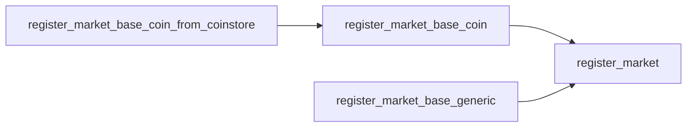
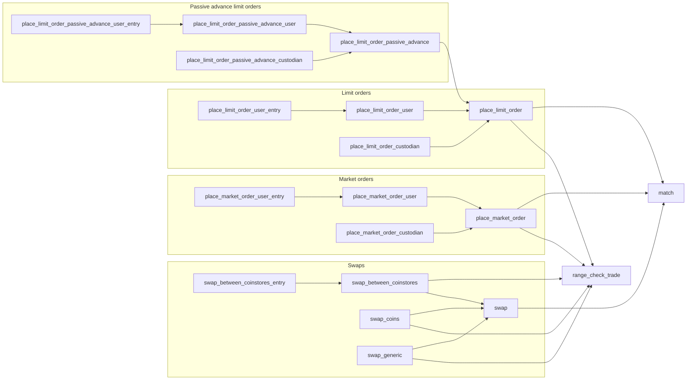
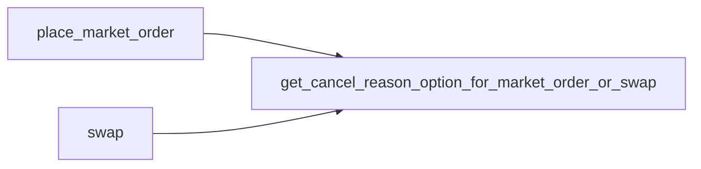
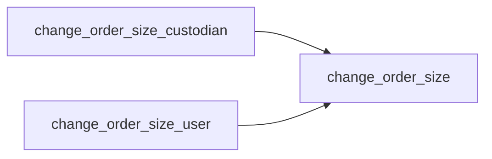
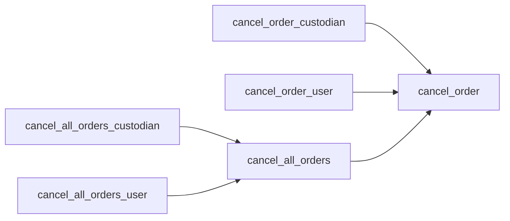
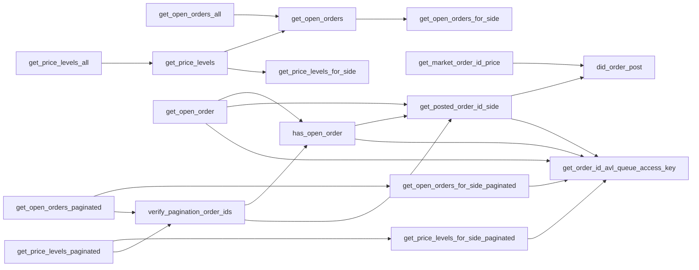
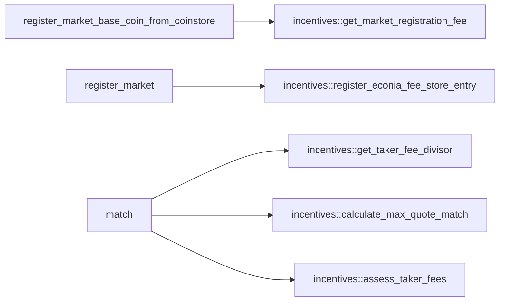
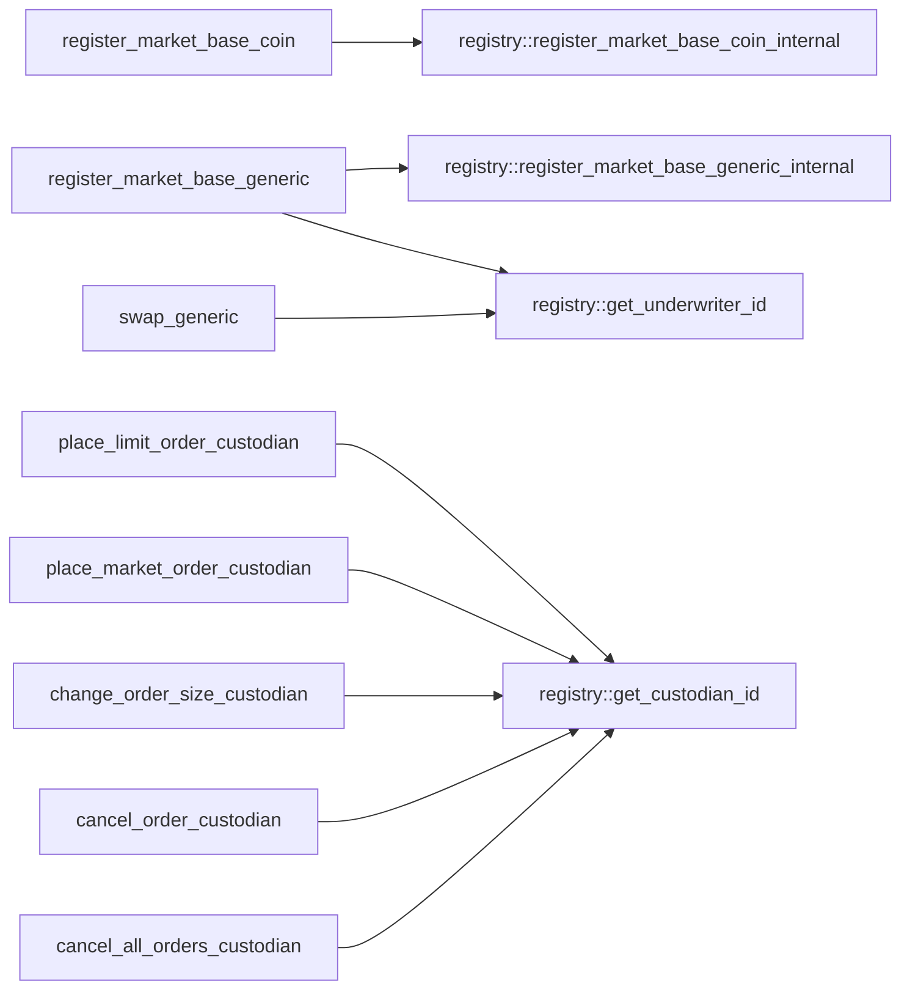
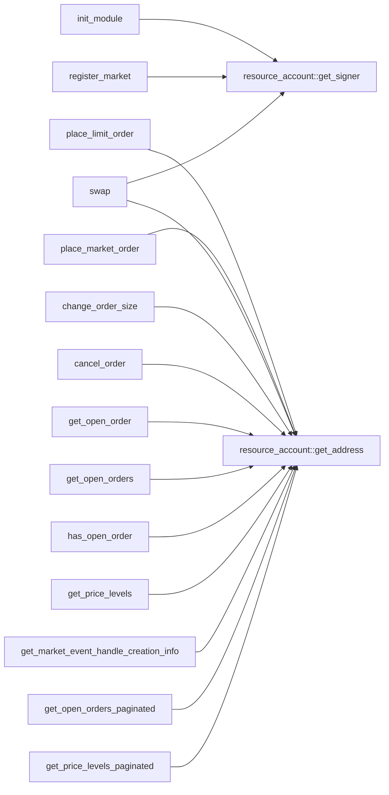
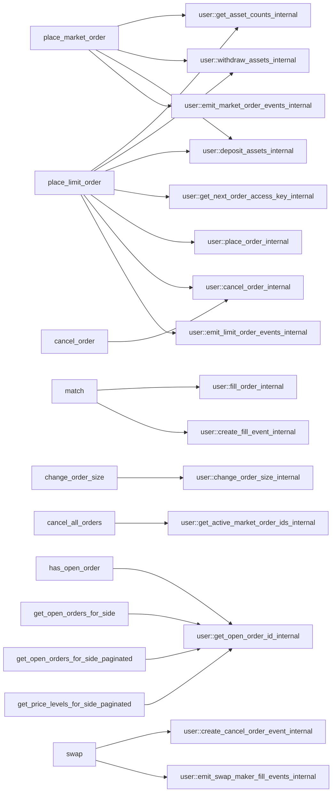

# Module `0x7b00569d23c3edd4538d0b6d8db15dd9f9c07e5d830f35b46afbaa670923b450::market`

Market functionality for order book operations.

For each registered market, Econia has an order book stored under a
global resource account. When someone registers a market, a new
order book entry is added under the resource account at a new market
ID.

Once a market is registered, signing users and delegated custodians
can place limit orders and market orders, and cancel or change the
size of any open orders. Swaps can be placed permissionlessly
without a market account.

Econia implements an atomic matching engine, and emits events in
response to changes in order book state as well as assorted market
operations. Notably, Econia evicts the ask or bid with the lowest
price-time priority when inserting a limit order to a binary search
tree that exceeds a critical height.

Multiple API variants are supported for market registration and
order management function, to enable diagnostic function returns,
public entry calls, etc.

All orders are issued an order ID upon placement, which is unique to
the given market. The order ID encodes a counter fo the number of
orders that have been placed on the corresponding market. For orders
that result in a post to the book, the market order ID additionally
encodes an "AVL queue access key" (essentially a pointer into
order book memory), which is required for order lookup during order
size change and/or order cancellation operations.

Note that the terms "order ID" and "market order ID" are used
interchangeably.

## General overview sections

[View functions](#view-functions)

* [Constant getters](#constant-getters)
* [Market order ID decoders](#market-order-id-decoders)
* [Order lookup](#order-lookup)

[Public function index](#public-function-index)

* [Market registration](#market-registration)
* [Limit orders](#limit-orders)
* [Passive advance limit orders](#passive-advance-limit-orders)
* [Market orders](#market-orders)
* [Swaps](#swaps)
* [Change order size](#change-order-size)
* [Cancel orders](#cancel-orders)
* [View function return decoders](#view-function-return-decoders)

[Dependency charts](#dependency-charts)

* [Internal dependencies](#internal-dependencies)
* [External module dependencies](#external-module-dependencies)

[Order management testing](#order-management-testing)

* [Functions with aborts](#functions-with-aborts)
* [Return proxies](#return-proxies)
* [Invocation proxies](#invocation-proxies)
* [Branching functions](#branching-functions)

[Complete DocGen index](#complete-docgen-index)

## View functions

### Constant getters

* <code><a href="market.md#0x7b00569d23c3edd4538d0b6d8db15dd9f9c07e5d830f35b46afbaa670923b450_market_get_ABORT">get_ABORT</a>()</code>
* <code><a href="market.md#0x7b00569d23c3edd4538d0b6d8db15dd9f9c07e5d830f35b46afbaa670923b450_market_get_ASK">get_ASK</a>()</code>
* <code><a href="market.md#0x7b00569d23c3edd4538d0b6d8db15dd9f9c07e5d830f35b46afbaa670923b450_market_get_BID">get_BID</a>()</code>
* <code><a href="market.md#0x7b00569d23c3edd4538d0b6d8db15dd9f9c07e5d830f35b46afbaa670923b450_market_get_BUY">get_BUY</a>()</code>
* <code><a href="market.md#0x7b00569d23c3edd4538d0b6d8db15dd9f9c07e5d830f35b46afbaa670923b450_market_get_CANCEL_BOTH">get_CANCEL_BOTH</a>()</code>
* <code><a href="market.md#0x7b00569d23c3edd4538d0b6d8db15dd9f9c07e5d830f35b46afbaa670923b450_market_get_CANCEL_MAKER">get_CANCEL_MAKER</a>()</code>
* <code><a href="market.md#0x7b00569d23c3edd4538d0b6d8db15dd9f9c07e5d830f35b46afbaa670923b450_market_get_CANCEL_TAKER">get_CANCEL_TAKER</a>()</code>
* <code><a href="market.md#0x7b00569d23c3edd4538d0b6d8db15dd9f9c07e5d830f35b46afbaa670923b450_market_get_FILL_OR_ABORT">get_FILL_OR_ABORT</a>()</code>
* <code><a href="market.md#0x7b00569d23c3edd4538d0b6d8db15dd9f9c07e5d830f35b46afbaa670923b450_market_get_HI_PRICE">get_HI_PRICE</a>()</code>
* <code><a href="market.md#0x7b00569d23c3edd4538d0b6d8db15dd9f9c07e5d830f35b46afbaa670923b450_market_get_IMMEDIATE_OR_CANCEL">get_IMMEDIATE_OR_CANCEL</a>()</code>
* <code><a href="market.md#0x7b00569d23c3edd4538d0b6d8db15dd9f9c07e5d830f35b46afbaa670923b450_market_get_MAX_POSSIBLE">get_MAX_POSSIBLE</a>()</code>
* <code><a href="market.md#0x7b00569d23c3edd4538d0b6d8db15dd9f9c07e5d830f35b46afbaa670923b450_market_get_NO_CUSTODIAN">get_NO_CUSTODIAN</a>()</code>
* <code><a href="market.md#0x7b00569d23c3edd4538d0b6d8db15dd9f9c07e5d830f35b46afbaa670923b450_market_get_NO_RESTRICTION">get_NO_RESTRICTION</a>()</code>
* <code><a href="market.md#0x7b00569d23c3edd4538d0b6d8db15dd9f9c07e5d830f35b46afbaa670923b450_market_get_NO_UNDERWRITER">get_NO_UNDERWRITER</a>()</code>
* <code><a href="market.md#0x7b00569d23c3edd4538d0b6d8db15dd9f9c07e5d830f35b46afbaa670923b450_market_get_POST_OR_ABORT">get_POST_OR_ABORT</a>()</code>
* <code><a href="market.md#0x7b00569d23c3edd4538d0b6d8db15dd9f9c07e5d830f35b46afbaa670923b450_market_get_PERCENT">get_PERCENT</a>()</code>
* <code><a href="market.md#0x7b00569d23c3edd4538d0b6d8db15dd9f9c07e5d830f35b46afbaa670923b450_market_get_SELL">get_SELL</a>()</code>
* <code><a href="market.md#0x7b00569d23c3edd4538d0b6d8db15dd9f9c07e5d830f35b46afbaa670923b450_market_get_TICKS">get_TICKS</a>()</code>

### Market order ID decoders

* <code><a href="market.md#0x7b00569d23c3edd4538d0b6d8db15dd9f9c07e5d830f35b46afbaa670923b450_market_did_order_post">did_order_post</a>()</code>
* <code><a href="market.md#0x7b00569d23c3edd4538d0b6d8db15dd9f9c07e5d830f35b46afbaa670923b450_market_get_market_order_id_counter">get_market_order_id_counter</a>()</code>
* <code><a href="market.md#0x7b00569d23c3edd4538d0b6d8db15dd9f9c07e5d830f35b46afbaa670923b450_market_get_market_order_id_price">get_market_order_id_price</a>()</code>
* <code><a href="market.md#0x7b00569d23c3edd4538d0b6d8db15dd9f9c07e5d830f35b46afbaa670923b450_market_get_posted_order_id_side">get_posted_order_id_side</a>()</code>

### Event handle lookup

* <code>get_market_event_handle_creation_info()</code>
* <code>get_swapper_event_handle_creation_numbers()</code>

### Order lookup

* <code><a href="market.md#0x7b00569d23c3edd4538d0b6d8db15dd9f9c07e5d830f35b46afbaa670923b450_market_get_open_order">get_open_order</a>()</code>
* <code><a href="market.md#0x7b00569d23c3edd4538d0b6d8db15dd9f9c07e5d830f35b46afbaa670923b450_market_get_open_orders">get_open_orders</a>()</code>
* <code><a href="market.md#0x7b00569d23c3edd4538d0b6d8db15dd9f9c07e5d830f35b46afbaa670923b450_market_get_open_orders_all">get_open_orders_all</a>()</code>
* <code><a href="market.md#0x7b00569d23c3edd4538d0b6d8db15dd9f9c07e5d830f35b46afbaa670923b450_market_get_open_orders_paginated">get_open_orders_paginated</a>()</code>
* <code><a href="market.md#0x7b00569d23c3edd4538d0b6d8db15dd9f9c07e5d830f35b46afbaa670923b450_market_get_price_levels">get_price_levels</a>()</code>
* <code><a href="market.md#0x7b00569d23c3edd4538d0b6d8db15dd9f9c07e5d830f35b46afbaa670923b450_market_get_price_levels_all">get_price_levels_all</a>()</code>
* <code><a href="market.md#0x7b00569d23c3edd4538d0b6d8db15dd9f9c07e5d830f35b46afbaa670923b450_market_get_price_levels_paginated">get_price_levels_paginated</a>()</code>
* <code><a href="market.md#0x7b00569d23c3edd4538d0b6d8db15dd9f9c07e5d830f35b46afbaa670923b450_market_has_open_order">has_open_order</a>()</code>

## Public function index

See the [dependency charts](#dependency-charts) for a visual map of
associated function wrappers.

### Market registration

* <code><a href="market.md#0x7b00569d23c3edd4538d0b6d8db15dd9f9c07e5d830f35b46afbaa670923b450_market_register_market_base_coin">register_market_base_coin</a>()</code>
* <code><a href="market.md#0x7b00569d23c3edd4538d0b6d8db15dd9f9c07e5d830f35b46afbaa670923b450_market_register_market_base_coin_from_coinstore">register_market_base_coin_from_coinstore</a>()</code>
* <code><a href="market.md#0x7b00569d23c3edd4538d0b6d8db15dd9f9c07e5d830f35b46afbaa670923b450_market_register_market_base_generic">register_market_base_generic</a>()</code>

### Limit orders

* <code><a href="market.md#0x7b00569d23c3edd4538d0b6d8db15dd9f9c07e5d830f35b46afbaa670923b450_market_place_limit_order_custodian">place_limit_order_custodian</a>()</code>
* <code><a href="market.md#0x7b00569d23c3edd4538d0b6d8db15dd9f9c07e5d830f35b46afbaa670923b450_market_place_limit_order_user">place_limit_order_user</a>()</code>
* <code><a href="market.md#0x7b00569d23c3edd4538d0b6d8db15dd9f9c07e5d830f35b46afbaa670923b450_market_place_limit_order_user_entry">place_limit_order_user_entry</a>()</code>

### Passive advance limit orders

* <code><a href="market.md#0x7b00569d23c3edd4538d0b6d8db15dd9f9c07e5d830f35b46afbaa670923b450_market_place_limit_order_passive_advance_custodian">place_limit_order_passive_advance_custodian</a>()</code>
* <code><a href="market.md#0x7b00569d23c3edd4538d0b6d8db15dd9f9c07e5d830f35b46afbaa670923b450_market_place_limit_order_passive_advance_user">place_limit_order_passive_advance_user</a>()</code>
* <code><a href="market.md#0x7b00569d23c3edd4538d0b6d8db15dd9f9c07e5d830f35b46afbaa670923b450_market_place_limit_order_passive_advance_user_entry">place_limit_order_passive_advance_user_entry</a>()</code>

### Market orders

* <code><a href="market.md#0x7b00569d23c3edd4538d0b6d8db15dd9f9c07e5d830f35b46afbaa670923b450_market_place_market_order_custodian">place_market_order_custodian</a>()</code>
* <code><a href="market.md#0x7b00569d23c3edd4538d0b6d8db15dd9f9c07e5d830f35b46afbaa670923b450_market_place_market_order_user">place_market_order_user</a>()</code>
* <code><a href="market.md#0x7b00569d23c3edd4538d0b6d8db15dd9f9c07e5d830f35b46afbaa670923b450_market_place_market_order_user_entry">place_market_order_user_entry</a>()</code>

### Swaps

* <code><a href="market.md#0x7b00569d23c3edd4538d0b6d8db15dd9f9c07e5d830f35b46afbaa670923b450_market_swap_between_coinstores">swap_between_coinstores</a>()</code>
* <code><a href="market.md#0x7b00569d23c3edd4538d0b6d8db15dd9f9c07e5d830f35b46afbaa670923b450_market_swap_between_coinstores_entry">swap_between_coinstores_entry</a>()</code>
* <code><a href="market.md#0x7b00569d23c3edd4538d0b6d8db15dd9f9c07e5d830f35b46afbaa670923b450_market_swap_coins">swap_coins</a>()</code>
* <code><a href="market.md#0x7b00569d23c3edd4538d0b6d8db15dd9f9c07e5d830f35b46afbaa670923b450_market_swap_generic">swap_generic</a>()</code>

### Change order size

* <code><a href="market.md#0x7b00569d23c3edd4538d0b6d8db15dd9f9c07e5d830f35b46afbaa670923b450_market_change_order_size_custodian">change_order_size_custodian</a>()</code>
* <code><a href="market.md#0x7b00569d23c3edd4538d0b6d8db15dd9f9c07e5d830f35b46afbaa670923b450_market_change_order_size_user">change_order_size_user</a>()</code>

### Cancel orders

* <code><a href="market.md#0x7b00569d23c3edd4538d0b6d8db15dd9f9c07e5d830f35b46afbaa670923b450_market_cancel_order_custodian">cancel_order_custodian</a>()</code>
* <code><a href="market.md#0x7b00569d23c3edd4538d0b6d8db15dd9f9c07e5d830f35b46afbaa670923b450_market_cancel_order_user">cancel_order_user</a>()</code>
* <code><a href="market.md#0x7b00569d23c3edd4538d0b6d8db15dd9f9c07e5d830f35b46afbaa670923b450_market_cancel_all_orders_custodian">cancel_all_orders_custodian</a>()</code>
* <code><a href="market.md#0x7b00569d23c3edd4538d0b6d8db15dd9f9c07e5d830f35b46afbaa670923b450_market_cancel_all_orders_user">cancel_all_orders_user</a>()</code>

### View function return decoders

* <code><a href="market.md#0x7b00569d23c3edd4538d0b6d8db15dd9f9c07e5d830f35b46afbaa670923b450_market_get_order_view_fields">get_order_view_fields</a>()</code>
* <code><a href="market.md#0x7b00569d23c3edd4538d0b6d8db15dd9f9c07e5d830f35b46afbaa670923b450_market_get_orders_view_fields">get_orders_view_fields</a>()</code>
* <code><a href="market.md#0x7b00569d23c3edd4538d0b6d8db15dd9f9c07e5d830f35b46afbaa670923b450_market_get_price_level_fields">get_price_level_fields</a>()</code>
* <code><a href="market.md#0x7b00569d23c3edd4538d0b6d8db15dd9f9c07e5d830f35b46afbaa670923b450_market_get_price_levels_fields">get_price_levels_fields</a>()</code>

## Dependency charts

The below dependency charts use <code>mermaid.js</code> syntax, which can be
automatically rendered into a diagram (depending on the browser)
when viewing the documentation file generated from source code. If
a browser renders the diagrams with coloring that makes it difficult
to read, try a different browser.

### Internal dependencies

These charts describe dependencies between <code><a href="market.md#0x7b00569d23c3edd4538d0b6d8db15dd9f9c07e5d830f35b46afbaa670923b450_market">market</a></code> functions.

Market registration:

Placing orders:

Cancel reasons:

Changing order size:

Cancelling orders:

View functions:

### External module dependencies

These charts describe <code><a href="market.md#0x7b00569d23c3edd4538d0b6d8db15dd9f9c07e5d830f35b46afbaa670923b450_market">market</a></code> function dependencies on functions
from other Econia modules, other than <code><a href="avl_queue.md#0x7b00569d23c3edd4538d0b6d8db15dd9f9c07e5d830f35b46afbaa670923b450_avl_queue">avl_queue</a></code> and <code><a href="tablist.md#0x7b00569d23c3edd4538d0b6d8db15dd9f9c07e5d830f35b46afbaa670923b450_tablist">tablist</a></code>,
which are essentially data structure libraries.

<code><a href="incentives.md#0x7b00569d23c3edd4538d0b6d8db15dd9f9c07e5d830f35b46afbaa670923b450_incentives">incentives</a></code>:

<code><a href="registry.md#0x7b00569d23c3edd4538d0b6d8db15dd9f9c07e5d830f35b46afbaa670923b450_registry">registry</a></code>:

<code><a href="">resource_account</a></code>:

<code><a href="user.md#0x7b00569d23c3edd4538d0b6d8db15dd9f9c07e5d830f35b46afbaa670923b450_user">user</a></code>:

## Order management testing

While market registration functions can be simply verified with
straightforward tests, order management functions are more
comprehensively tested through integrated tests that verify multiple
logical branches, returns, and state updates. Aborts are tested
individually for each function.

### Functions with aborts

Function aborts to test:

* [x] <code><a href="market.md#0x7b00569d23c3edd4538d0b6d8db15dd9f9c07e5d830f35b46afbaa670923b450_market_cancel_order">cancel_order</a>()</code>
* [x] <code><a href="market.md#0x7b00569d23c3edd4538d0b6d8db15dd9f9c07e5d830f35b46afbaa670923b450_market_change_order_size">change_order_size</a>()</code>
* [x] <code>match()</code>
* [x] <code><a href="market.md#0x7b00569d23c3edd4538d0b6d8db15dd9f9c07e5d830f35b46afbaa670923b450_market_place_limit_order">place_limit_order</a>()</code>
* [x] <code><a href="market.md#0x7b00569d23c3edd4538d0b6d8db15dd9f9c07e5d830f35b46afbaa670923b450_market_place_limit_order_passive_advance">place_limit_order_passive_advance</a>()</code>
* [x] <code><a href="market.md#0x7b00569d23c3edd4538d0b6d8db15dd9f9c07e5d830f35b46afbaa670923b450_market_place_market_order">place_market_order</a>()</code>
* [x] <code><a href="market.md#0x7b00569d23c3edd4538d0b6d8db15dd9f9c07e5d830f35b46afbaa670923b450_market_range_check_trade">range_check_trade</a>()</code>
* [x] <code><a href="market.md#0x7b00569d23c3edd4538d0b6d8db15dd9f9c07e5d830f35b46afbaa670923b450_market_swap">swap</a>()</code>

### Return proxies

Various order management functions have returns, and verifying the
returns of some functions verifies the returns of associated inner
functions. For example, the collective verification of the returns
of <code><a href="market.md#0x7b00569d23c3edd4538d0b6d8db15dd9f9c07e5d830f35b46afbaa670923b450_market_swap_coins">swap_coins</a>()</code> and <code><a href="market.md#0x7b00569d23c3edd4538d0b6d8db15dd9f9c07e5d830f35b46afbaa670923b450_market_swap_generic">swap_generic</a>()</code> verifies the returns of both
<code><a href="market.md#0x7b00569d23c3edd4538d0b6d8db15dd9f9c07e5d830f35b46afbaa670923b450_market_swap">swap</a>()</code> and <code>match()</code>, such that the combination of <code><a href="market.md#0x7b00569d23c3edd4538d0b6d8db15dd9f9c07e5d830f35b46afbaa670923b450_market_swap_coins">swap_coins</a>()</code>
and <code><a href="market.md#0x7b00569d23c3edd4538d0b6d8db15dd9f9c07e5d830f35b46afbaa670923b450_market_swap_generic">swap_generic</a>()</code> can be considered a "return proxy" of both
<code><a href="market.md#0x7b00569d23c3edd4538d0b6d8db15dd9f9c07e5d830f35b46afbaa670923b450_market_swap">swap</a>()</code> and of <code>match()</code>. Hence the most efficient test suite
involves return verification for the minimal return proxy set:

| Function                         | Return proxy                |
|----------------------------------|-----------------------------|
| <code>match()</code>                   | <code><a href="market.md#0x7b00569d23c3edd4538d0b6d8db15dd9f9c07e5d830f35b46afbaa670923b450_market_swap_coins">swap_coins</a>()</code>, <code><a href="market.md#0x7b00569d23c3edd4538d0b6d8db15dd9f9c07e5d830f35b46afbaa670923b450_market_swap_generic">swap_generic</a>()</code> |
| <code><a href="market.md#0x7b00569d23c3edd4538d0b6d8db15dd9f9c07e5d830f35b46afbaa670923b450_market_place_limit_order">place_limit_order</a>()</code>            | <code><a href="market.md#0x7b00569d23c3edd4538d0b6d8db15dd9f9c07e5d830f35b46afbaa670923b450_market_place_limit_order_user">place_limit_order_user</a>()</code>  |
| <code><a href="market.md#0x7b00569d23c3edd4538d0b6d8db15dd9f9c07e5d830f35b46afbaa670923b450_market_place_limit_order_custodian">place_limit_order_custodian</a>()</code>  | None                        |
| <code><a href="market.md#0x7b00569d23c3edd4538d0b6d8db15dd9f9c07e5d830f35b46afbaa670923b450_market_place_limit_order_user">place_limit_order_user</a>()</code>       | None                        |
| <code><a href="market.md#0x7b00569d23c3edd4538d0b6d8db15dd9f9c07e5d830f35b46afbaa670923b450_market_place_market_order">place_market_order</a>()</code>           | <code><a href="market.md#0x7b00569d23c3edd4538d0b6d8db15dd9f9c07e5d830f35b46afbaa670923b450_market_place_market_order_user">place_market_order_user</a>()</code> |
| <code><a href="market.md#0x7b00569d23c3edd4538d0b6d8db15dd9f9c07e5d830f35b46afbaa670923b450_market_place_market_order_custodian">place_market_order_custodian</a>()</code> | None                        |
| <code><a href="market.md#0x7b00569d23c3edd4538d0b6d8db15dd9f9c07e5d830f35b46afbaa670923b450_market_place_market_order_user">place_market_order_user</a>()</code>      | None                        |
| <code><a href="market.md#0x7b00569d23c3edd4538d0b6d8db15dd9f9c07e5d830f35b46afbaa670923b450_market_swap">swap</a>()</code>                    | <code><a href="market.md#0x7b00569d23c3edd4538d0b6d8db15dd9f9c07e5d830f35b46afbaa670923b450_market_swap_coins">swap_coins</a>()</code>, <code><a href="market.md#0x7b00569d23c3edd4538d0b6d8db15dd9f9c07e5d830f35b46afbaa670923b450_market_swap_generic">swap_generic</a>()</code> |
| <code><a href="market.md#0x7b00569d23c3edd4538d0b6d8db15dd9f9c07e5d830f35b46afbaa670923b450_market_swap_between_coinstores">swap_between_coinstores</a>()</code>      | None                        |
| <code><a href="market.md#0x7b00569d23c3edd4538d0b6d8db15dd9f9c07e5d830f35b46afbaa670923b450_market_swap_coins">swap_coins</a>()</code>                   | None                        |
| <code><a href="market.md#0x7b00569d23c3edd4538d0b6d8db15dd9f9c07e5d830f35b46afbaa670923b450_market_swap_generic">swap_generic</a>()</code>                 | None                        |

Passive advance limit order functions do not fit in the above table
without excessive line length, and are thus presented here:

* Function <code><a href="market.md#0x7b00569d23c3edd4538d0b6d8db15dd9f9c07e5d830f35b46afbaa670923b450_market_place_limit_order_passive_advance">place_limit_order_passive_advance</a>()</code> has return proxy
<code><a href="market.md#0x7b00569d23c3edd4538d0b6d8db15dd9f9c07e5d830f35b46afbaa670923b450_market_place_limit_order_passive_advance_user">place_limit_order_passive_advance_user</a>()</code>.
* Function <code><a href="market.md#0x7b00569d23c3edd4538d0b6d8db15dd9f9c07e5d830f35b46afbaa670923b450_market_place_limit_order_passive_advance_user">place_limit_order_passive_advance_user</a>()</code> has no return
proxy.
* Function <code><a href="market.md#0x7b00569d23c3edd4538d0b6d8db15dd9f9c07e5d830f35b46afbaa670923b450_market_place_limit_order_passive_advance_custodian">place_limit_order_passive_advance_custodian</a>()</code> has no
return proxy.

Function returns to test:

* [x] <code><a href="market.md#0x7b00569d23c3edd4538d0b6d8db15dd9f9c07e5d830f35b46afbaa670923b450_market_place_limit_order_custodian">place_limit_order_custodian</a>()</code>
* [x] <code><a href="market.md#0x7b00569d23c3edd4538d0b6d8db15dd9f9c07e5d830f35b46afbaa670923b450_market_place_limit_order_passive_advance_custodian">place_limit_order_passive_advance_custodian</a>()</code>
* [x] <code><a href="market.md#0x7b00569d23c3edd4538d0b6d8db15dd9f9c07e5d830f35b46afbaa670923b450_market_place_limit_order_passive_advance_user">place_limit_order_passive_advance_user</a>()</code>
* [x] <code><a href="market.md#0x7b00569d23c3edd4538d0b6d8db15dd9f9c07e5d830f35b46afbaa670923b450_market_place_limit_order_user">place_limit_order_user</a>()</code>
* [x] <code><a href="market.md#0x7b00569d23c3edd4538d0b6d8db15dd9f9c07e5d830f35b46afbaa670923b450_market_place_market_order_custodian">place_market_order_custodian</a>()</code>
* [x] <code><a href="market.md#0x7b00569d23c3edd4538d0b6d8db15dd9f9c07e5d830f35b46afbaa670923b450_market_place_market_order_user">place_market_order_user</a>()</code>
* [x] <code><a href="market.md#0x7b00569d23c3edd4538d0b6d8db15dd9f9c07e5d830f35b46afbaa670923b450_market_swap_between_coinstores">swap_between_coinstores</a>()</code>
* [x] <code><a href="market.md#0x7b00569d23c3edd4538d0b6d8db15dd9f9c07e5d830f35b46afbaa670923b450_market_swap_coins">swap_coins</a>()</code>
* [x] <code><a href="market.md#0x7b00569d23c3edd4538d0b6d8db15dd9f9c07e5d830f35b46afbaa670923b450_market_swap_generic">swap_generic</a>()</code>

### Invocation proxies

Similarly, verifying the invocation of some functions verifies the
invocation of associated inner functions. For example,
<code><a href="market.md#0x7b00569d23c3edd4538d0b6d8db15dd9f9c07e5d830f35b46afbaa670923b450_market_cancel_all_orders_user">cancel_all_orders_user</a>()</code> can be considered an invocation proxy
of <code><a href="market.md#0x7b00569d23c3edd4538d0b6d8db15dd9f9c07e5d830f35b46afbaa670923b450_market_cancel_all_orders">cancel_all_orders</a>()</code> and of <code><a href="market.md#0x7b00569d23c3edd4538d0b6d8db15dd9f9c07e5d830f35b46afbaa670923b450_market_cancel_order">cancel_order</a>()</code>. Here, to provide
100% invocation coverage, only functions at the top of the
dependency stack must be verified.

Function invocations to test:

* [x] <code><a href="market.md#0x7b00569d23c3edd4538d0b6d8db15dd9f9c07e5d830f35b46afbaa670923b450_market_cancel_all_orders_custodian">cancel_all_orders_custodian</a>()</code>
* [x] <code><a href="market.md#0x7b00569d23c3edd4538d0b6d8db15dd9f9c07e5d830f35b46afbaa670923b450_market_cancel_all_orders_user">cancel_all_orders_user</a>()</code>
* [x] <code><a href="market.md#0x7b00569d23c3edd4538d0b6d8db15dd9f9c07e5d830f35b46afbaa670923b450_market_cancel_order_custodian">cancel_order_custodian</a>()</code>
* [x] <code><a href="market.md#0x7b00569d23c3edd4538d0b6d8db15dd9f9c07e5d830f35b46afbaa670923b450_market_cancel_order_user">cancel_order_user</a>()</code>
* [x] <code><a href="market.md#0x7b00569d23c3edd4538d0b6d8db15dd9f9c07e5d830f35b46afbaa670923b450_market_change_order_size_custodian">change_order_size_custodian</a>()</code>
* [x] <code><a href="market.md#0x7b00569d23c3edd4538d0b6d8db15dd9f9c07e5d830f35b46afbaa670923b450_market_change_order_size_user">change_order_size_user</a>()</code>
* [x] <code><a href="market.md#0x7b00569d23c3edd4538d0b6d8db15dd9f9c07e5d830f35b46afbaa670923b450_market_place_limit_order_user_entry">place_limit_order_user_entry</a>()</code>
* [x] <code><a href="market.md#0x7b00569d23c3edd4538d0b6d8db15dd9f9c07e5d830f35b46afbaa670923b450_market_place_limit_order_custodian">place_limit_order_custodian</a>()</code>
* [x] <code><a href="market.md#0x7b00569d23c3edd4538d0b6d8db15dd9f9c07e5d830f35b46afbaa670923b450_market_place_limit_order_passive_advance_custodian">place_limit_order_passive_advance_custodian</a>()</code>
* [x] <code><a href="market.md#0x7b00569d23c3edd4538d0b6d8db15dd9f9c07e5d830f35b46afbaa670923b450_market_place_limit_order_passive_advance_user_entry">place_limit_order_passive_advance_user_entry</a>()</code>
* [x] <code><a href="market.md#0x7b00569d23c3edd4538d0b6d8db15dd9f9c07e5d830f35b46afbaa670923b450_market_place_market_order_user_entry">place_market_order_user_entry</a>()</code>
* [x] <code><a href="market.md#0x7b00569d23c3edd4538d0b6d8db15dd9f9c07e5d830f35b46afbaa670923b450_market_place_market_order_custodian">place_market_order_custodian</a>()</code>
* [x] <code><a href="market.md#0x7b00569d23c3edd4538d0b6d8db15dd9f9c07e5d830f35b46afbaa670923b450_market_swap_between_coinstores_entry">swap_between_coinstores_entry</a>()</code>
* [x] <code><a href="market.md#0x7b00569d23c3edd4538d0b6d8db15dd9f9c07e5d830f35b46afbaa670923b450_market_swap_coins">swap_coins</a>()</code>
* [x] <code><a href="market.md#0x7b00569d23c3edd4538d0b6d8db15dd9f9c07e5d830f35b46afbaa670923b450_market_swap_generic">swap_generic</a>()</code>

### Branching functions

Functions with logical branches to test:

* [x] <code><a href="market.md#0x7b00569d23c3edd4538d0b6d8db15dd9f9c07e5d830f35b46afbaa670923b450_market_cancel_all_orders">cancel_all_orders</a>()</code>
* [x] <code><a href="market.md#0x7b00569d23c3edd4538d0b6d8db15dd9f9c07e5d830f35b46afbaa670923b450_market_cancel_order">cancel_order</a>()</code>
* [x] <code><a href="market.md#0x7b00569d23c3edd4538d0b6d8db15dd9f9c07e5d830f35b46afbaa670923b450_market_change_order_size">change_order_size</a>()</code>
* [x] <code>match()</code>
* [x] <code><a href="market.md#0x7b00569d23c3edd4538d0b6d8db15dd9f9c07e5d830f35b46afbaa670923b450_market_place_limit_order">place_limit_order</a>()</code>
* [x] <code><a href="market.md#0x7b00569d23c3edd4538d0b6d8db15dd9f9c07e5d830f35b46afbaa670923b450_market_place_limit_order_passive_advance">place_limit_order_passive_advance</a>()</code>
* [x] <code><a href="market.md#0x7b00569d23c3edd4538d0b6d8db15dd9f9c07e5d830f35b46afbaa670923b450_market_place_market_order">place_market_order</a>()</code>
* [x] <code><a href="market.md#0x7b00569d23c3edd4538d0b6d8db15dd9f9c07e5d830f35b46afbaa670923b450_market_range_check_trade">range_check_trade</a>()</code>
* [x] <code><a href="market.md#0x7b00569d23c3edd4538d0b6d8db15dd9f9c07e5d830f35b46afbaa670923b450_market_swap_between_coinstores">swap_between_coinstores</a>()</code>
* [x] <code><a href="market.md#0x7b00569d23c3edd4538d0b6d8db15dd9f9c07e5d830f35b46afbaa670923b450_market_swap_coins">swap_coins</a>()</code>
* [x] <code><a href="market.md#0x7b00569d23c3edd4538d0b6d8db15dd9f9c07e5d830f35b46afbaa670923b450_market_swap_generic">swap_generic</a>()</code>
* [x] <code><a href="market.md#0x7b00569d23c3edd4538d0b6d8db15dd9f9c07e5d830f35b46afbaa670923b450_market_swap">swap</a>()</code>

See each function for its logical branches.

## Complete DocGen index

The below index is automatically generated from source code:

-  [General overview sections](#@General_overview_sections_0)
-  [View functions](#@View_functions_1)
    -  [Constant getters](#@Constant_getters_2)
    -  [Market order ID decoders](#@Market_order_ID_decoders_3)
    -  [Event handle lookup](#@Event_handle_lookup_4)
    -  [Order lookup](#@Order_lookup_5)
-  [Public function index](#@Public_function_index_6)
    -  [Market registration](#@Market_registration_7)
    -  [Limit orders](#@Limit_orders_8)
    -  [Passive advance limit orders](#@Passive_advance_limit_orders_9)
    -  [Market orders](#@Market_orders_10)
    -  [Swaps](#@Swaps_11)
    -  [Change order size](#@Change_order_size_12)
    -  [Cancel orders](#@Cancel_orders_13)
    -  [View function return decoders](#@View_function_return_decoders_14)
-  [Dependency charts](#@Dependency_charts_15)
    -  [Internal dependencies](#@Internal_dependencies_16)
    -  [External module dependencies](#@External_module_dependencies_17)
-  [Order management testing](#@Order_management_testing_18)
    -  [Functions with aborts](#@Functions_with_aborts_19)
    -  [Return proxies](#@Return_proxies_20)
    -  [Invocation proxies](#@Invocation_proxies_21)
    -  [Branching functions](#@Branching_functions_22)
-  [Complete DocGen index](#@Complete_DocGen_index_23)
-  [Struct `Order`](#0x7b00569d23c3edd4538d0b6d8db15dd9f9c07e5d830f35b46afbaa670923b450_market_Order)
-  [Struct `OrderBook`](#0x7b00569d23c3edd4538d0b6d8db15dd9f9c07e5d830f35b46afbaa670923b450_market_OrderBook)
-  [Resource `OrderBooks`](#0x7b00569d23c3edd4538d0b6d8db15dd9f9c07e5d830f35b46afbaa670923b450_market_OrderBooks)
-  [Struct `OrderView`](#0x7b00569d23c3edd4538d0b6d8db15dd9f9c07e5d830f35b46afbaa670923b450_market_OrderView)
-  [Struct `OrdersView`](#0x7b00569d23c3edd4538d0b6d8db15dd9f9c07e5d830f35b46afbaa670923b450_market_OrdersView)
-  [Struct `PlaceSwapOrderEvent`](#0x7b00569d23c3edd4538d0b6d8db15dd9f9c07e5d830f35b46afbaa670923b450_market_PlaceSwapOrderEvent)
-  [Struct `SwapperPlaceSwapOrderEvent`](#0x7b00569d23c3edd4538d0b6d8db15dd9f9c07e5d830f35b46afbaa670923b450_market_SwapperPlaceSwapOrderEvent)
-  [Struct `PriceLevel`](#0x7b00569d23c3edd4538d0b6d8db15dd9f9c07e5d830f35b46afbaa670923b450_market_PriceLevel)
-  [Struct `PriceLevels`](#0x7b00569d23c3edd4538d0b6d8db15dd9f9c07e5d830f35b46afbaa670923b450_market_PriceLevels)
-  [Struct `MarketCancelOrderEvent`](#0x7b00569d23c3edd4538d0b6d8db15dd9f9c07e5d830f35b46afbaa670923b450_market_MarketCancelOrderEvent)
-  [Struct `SwapperCancelOrderEvent`](#0x7b00569d23c3edd4538d0b6d8db15dd9f9c07e5d830f35b46afbaa670923b450_market_SwapperCancelOrderEvent)
-  [Struct `SwapperFillEvent`](#0x7b00569d23c3edd4538d0b6d8db15dd9f9c07e5d830f35b46afbaa670923b450_market_SwapperFillEvent)
-  [Constants](#@Constants_24)
-  [Function `did_order_post`](#0x7b00569d23c3edd4538d0b6d8db15dd9f9c07e5d830f35b46afbaa670923b450_market_did_order_post)
    -  [Testing](#@Testing_25)
-  [Function `get_ABORT`](#0x7b00569d23c3edd4538d0b6d8db15dd9f9c07e5d830f35b46afbaa670923b450_market_get_ABORT)
    -  [Testing](#@Testing_26)
-  [Function `get_ASK`](#0x7b00569d23c3edd4538d0b6d8db15dd9f9c07e5d830f35b46afbaa670923b450_market_get_ASK)
    -  [Testing](#@Testing_27)
-  [Function `get_BID`](#0x7b00569d23c3edd4538d0b6d8db15dd9f9c07e5d830f35b46afbaa670923b450_market_get_BID)
    -  [Testing](#@Testing_28)
-  [Function `get_BUY`](#0x7b00569d23c3edd4538d0b6d8db15dd9f9c07e5d830f35b46afbaa670923b450_market_get_BUY)
    -  [Testing](#@Testing_29)
-  [Function `get_CANCEL_BOTH`](#0x7b00569d23c3edd4538d0b6d8db15dd9f9c07e5d830f35b46afbaa670923b450_market_get_CANCEL_BOTH)
    -  [Testing](#@Testing_30)
-  [Function `get_CANCEL_MAKER`](#0x7b00569d23c3edd4538d0b6d8db15dd9f9c07e5d830f35b46afbaa670923b450_market_get_CANCEL_MAKER)
    -  [Testing](#@Testing_31)
-  [Function `get_CANCEL_TAKER`](#0x7b00569d23c3edd4538d0b6d8db15dd9f9c07e5d830f35b46afbaa670923b450_market_get_CANCEL_TAKER)
    -  [Testing](#@Testing_32)
-  [Function `get_FILL_OR_ABORT`](#0x7b00569d23c3edd4538d0b6d8db15dd9f9c07e5d830f35b46afbaa670923b450_market_get_FILL_OR_ABORT)
    -  [Testing](#@Testing_33)
-  [Function `get_HI_PRICE`](#0x7b00569d23c3edd4538d0b6d8db15dd9f9c07e5d830f35b46afbaa670923b450_market_get_HI_PRICE)
    -  [Testing](#@Testing_34)
-  [Function `get_IMMEDIATE_OR_CANCEL`](#0x7b00569d23c3edd4538d0b6d8db15dd9f9c07e5d830f35b46afbaa670923b450_market_get_IMMEDIATE_OR_CANCEL)
    -  [Testing](#@Testing_35)
-  [Function `get_MAX_POSSIBLE`](#0x7b00569d23c3edd4538d0b6d8db15dd9f9c07e5d830f35b46afbaa670923b450_market_get_MAX_POSSIBLE)
    -  [Testing](#@Testing_36)
-  [Function `get_NO_CUSTODIAN`](#0x7b00569d23c3edd4538d0b6d8db15dd9f9c07e5d830f35b46afbaa670923b450_market_get_NO_CUSTODIAN)
    -  [Testing](#@Testing_37)
-  [Function `get_NO_RESTRICTION`](#0x7b00569d23c3edd4538d0b6d8db15dd9f9c07e5d830f35b46afbaa670923b450_market_get_NO_RESTRICTION)
    -  [Testing](#@Testing_38)
-  [Function `get_NO_UNDERWRITER`](#0x7b00569d23c3edd4538d0b6d8db15dd9f9c07e5d830f35b46afbaa670923b450_market_get_NO_UNDERWRITER)
    -  [Testing](#@Testing_39)
-  [Function `get_POST_OR_ABORT`](#0x7b00569d23c3edd4538d0b6d8db15dd9f9c07e5d830f35b46afbaa670923b450_market_get_POST_OR_ABORT)
    -  [Testing](#@Testing_40)
-  [Function `get_PERCENT`](#0x7b00569d23c3edd4538d0b6d8db15dd9f9c07e5d830f35b46afbaa670923b450_market_get_PERCENT)
    -  [Testing](#@Testing_41)
-  [Function `get_SELL`](#0x7b00569d23c3edd4538d0b6d8db15dd9f9c07e5d830f35b46afbaa670923b450_market_get_SELL)
    -  [Testing](#@Testing_42)
-  [Function `get_TICKS`](#0x7b00569d23c3edd4538d0b6d8db15dd9f9c07e5d830f35b46afbaa670923b450_market_get_TICKS)
    -  [Testing](#@Testing_43)
-  [Function `get_market_order_id_counter`](#0x7b00569d23c3edd4538d0b6d8db15dd9f9c07e5d830f35b46afbaa670923b450_market_get_market_order_id_counter)
    -  [Testing](#@Testing_44)
-  [Function `get_market_order_id_price`](#0x7b00569d23c3edd4538d0b6d8db15dd9f9c07e5d830f35b46afbaa670923b450_market_get_market_order_id_price)
    -  [Aborts](#@Aborts_45)
    -  [Testing](#@Testing_46)
-  [Function `get_open_order`](#0x7b00569d23c3edd4538d0b6d8db15dd9f9c07e5d830f35b46afbaa670923b450_market_get_open_order)
    -  [Testing](#@Testing_47)
-  [Function `get_open_orders_paginated`](#0x7b00569d23c3edd4538d0b6d8db15dd9f9c07e5d830f35b46afbaa670923b450_market_get_open_orders_paginated)
    -  [Parameters](#@Parameters_48)
    -  [Returns](#@Returns_49)
    -  [Expected value testing](#@Expected_value_testing_50)
    -  [Failure testing](#@Failure_testing_51)
-  [Function `get_posted_order_id_side`](#0x7b00569d23c3edd4538d0b6d8db15dd9f9c07e5d830f35b46afbaa670923b450_market_get_posted_order_id_side)
    -  [Aborts](#@Aborts_52)
    -  [Testing](#@Testing_53)
-  [Function `get_price_levels_paginated`](#0x7b00569d23c3edd4538d0b6d8db15dd9f9c07e5d830f35b46afbaa670923b450_market_get_price_levels_paginated)
    -  [Parameters](#@Parameters_54)
    -  [Returns](#@Returns_55)
    -  [Expected value testing](#@Expected_value_testing_56)
    -  [Failure testing](#@Failure_testing_57)
-  [Function `has_open_order`](#0x7b00569d23c3edd4538d0b6d8db15dd9f9c07e5d830f35b46afbaa670923b450_market_has_open_order)
    -  [Testing](#@Testing_58)
-  [Function `cancel_all_orders_custodian`](#0x7b00569d23c3edd4538d0b6d8db15dd9f9c07e5d830f35b46afbaa670923b450_market_cancel_all_orders_custodian)
    -  [Invocation testing](#@Invocation_testing_59)
-  [Function `cancel_order_custodian`](#0x7b00569d23c3edd4538d0b6d8db15dd9f9c07e5d830f35b46afbaa670923b450_market_cancel_order_custodian)
    -  [Invocation testing](#@Invocation_testing_60)
-  [Function `change_order_size_custodian`](#0x7b00569d23c3edd4538d0b6d8db15dd9f9c07e5d830f35b46afbaa670923b450_market_change_order_size_custodian)
    -  [Invocation testing](#@Invocation_testing_61)
-  [Function `get_order_view_fields`](#0x7b00569d23c3edd4538d0b6d8db15dd9f9c07e5d830f35b46afbaa670923b450_market_get_order_view_fields)
    -  [Testing](#@Testing_62)
-  [Function `get_orders_view_fields`](#0x7b00569d23c3edd4538d0b6d8db15dd9f9c07e5d830f35b46afbaa670923b450_market_get_orders_view_fields)
    -  [Testing](#@Testing_63)
-  [Function `get_price_level_fields`](#0x7b00569d23c3edd4538d0b6d8db15dd9f9c07e5d830f35b46afbaa670923b450_market_get_price_level_fields)
    -  [Testing](#@Testing_64)
-  [Function `get_price_levels_fields`](#0x7b00569d23c3edd4538d0b6d8db15dd9f9c07e5d830f35b46afbaa670923b450_market_get_price_levels_fields)
    -  [Testing](#@Testing_65)
-  [Function `place_limit_order_custodian`](#0x7b00569d23c3edd4538d0b6d8db15dd9f9c07e5d830f35b46afbaa670923b450_market_place_limit_order_custodian)
    -  [Invocation and return testing](#@Invocation_and_return_testing_66)
-  [Function `place_limit_order_passive_advance_custodian`](#0x7b00569d23c3edd4538d0b6d8db15dd9f9c07e5d830f35b46afbaa670923b450_market_place_limit_order_passive_advance_custodian)
    -  [Invocation and return testing](#@Invocation_and_return_testing_67)
-  [Function `place_limit_order_passive_advance_user`](#0x7b00569d23c3edd4538d0b6d8db15dd9f9c07e5d830f35b46afbaa670923b450_market_place_limit_order_passive_advance_user)
    -  [Invocation and return testing](#@Invocation_and_return_testing_68)
-  [Function `place_limit_order_user`](#0x7b00569d23c3edd4538d0b6d8db15dd9f9c07e5d830f35b46afbaa670923b450_market_place_limit_order_user)
    -  [Invocation and return testing](#@Invocation_and_return_testing_69)
-  [Function `place_market_order_custodian`](#0x7b00569d23c3edd4538d0b6d8db15dd9f9c07e5d830f35b46afbaa670923b450_market_place_market_order_custodian)
    -  [Invocation and return testing](#@Invocation_and_return_testing_70)
-  [Function `place_market_order_user`](#0x7b00569d23c3edd4538d0b6d8db15dd9f9c07e5d830f35b46afbaa670923b450_market_place_market_order_user)
    -  [Invocation and return testing](#@Invocation_and_return_testing_71)
-  [Function `register_market_base_coin`](#0x7b00569d23c3edd4538d0b6d8db15dd9f9c07e5d830f35b46afbaa670923b450_market_register_market_base_coin)
    -  [Type parameters](#@Type_parameters_72)
    -  [Parameters](#@Parameters_73)
    -  [Returns](#@Returns_74)
    -  [Testing](#@Testing_75)
-  [Function `register_market_base_generic`](#0x7b00569d23c3edd4538d0b6d8db15dd9f9c07e5d830f35b46afbaa670923b450_market_register_market_base_generic)
    -  [Type parameters](#@Type_parameters_76)
    -  [Parameters](#@Parameters_77)
    -  [Returns](#@Returns_78)
    -  [Testing](#@Testing_79)
-  [Function `swap_between_coinstores`](#0x7b00569d23c3edd4538d0b6d8db15dd9f9c07e5d830f35b46afbaa670923b450_market_swap_between_coinstores)
    -  [Type Parameters](#@Type_Parameters_80)
    -  [Parameters](#@Parameters_81)
    -  [Returns](#@Returns_82)
    -  [Emits](#@Emits_83)
    -  [Testing](#@Testing_84)
-  [Function `swap_coins`](#0x7b00569d23c3edd4538d0b6d8db15dd9f9c07e5d830f35b46afbaa670923b450_market_swap_coins)
    -  [Type Parameters](#@Type_Parameters_85)
    -  [Parameters](#@Parameters_86)
    -  [Returns](#@Returns_87)
    -  [Terminology](#@Terminology_88)
    -  [Testing](#@Testing_89)
-  [Function `swap_generic`](#0x7b00569d23c3edd4538d0b6d8db15dd9f9c07e5d830f35b46afbaa670923b450_market_swap_generic)
    -  [Type Parameters](#@Type_Parameters_90)
    -  [Parameters](#@Parameters_91)
    -  [Returns](#@Returns_92)
    -  [Testing](#@Testing_93)
-  [Function `cancel_all_orders_user`](#0x7b00569d23c3edd4538d0b6d8db15dd9f9c07e5d830f35b46afbaa670923b450_market_cancel_all_orders_user)
    -  [Invocation testing](#@Invocation_testing_94)
-  [Function `cancel_order_user`](#0x7b00569d23c3edd4538d0b6d8db15dd9f9c07e5d830f35b46afbaa670923b450_market_cancel_order_user)
    -  [Invocation testing](#@Invocation_testing_95)
-  [Function `change_order_size_user`](#0x7b00569d23c3edd4538d0b6d8db15dd9f9c07e5d830f35b46afbaa670923b450_market_change_order_size_user)
    -  [Invocation testing](#@Invocation_testing_96)
-  [Function `place_limit_order_passive_advance_user_entry`](#0x7b00569d23c3edd4538d0b6d8db15dd9f9c07e5d830f35b46afbaa670923b450_market_place_limit_order_passive_advance_user_entry)
    -  [Invocation testing](#@Invocation_testing_97)
-  [Function `place_limit_order_user_entry`](#0x7b00569d23c3edd4538d0b6d8db15dd9f9c07e5d830f35b46afbaa670923b450_market_place_limit_order_user_entry)
    -  [Invocation testing](#@Invocation_testing_98)
-  [Function `place_market_order_user_entry`](#0x7b00569d23c3edd4538d0b6d8db15dd9f9c07e5d830f35b46afbaa670923b450_market_place_market_order_user_entry)
    -  [Invocation testing](#@Invocation_testing_99)
-  [Function `register_market_base_coin_from_coinstore`](#0x7b00569d23c3edd4538d0b6d8db15dd9f9c07e5d830f35b46afbaa670923b450_market_register_market_base_coin_from_coinstore)
    -  [Testing](#@Testing_100)
-  [Function `swap_between_coinstores_entry`](#0x7b00569d23c3edd4538d0b6d8db15dd9f9c07e5d830f35b46afbaa670923b450_market_swap_between_coinstores_entry)
    -  [Invocation testing](#@Invocation_testing_101)

<pre><code><b>use</b> <a href="">0x1::coin</a>;
<b>use</b> <a href="">0x1::event</a>;
<b>use</b> <a href="">0x1::option</a>;
<b>use</b> <a href="">0x1::signer</a>;
<b>use</b> <a href="">0x1::string</a>;
<b>use</b> <a href="">0x1::type_info</a>;
<b>use</b> <a href="avl_queue.md#0x7b00569d23c3edd4538d0b6d8db15dd9f9c07e5d830f35b46afbaa670923b450_avl_queue">0x7b00569d23c3edd4538d0b6d8db15dd9f9c07e5d830f35b46afbaa670923b450::avl_queue</a>;
<b>use</b> <a href="incentives.md#0x7b00569d23c3edd4538d0b6d8db15dd9f9c07e5d830f35b46afbaa670923b450_incentives">0x7b00569d23c3edd4538d0b6d8db15dd9f9c07e5d830f35b46afbaa670923b450::incentives</a>;
<b>use</b> <a href="registry.md#0x7b00569d23c3edd4538d0b6d8db15dd9f9c07e5d830f35b46afbaa670923b450_registry">0x7b00569d23c3edd4538d0b6d8db15dd9f9c07e5d830f35b46afbaa670923b450::registry</a>;
<b>use</b> <a href="resource_account.md#0x7b00569d23c3edd4538d0b6d8db15dd9f9c07e5d830f35b46afbaa670923b450_resource_account">0x7b00569d23c3edd4538d0b6d8db15dd9f9c07e5d830f35b46afbaa670923b450::resource_account</a>;
<b>use</b> <a href="tablist.md#0x7b00569d23c3edd4538d0b6d8db15dd9f9c07e5d830f35b46afbaa670923b450_tablist">0x7b00569d23c3edd4538d0b6d8db15dd9f9c07e5d830f35b46afbaa670923b450::tablist</a>;
<b>use</b> <a href="user.md#0x7b00569d23c3edd4538d0b6d8db15dd9f9c07e5d830f35b46afbaa670923b450_user">0x7b00569d23c3edd4538d0b6d8db15dd9f9c07e5d830f35b46afbaa670923b450::user</a>;
</code></pre>

## Struct `Order`

An order on the order book.

<pre><code><b>struct</b> <a href="market.md#0x7b00569d23c3edd4538d0b6d8db15dd9f9c07e5d830f35b46afbaa670923b450_market_Order">Order</a> <b>has</b> store
</code></pre>

## Struct `OrderBook`

An order book for a given market. Contains
<code><a href="registry.md#0x7b00569d23c3edd4538d0b6d8db15dd9f9c07e5d830f35b46afbaa670923b450_registry_MarketInfo">registry::MarketInfo</a></code> field duplicates to reduce global storage
item queries against the registry.

<pre><code><b>struct</b> <a href="market.md#0x7b00569d23c3edd4538d0b6d8db15dd9f9c07e5d830f35b46afbaa670923b450_market_OrderBook">OrderBook</a> <b>has</b> store
</code></pre>

## Resource `OrderBooks`

Order book map for all Econia order books.

<pre><code><b>struct</b> <a href="market.md#0x7b00569d23c3edd4538d0b6d8db15dd9f9c07e5d830f35b46afbaa670923b450_market_OrderBooks">OrderBooks</a> <b>has</b> key
</code></pre>

## Struct `OrderView`

User-friendly representation of an open order on the order book.

<pre><code><b>struct</b> <a href="market.md#0x7b00569d23c3edd4538d0b6d8db15dd9f9c07e5d830f35b46afbaa670923b450_market_OrderView">OrderView</a> <b>has</b> <b>copy</b>, drop
</code></pre>

## Struct `OrdersView`

<code><a href="market.md#0x7b00569d23c3edd4538d0b6d8db15dd9f9c07e5d830f35b46afbaa670923b450_market_OrderView">OrderView</a></code> instances from an <code><a href="market.md#0x7b00569d23c3edd4538d0b6d8db15dd9f9c07e5d830f35b46afbaa670923b450_market_OrderBook">OrderBook</a></code>, indexed by side and
sorted by price-time priority.

<pre><code><b>struct</b> <a href="market.md#0x7b00569d23c3edd4538d0b6d8db15dd9f9c07e5d830f35b46afbaa670923b450_market_OrdersView">OrdersView</a> <b>has</b> <b>copy</b>, drop
</code></pre>

## Struct `PlaceSwapOrderEvent`

Emitted when a swap order is placed.

<pre><code>#[<a href="">event</a>]
<b>struct</b> <a href="market.md#0x7b00569d23c3edd4538d0b6d8db15dd9f9c07e5d830f35b46afbaa670923b450_market_PlaceSwapOrderEvent">PlaceSwapOrderEvent</a> <b>has</b> <b>copy</b>, drop, store
</code></pre>

## Struct `SwapperPlaceSwapOrderEvent`

Created for swapper as we converted event to module event

<pre><code>#[<a href="">event</a>]
<b>struct</b> <a href="market.md#0x7b00569d23c3edd4538d0b6d8db15dd9f9c07e5d830f35b46afbaa670923b450_market_SwapperPlaceSwapOrderEvent">SwapperPlaceSwapOrderEvent</a> <b>has</b> <b>copy</b>, drop, store
</code></pre>

## Struct `PriceLevel`

A price level from an <code><a href="market.md#0x7b00569d23c3edd4538d0b6d8db15dd9f9c07e5d830f35b46afbaa670923b450_market_OrderBook">OrderBook</a></code>.

<pre><code><b>struct</b> <a href="market.md#0x7b00569d23c3edd4538d0b6d8db15dd9f9c07e5d830f35b46afbaa670923b450_market_PriceLevel">PriceLevel</a> <b>has</b> <b>copy</b>, drop
</code></pre>

## Struct `PriceLevels`

<code><a href="market.md#0x7b00569d23c3edd4538d0b6d8db15dd9f9c07e5d830f35b46afbaa670923b450_market_PriceLevel">PriceLevel</a></code> instances from an <code><a href="market.md#0x7b00569d23c3edd4538d0b6d8db15dd9f9c07e5d830f35b46afbaa670923b450_market_OrderBook">OrderBook</a></code>, indexed by side and
sorted by price-time priority.

<pre><code><b>struct</b> <a href="market.md#0x7b00569d23c3edd4538d0b6d8db15dd9f9c07e5d830f35b46afbaa670923b450_market_PriceLevels">PriceLevels</a> <b>has</b> <b>copy</b>, drop
</code></pre>

## Struct `MarketCancelOrderEvent`

Created for market as we converted event to module event

<pre><code>#[<a href="">event</a>]
<b>struct</b> <a href="market.md#0x7b00569d23c3edd4538d0b6d8db15dd9f9c07e5d830f35b46afbaa670923b450_market_MarketCancelOrderEvent">MarketCancelOrderEvent</a> <b>has</b> <b>copy</b>, drop, store
</code></pre>

## Struct `SwapperCancelOrderEvent`

Created for swapper as we converted event to module event

<pre><code>#[<a href="">event</a>]
<b>struct</b> <a href="market.md#0x7b00569d23c3edd4538d0b6d8db15dd9f9c07e5d830f35b46afbaa670923b450_market_SwapperCancelOrderEvent">SwapperCancelOrderEvent</a> <b>has</b> <b>copy</b>, drop, store
</code></pre>

## Struct `SwapperFillEvent`

Created for swapper as we converted event to module event

<pre><code>#[<a href="">event</a>]
<b>struct</b> <a href="market.md#0x7b00569d23c3edd4538d0b6d8db15dd9f9c07e5d830f35b46afbaa670923b450_market_SwapperFillEvent">SwapperFillEvent</a> <b>has</b> <b>copy</b>, drop, store
</code></pre>

## Constants

Ascending AVL queue flag, for asks AVL queue.

<pre><code><b>const</b> <a href="market.md#0x7b00569d23c3edd4538d0b6d8db15dd9f9c07e5d830f35b46afbaa670923b450_market_ASCENDING">ASCENDING</a>: bool = <b>true</b>;
</code></pre>

Descending AVL queue flag, for bids AVL queue.

<pre><code><b>const</b> <a href="market.md#0x7b00569d23c3edd4538d0b6d8db15dd9f9c07e5d830f35b46afbaa670923b450_market_DESCENDING">DESCENDING</a>: bool = <b>false</b>;
</code></pre>

<code>u64</code> bitmask with all bits set, generated in Python via
<code>hex(int('1' * 64, 2))</code>.

<pre><code><b>const</b> <a href="market.md#0x7b00569d23c3edd4538d0b6d8db15dd9f9c07e5d830f35b46afbaa670923b450_market_HI_64">HI_64</a>: u64 = 18446744073709551615;
</code></pre>

Flag for null value when null defined as 0.

<pre><code><b>const</b> <a href="market.md#0x7b00569d23c3edd4538d0b6d8db15dd9f9c07e5d830f35b46afbaa670923b450_market_NIL">NIL</a>: u64 = 0;
</code></pre>

Flag for buy direction.

<pre><code><b>const</b> <a href="market.md#0x7b00569d23c3edd4538d0b6d8db15dd9f9c07e5d830f35b46afbaa670923b450_market_BUY">BUY</a>: bool = <b>false</b>;
</code></pre>

Flag for sell direction.

<pre><code><b>const</b> <a href="market.md#0x7b00569d23c3edd4538d0b6d8db15dd9f9c07e5d830f35b46afbaa670923b450_market_SELL">SELL</a>: bool = <b>true</b>;
</code></pre>

Base asset type is invalid.

<pre><code><b>const</b> <a href="market.md#0x7b00569d23c3edd4538d0b6d8db15dd9f9c07e5d830f35b46afbaa670923b450_market_E_INVALID_BASE">E_INVALID_BASE</a>: u64 = 7;
</code></pre>

No market with given ID.

<pre><code><b>const</b> <a href="market.md#0x7b00569d23c3edd4538d0b6d8db15dd9f9c07e5d830f35b46afbaa670923b450_market_E_INVALID_MARKET_ID">E_INVALID_MARKET_ID</a>: u64 = 6;
</code></pre>

Quote asset type is invalid.

<pre><code><b>const</b> <a href="market.md#0x7b00569d23c3edd4538d0b6d8db15dd9f9c07e5d830f35b46afbaa670923b450_market_E_INVALID_QUOTE">E_INVALID_QUOTE</a>: u64 = 8;
</code></pre>

Custodian ID flag for no custodian.

<pre><code><b>const</b> <a href="market.md#0x7b00569d23c3edd4538d0b6d8db15dd9f9c07e5d830f35b46afbaa670923b450_market_NO_CUSTODIAN">NO_CUSTODIAN</a>: u64 = 0;
</code></pre>

Underwriter ID flag for no underwriter.

<pre><code><b>const</b> <a href="market.md#0x7b00569d23c3edd4538d0b6d8db15dd9f9c07e5d830f35b46afbaa670923b450_market_NO_UNDERWRITER">NO_UNDERWRITER</a>: u64 = 0;
</code></pre>

Flag for ask side.

<pre><code><b>const</b> <a href="market.md#0x7b00569d23c3edd4538d0b6d8db15dd9f9c07e5d830f35b46afbaa670923b450_market_ASK">ASK</a>: bool = <b>true</b>;
</code></pre>

Flag for bid side.

<pre><code><b>const</b> <a href="market.md#0x7b00569d23c3edd4538d0b6d8db15dd9f9c07e5d830f35b46afbaa670923b450_market_BID">BID</a>: bool = <b>false</b>;
</code></pre>

Order cancelled because it was evicted from the price-time
priority queue.

<pre><code><b>const</b> <a href="market.md#0x7b00569d23c3edd4538d0b6d8db15dd9f9c07e5d830f35b46afbaa670923b450_market_CANCEL_REASON_EVICTION">CANCEL_REASON_EVICTION</a>: u8 = 1;
</code></pre>

Order cancelled because it was an immediate-or-cancel order
that did not immediately fill.

<pre><code><b>const</b> <a href="market.md#0x7b00569d23c3edd4538d0b6d8db15dd9f9c07e5d830f35b46afbaa670923b450_market_CANCEL_REASON_IMMEDIATE_OR_CANCEL">CANCEL_REASON_IMMEDIATE_OR_CANCEL</a>: u8 = 2;
</code></pre>

Order cancelled because it was manually cancelled by either
signing user or custodian.

<pre><code><b>const</b> <a href="market.md#0x7b00569d23c3edd4538d0b6d8db15dd9f9c07e5d830f35b46afbaa670923b450_market_CANCEL_REASON_MANUAL_CANCEL">CANCEL_REASON_MANUAL_CANCEL</a>: u8 = 3;
</code></pre>

Order cancelled because no more quote asset could be traded.

<pre><code><b>const</b> <a href="market.md#0x7b00569d23c3edd4538d0b6d8db15dd9f9c07e5d830f35b46afbaa670923b450_market_CANCEL_REASON_MAX_QUOTE_TRADED">CANCEL_REASON_MAX_QUOTE_TRADED</a>: u8 = 4;
</code></pre>

Order cancelled because there was not enough liquidity to take
from.

<pre><code><b>const</b> <a href="market.md#0x7b00569d23c3edd4538d0b6d8db15dd9f9c07e5d830f35b46afbaa670923b450_market_CANCEL_REASON_NOT_ENOUGH_LIQUIDITY">CANCEL_REASON_NOT_ENOUGH_LIQUIDITY</a>: u8 = 5;
</code></pre>

Order cancelled because it was on the maker side of an fill
where self match behavior indicated cancelling the maker order.

<pre><code><b>const</b> <a href="market.md#0x7b00569d23c3edd4538d0b6d8db15dd9f9c07e5d830f35b46afbaa670923b450_market_CANCEL_REASON_SELF_MATCH_MAKER">CANCEL_REASON_SELF_MATCH_MAKER</a>: u8 = 6;
</code></pre>

Order cancelled because it was on the taker side of an fill
where self match behavior indicated cancelling the taker order.

<pre><code><b>const</b> <a href="market.md#0x7b00569d23c3edd4538d0b6d8db15dd9f9c07e5d830f35b46afbaa670923b450_market_CANCEL_REASON_SELF_MATCH_TAKER">CANCEL_REASON_SELF_MATCH_TAKER</a>: u8 = 7;
</code></pre>

Swap order cancelled because the remaining base asset amount to
match was too small to fill a single lot.

<pre><code><b>const</b> <a href="market.md#0x7b00569d23c3edd4538d0b6d8db15dd9f9c07e5d830f35b46afbaa670923b450_market_CANCEL_REASON_TOO_SMALL_TO_FILL_LOT">CANCEL_REASON_TOO_SMALL_TO_FILL_LOT</a>: u8 = 8;
</code></pre>

Swap order cancelled because the next order on the book to match
against violated the swap order limit price.

<pre><code><b>const</b> <a href="market.md#0x7b00569d23c3edd4538d0b6d8db15dd9f9c07e5d830f35b46afbaa670923b450_market_CANCEL_REASON_VIOLATED_LIMIT_PRICE">CANCEL_REASON_VIOLATED_LIMIT_PRICE</a>: u8 = 9;
</code></pre>

Market order ID invalid.

<pre><code><b>const</b> <a href="market.md#0x7b00569d23c3edd4538d0b6d8db15dd9f9c07e5d830f35b46afbaa670923b450_market_E_INVALID_MARKET_ORDER_ID">E_INVALID_MARKET_ORDER_ID</a>: u64 = 22;
</code></pre>

Underwriter invalid for given market.

<pre><code><b>const</b> <a href="market.md#0x7b00569d23c3edd4538d0b6d8db15dd9f9c07e5d830f35b46afbaa670923b450_market_E_INVALID_UNDERWRITER">E_INVALID_UNDERWRITER</a>: u64 = 21;
</code></pre>

Not enough asset to trade away.

<pre><code><b>const</b> <a href="market.md#0x7b00569d23c3edd4538d0b6d8db15dd9f9c07e5d830f35b46afbaa670923b450_market_E_NOT_ENOUGH_ASSET_OUT">E_NOT_ENOUGH_ASSET_OUT</a>: u64 = 5;
</code></pre>

Filling order would overflow asset received from trade.

<pre><code><b>const</b> <a href="market.md#0x7b00569d23c3edd4538d0b6d8db15dd9f9c07e5d830f35b46afbaa670923b450_market_E_OVERFLOW_ASSET_IN">E_OVERFLOW_ASSET_IN</a>: u64 = 4;
</code></pre>

Order price specified as 0.

<pre><code><b>const</b> <a href="market.md#0x7b00569d23c3edd4538d0b6d8db15dd9f9c07e5d830f35b46afbaa670923b450_market_E_PRICE_0">E_PRICE_0</a>: u64 = 11;
</code></pre>

Order price exceeds maximum allowable price.

<pre><code><b>const</b> <a href="market.md#0x7b00569d23c3edd4538d0b6d8db15dd9f9c07e5d830f35b46afbaa670923b450_market_E_PRICE_TOO_HIGH">E_PRICE_TOO_HIGH</a>: u64 = 12;
</code></pre>

All bits set in integer of width required to encode price.
Generated in Python via <code>hex(int('1' * 32, 2))</code>.

<pre><code><b>const</b> <a href="market.md#0x7b00569d23c3edd4538d0b6d8db15dd9f9c07e5d830f35b46afbaa670923b450_market_HI_PRICE">HI_PRICE</a>: u64 = 4294967295;
</code></pre>

Flag to abort during a self match.

<pre><code><b>const</b> <a href="market.md#0x7b00569d23c3edd4538d0b6d8db15dd9f9c07e5d830f35b46afbaa670923b450_market_ABORT">ABORT</a>: u8 = 0;
</code></pre>

Flag to cancel maker and taker order during a self match.

<pre><code><b>const</b> <a href="market.md#0x7b00569d23c3edd4538d0b6d8db15dd9f9c07e5d830f35b46afbaa670923b450_market_CANCEL_BOTH">CANCEL_BOTH</a>: u8 = 1;
</code></pre>

Flag to cancel maker order only during a self match.

<pre><code><b>const</b> <a href="market.md#0x7b00569d23c3edd4538d0b6d8db15dd9f9c07e5d830f35b46afbaa670923b450_market_CANCEL_MAKER">CANCEL_MAKER</a>: u8 = 2;
</code></pre>

Flag to cancel taker order only during a self match.

<pre><code><b>const</b> <a href="market.md#0x7b00569d23c3edd4538d0b6d8db15dd9f9c07e5d830f35b46afbaa670923b450_market_CANCEL_TAKER">CANCEL_TAKER</a>: u8 = 3;
</code></pre>

Critical tree height above which evictions may take place.

<pre><code><b>const</b> <a href="market.md#0x7b00569d23c3edd4538d0b6d8db15dd9f9c07e5d830f35b46afbaa670923b450_market_CRITICAL_HEIGHT">CRITICAL_HEIGHT</a>: u8 = 18;
</code></pre>

Fill-or-abort price does not cross the spread.

<pre><code><b>const</b> <a href="market.md#0x7b00569d23c3edd4538d0b6d8db15dd9f9c07e5d830f35b46afbaa670923b450_market_E_FILL_OR_ABORT_NOT_CROSS_SPREAD">E_FILL_OR_ABORT_NOT_CROSS_SPREAD</a>: u64 = 25;
</code></pre>

AVL queue head price does not match head order price.

<pre><code><b>const</b> <a href="market.md#0x7b00569d23c3edd4538d0b6d8db15dd9f9c07e5d830f35b46afbaa670923b450_market_E_HEAD_KEY_PRICE_MISMATCH">E_HEAD_KEY_PRICE_MISMATCH</a>: u64 = 26;
</code></pre>

Custodian not authorized for operation.

<pre><code><b>const</b> <a href="market.md#0x7b00569d23c3edd4538d0b6d8db15dd9f9c07e5d830f35b46afbaa670923b450_market_E_INVALID_CUSTODIAN">E_INVALID_CUSTODIAN</a>: u64 = 23;
</code></pre>

Passive advance percent is not less than or equal to 100.

<pre><code><b>const</b> <a href="market.md#0x7b00569d23c3edd4538d0b6d8db15dd9f9c07e5d830f35b46afbaa670923b450_market_E_INVALID_PERCENT">E_INVALID_PERCENT</a>: u64 = 29;
</code></pre>

Invalid restriction flag.

<pre><code><b>const</b> <a href="market.md#0x7b00569d23c3edd4538d0b6d8db15dd9f9c07e5d830f35b46afbaa670923b450_market_E_INVALID_RESTRICTION">E_INVALID_RESTRICTION</a>: u64 = 18;
</code></pre>

Invalid self match behavior flag.

<pre><code><b>const</b> <a href="market.md#0x7b00569d23c3edd4538d0b6d8db15dd9f9c07e5d830f35b46afbaa670923b450_market_E_INVALID_SELF_MATCH_BEHAVIOR">E_INVALID_SELF_MATCH_BEHAVIOR</a>: u64 = 28;
</code></pre>

Invalid user indicated for operation.

<pre><code><b>const</b> <a href="market.md#0x7b00569d23c3edd4538d0b6d8db15dd9f9c07e5d830f35b46afbaa670923b450_market_E_INVALID_USER">E_INVALID_USER</a>: u64 = 24;
</code></pre>

Maximum base trade amount specified as 0.

<pre><code><b>const</b> <a href="market.md#0x7b00569d23c3edd4538d0b6d8db15dd9f9c07e5d830f35b46afbaa670923b450_market_E_MAX_BASE_0">E_MAX_BASE_0</a>: u64 = 0;
</code></pre>

Maximum quote trade amount specified as 0.

<pre><code><b>const</b> <a href="market.md#0x7b00569d23c3edd4538d0b6d8db15dd9f9c07e5d830f35b46afbaa670923b450_market_E_MAX_QUOTE_0">E_MAX_QUOTE_0</a>: u64 = 1;
</code></pre>

Minimum base trade amount exceeds maximum base trade amount.

<pre><code><b>const</b> <a href="market.md#0x7b00569d23c3edd4538d0b6d8db15dd9f9c07e5d830f35b46afbaa670923b450_market_E_MIN_BASE_EXCEEDS_MAX">E_MIN_BASE_EXCEEDS_MAX</a>: u64 = 2;
</code></pre>

Minimum base asset trade amount requirement not met.

<pre><code><b>const</b> <a href="market.md#0x7b00569d23c3edd4538d0b6d8db15dd9f9c07e5d830f35b46afbaa670923b450_market_E_MIN_BASE_NOT_TRADED">E_MIN_BASE_NOT_TRADED</a>: u64 = 9;
</code></pre>

Minimum quote trade amount exceeds maximum quote trade amount.

<pre><code><b>const</b> <a href="market.md#0x7b00569d23c3edd4538d0b6d8db15dd9f9c07e5d830f35b46afbaa670923b450_market_E_MIN_QUOTE_EXCEEDS_MAX">E_MIN_QUOTE_EXCEEDS_MAX</a>: u64 = 3;
</code></pre>

Minimum quote coin trade amount requirement not met.

<pre><code><b>const</b> <a href="market.md#0x7b00569d23c3edd4538d0b6d8db15dd9f9c07e5d830f35b46afbaa670923b450_market_E_MIN_QUOTE_NOT_TRADED">E_MIN_QUOTE_NOT_TRADED</a>: u64 = 10;
</code></pre>

Simulation query called by invalid account.

<pre><code><b>const</b> <a href="market.md#0x7b00569d23c3edd4538d0b6d8db15dd9f9c07e5d830f35b46afbaa670923b450_market_E_NOT_SIMULATION_ACCOUNT">E_NOT_SIMULATION_ACCOUNT</a>: u64 = 27;
</code></pre>

Order ID corresponds to an order that did not post.

<pre><code><b>const</b> <a href="market.md#0x7b00569d23c3edd4538d0b6d8db15dd9f9c07e5d830f35b46afbaa670923b450_market_E_ORDER_DID_NOT_POST">E_ORDER_DID_NOT_POST</a>: u64 = 31;
</code></pre>

Order price field does not match AVL queue insertion key price.

<pre><code><b>const</b> <a href="market.md#0x7b00569d23c3edd4538d0b6d8db15dd9f9c07e5d830f35b46afbaa670923b450_market_E_ORDER_PRICE_MISMATCH">E_ORDER_PRICE_MISMATCH</a>: u64 = 32;
</code></pre>

Post-or-abort limit order price crosses spread.

<pre><code><b>const</b> <a href="market.md#0x7b00569d23c3edd4538d0b6d8db15dd9f9c07e5d830f35b46afbaa670923b450_market_E_POST_OR_ABORT_CROSSES_SPREAD">E_POST_OR_ABORT_CROSSES_SPREAD</a>: u64 = 13;
</code></pre>

No room to insert order with such low price-time priority.

<pre><code><b>const</b> <a href="market.md#0x7b00569d23c3edd4538d0b6d8db15dd9f9c07e5d830f35b46afbaa670923b450_market_E_PRICE_TIME_PRIORITY_TOO_LOW">E_PRICE_TIME_PRIORITY_TOO_LOW</a>: u64 = 20;
</code></pre>

A self match occurs when self match behavior is abort.

<pre><code><b>const</b> <a href="market.md#0x7b00569d23c3edd4538d0b6d8db15dd9f9c07e5d830f35b46afbaa670923b450_market_E_SELF_MATCH">E_SELF_MATCH</a>: u64 = 19;
</code></pre>

Limit order size results in base asset amount overflow.

<pre><code><b>const</b> <a href="market.md#0x7b00569d23c3edd4538d0b6d8db15dd9f9c07e5d830f35b46afbaa670923b450_market_E_SIZE_BASE_OVERFLOW">E_SIZE_BASE_OVERFLOW</a>: u64 = 15;
</code></pre>

New order size is less than the minimum order size for market.

<pre><code><b>const</b> <a href="market.md#0x7b00569d23c3edd4538d0b6d8db15dd9f9c07e5d830f35b46afbaa670923b450_market_E_SIZE_CHANGE_BELOW_MIN_SIZE">E_SIZE_CHANGE_BELOW_MIN_SIZE</a>: u64 = 33;
</code></pre>

Order size change requiring insertion resulted in an AVL queue
access key mismatch.

<pre><code><b>const</b> <a href="market.md#0x7b00569d23c3edd4538d0b6d8db15dd9f9c07e5d830f35b46afbaa670923b450_market_E_SIZE_CHANGE_INSERTION_ERROR">E_SIZE_CHANGE_INSERTION_ERROR</a>: u64 = 30;
</code></pre>

Limit order size and price results in quote amount overflow.

<pre><code><b>const</b> <a href="market.md#0x7b00569d23c3edd4538d0b6d8db15dd9f9c07e5d830f35b46afbaa670923b450_market_E_SIZE_PRICE_QUOTE_OVERFLOW">E_SIZE_PRICE_QUOTE_OVERFLOW</a>: u64 = 17;
</code></pre>

Limit order size and price results in ticks amount overflow.

<pre><code><b>const</b> <a href="market.md#0x7b00569d23c3edd4538d0b6d8db15dd9f9c07e5d830f35b46afbaa670923b450_market_E_SIZE_PRICE_TICKS_OVERFLOW">E_SIZE_PRICE_TICKS_OVERFLOW</a>: u64 = 16;
</code></pre>

Order size does not meet minimum size for market.

<pre><code><b>const</b> <a href="market.md#0x7b00569d23c3edd4538d0b6d8db15dd9f9c07e5d830f35b46afbaa670923b450_market_E_SIZE_TOO_SMALL">E_SIZE_TOO_SMALL</a>: u64 = 14;
</code></pre>

Flag for fill-or-abort order restriction.

<pre><code><b>const</b> <a href="market.md#0x7b00569d23c3edd4538d0b6d8db15dd9f9c07e5d830f35b46afbaa670923b450_market_FILL_OR_ABORT">FILL_OR_ABORT</a>: u8 = 1;
</code></pre>

Flag for immediate-or-cancel order restriction.

<pre><code><b>const</b> <a href="market.md#0x7b00569d23c3edd4538d0b6d8db15dd9f9c07e5d830f35b46afbaa670923b450_market_IMMEDIATE_OR_CANCEL">IMMEDIATE_OR_CANCEL</a>: u8 = 2;
</code></pre>

Flag to trade max possible asset amount: <code>u64</code> bitmask with all
bits set, generated in Python via <code>hex(int('1' * 64, 2))</code>.

<pre><code><b>const</b> <a href="market.md#0x7b00569d23c3edd4538d0b6d8db15dd9f9c07e5d830f35b46afbaa670923b450_market_MAX_POSSIBLE">MAX_POSSIBLE</a>: u64 = 18446744073709551615;
</code></pre>

Flag for no order restriction.

<pre><code><b>const</b> <a href="market.md#0x7b00569d23c3edd4538d0b6d8db15dd9f9c07e5d830f35b46afbaa670923b450_market_NO_RESTRICTION">NO_RESTRICTION</a>: u8 = 0;
</code></pre>

Taker address flag for when taker order does not originate from
a market account or a signing swapper.

<pre><code><b>const</b> <a href="market.md#0x7b00569d23c3edd4538d0b6d8db15dd9f9c07e5d830f35b46afbaa670923b450_market_NO_TAKER_ADDRESS">NO_TAKER_ADDRESS</a>: <b>address</b> = 0x0;
</code></pre>

Number of restriction flags.

<pre><code><b>const</b> <a href="market.md#0x7b00569d23c3edd4538d0b6d8db15dd9f9c07e5d830f35b46afbaa670923b450_market_N_RESTRICTIONS">N_RESTRICTIONS</a>: u8 = 3;
</code></pre>

Flag for passive order specified by percent advance.

<pre><code><b>const</b> <a href="market.md#0x7b00569d23c3edd4538d0b6d8db15dd9f9c07e5d830f35b46afbaa670923b450_market_PERCENT">PERCENT</a>: bool = <b>true</b>;
</code></pre>

Maximum percentage passive advance.

<pre><code><b>const</b> <a href="market.md#0x7b00569d23c3edd4538d0b6d8db15dd9f9c07e5d830f35b46afbaa670923b450_market_PERCENT_100">PERCENT_100</a>: u64 = 100;
</code></pre>

Flag for post-or-abort order restriction.

<pre><code><b>const</b> <a href="market.md#0x7b00569d23c3edd4538d0b6d8db15dd9f9c07e5d830f35b46afbaa670923b450_market_POST_OR_ABORT">POST_OR_ABORT</a>: u8 = 3;
</code></pre>

Number of bits order counter is shifted in an order ID.

<pre><code><b>const</b> <a href="market.md#0x7b00569d23c3edd4538d0b6d8db15dd9f9c07e5d830f35b46afbaa670923b450_market_SHIFT_COUNTER">SHIFT_COUNTER</a>: u8 = 64;
</code></pre>

Flag for passive order specified by advance in ticks.

<pre><code><b>const</b> <a href="market.md#0x7b00569d23c3edd4538d0b6d8db15dd9f9c07e5d830f35b46afbaa670923b450_market_TICKS">TICKS</a>: bool = <b>false</b>;
</code></pre>

## Function `did_order_post`

Return true if the order ID corresponds to an order that
resulted in a post to the order book (including an order that
filled across the spread as a taker before posting as a maker).

### Testing

* <code>test_get_market_order_id_price_did_not_post()</code>
* <code>test_get_market_order_id_side_did_not_post()</code>
* <code>test_place_limit_order_no_cross_ask_user()</code>
* <code>test_place_limit_order_no_cross_bid_custodian()</code>

<pre><code>#[view]
<b>public</b> <b>fun</b> <a href="market.md#0x7b00569d23c3edd4538d0b6d8db15dd9f9c07e5d830f35b46afbaa670923b450_market_did_order_post">did_order_post</a>(order_id: u128): bool
</code></pre>

## Function `get_ABORT`

Public constant getter for <code><a href="market.md#0x7b00569d23c3edd4538d0b6d8db15dd9f9c07e5d830f35b46afbaa670923b450_market_ABORT">ABORT</a></code>.

### Testing

* <code>test_get_ABORT()</code>

<pre><code>#[view]
<b>public</b> <b>fun</b> <a href="market.md#0x7b00569d23c3edd4538d0b6d8db15dd9f9c07e5d830f35b46afbaa670923b450_market_get_ABORT">get_ABORT</a>(): u8
</code></pre>

## Function `get_ASK`

Public constant getter for <code><a href="market.md#0x7b00569d23c3edd4538d0b6d8db15dd9f9c07e5d830f35b46afbaa670923b450_market_ASK">ASK</a></code>.

### Testing

* <code>test_direction_side_polarities()</code>
* <code>test_get_ASK()</code>

<pre><code>#[view]
<b>public</b> <b>fun</b> <a href="market.md#0x7b00569d23c3edd4538d0b6d8db15dd9f9c07e5d830f35b46afbaa670923b450_market_get_ASK">get_ASK</a>(): bool
</code></pre>

## Function `get_BID`

Public constant getter for <code><a href="market.md#0x7b00569d23c3edd4538d0b6d8db15dd9f9c07e5d830f35b46afbaa670923b450_market_BID">BID</a></code>.

### Testing

* <code>test_direction_side_polarities()</code>
* <code>test_get_BID()</code>

<pre><code>#[view]
<b>public</b> <b>fun</b> <a href="market.md#0x7b00569d23c3edd4538d0b6d8db15dd9f9c07e5d830f35b46afbaa670923b450_market_get_BID">get_BID</a>(): bool
</code></pre>

## Function `get_BUY`

Public constant getter for <code><a href="market.md#0x7b00569d23c3edd4538d0b6d8db15dd9f9c07e5d830f35b46afbaa670923b450_market_BUY">BUY</a></code>.

### Testing

* <code>test_direction_side_polarities()</code>
* <code>test_get_BUY()</code>

<pre><code>#[view]
<b>public</b> <b>fun</b> <a href="market.md#0x7b00569d23c3edd4538d0b6d8db15dd9f9c07e5d830f35b46afbaa670923b450_market_get_BUY">get_BUY</a>(): bool
</code></pre>

## Function `get_CANCEL_BOTH`

Public constant getter for <code><a href="market.md#0x7b00569d23c3edd4538d0b6d8db15dd9f9c07e5d830f35b46afbaa670923b450_market_CANCEL_BOTH">CANCEL_BOTH</a></code>.

### Testing

* <code>test_get_CANCEL_BOTH()</code>

<pre><code>#[view]
<b>public</b> <b>fun</b> <a href="market.md#0x7b00569d23c3edd4538d0b6d8db15dd9f9c07e5d830f35b46afbaa670923b450_market_get_CANCEL_BOTH">get_CANCEL_BOTH</a>(): u8
</code></pre>

## Function `get_CANCEL_MAKER`

Public constant getter for <code><a href="market.md#0x7b00569d23c3edd4538d0b6d8db15dd9f9c07e5d830f35b46afbaa670923b450_market_CANCEL_MAKER">CANCEL_MAKER</a></code>.

### Testing

* <code>test_get_CANCEL_MAKER()</code>

<pre><code>#[view]
<b>public</b> <b>fun</b> <a href="market.md#0x7b00569d23c3edd4538d0b6d8db15dd9f9c07e5d830f35b46afbaa670923b450_market_get_CANCEL_MAKER">get_CANCEL_MAKER</a>(): u8
</code></pre>

## Function `get_CANCEL_TAKER`

Public constant getter for <code><a href="market.md#0x7b00569d23c3edd4538d0b6d8db15dd9f9c07e5d830f35b46afbaa670923b450_market_CANCEL_TAKER">CANCEL_TAKER</a></code>.

### Testing

* <code>test_get_CANCEL_TAKER()</code>

<pre><code>#[view]
<b>public</b> <b>fun</b> <a href="market.md#0x7b00569d23c3edd4538d0b6d8db15dd9f9c07e5d830f35b46afbaa670923b450_market_get_CANCEL_TAKER">get_CANCEL_TAKER</a>(): u8
</code></pre>

## Function `get_FILL_OR_ABORT`

Public constant getter for <code><a href="market.md#0x7b00569d23c3edd4538d0b6d8db15dd9f9c07e5d830f35b46afbaa670923b450_market_FILL_OR_ABORT">FILL_OR_ABORT</a></code>.

### Testing

* <code>test_get_FILL_OR_ABORT()</code>

<pre><code>#[view]
<b>public</b> <b>fun</b> <a href="market.md#0x7b00569d23c3edd4538d0b6d8db15dd9f9c07e5d830f35b46afbaa670923b450_market_get_FILL_OR_ABORT">get_FILL_OR_ABORT</a>(): u8
</code></pre>

## Function `get_HI_PRICE`

Public constant getter for <code><a href="market.md#0x7b00569d23c3edd4538d0b6d8db15dd9f9c07e5d830f35b46afbaa670923b450_market_HI_PRICE">HI_PRICE</a></code>.

### Testing

* <code>test_get_HI_PRICE()</code>

<pre><code>#[view]
<b>public</b> <b>fun</b> <a href="market.md#0x7b00569d23c3edd4538d0b6d8db15dd9f9c07e5d830f35b46afbaa670923b450_market_get_HI_PRICE">get_HI_PRICE</a>(): u64
</code></pre>

## Function `get_IMMEDIATE_OR_CANCEL`

Public constant getter for <code><a href="market.md#0x7b00569d23c3edd4538d0b6d8db15dd9f9c07e5d830f35b46afbaa670923b450_market_IMMEDIATE_OR_CANCEL">IMMEDIATE_OR_CANCEL</a></code>.

### Testing

* <code>test_get_IMMEDIATE_OR_CANCEL()</code>

<pre><code>#[view]
<b>public</b> <b>fun</b> <a href="market.md#0x7b00569d23c3edd4538d0b6d8db15dd9f9c07e5d830f35b46afbaa670923b450_market_get_IMMEDIATE_OR_CANCEL">get_IMMEDIATE_OR_CANCEL</a>(): u8
</code></pre>

## Function `get_MAX_POSSIBLE`

Public constant getter for <code><a href="market.md#0x7b00569d23c3edd4538d0b6d8db15dd9f9c07e5d830f35b46afbaa670923b450_market_MAX_POSSIBLE">MAX_POSSIBLE</a></code>.

### Testing

* <code>test_get_MAX_POSSIBLE()</code>

<pre><code>#[view]
<b>public</b> <b>fun</b> <a href="market.md#0x7b00569d23c3edd4538d0b6d8db15dd9f9c07e5d830f35b46afbaa670923b450_market_get_MAX_POSSIBLE">get_MAX_POSSIBLE</a>(): u64
</code></pre>

## Function `get_NO_CUSTODIAN`

Public constant getter for <code><a href="market.md#0x7b00569d23c3edd4538d0b6d8db15dd9f9c07e5d830f35b46afbaa670923b450_market_NO_CUSTODIAN">NO_CUSTODIAN</a></code>.

### Testing

* <code>test_get_NO_CUSTODIAN()</code>

<pre><code>#[view]
<b>public</b> <b>fun</b> <a href="market.md#0x7b00569d23c3edd4538d0b6d8db15dd9f9c07e5d830f35b46afbaa670923b450_market_get_NO_CUSTODIAN">get_NO_CUSTODIAN</a>(): u64
</code></pre>

## Function `get_NO_RESTRICTION`

Public constant getter for <code><a href="market.md#0x7b00569d23c3edd4538d0b6d8db15dd9f9c07e5d830f35b46afbaa670923b450_market_NO_RESTRICTION">NO_RESTRICTION</a></code>.

### Testing

* <code>test_get_NO_RESTRICTION()</code>

<pre><code>#[view]
<b>public</b> <b>fun</b> <a href="market.md#0x7b00569d23c3edd4538d0b6d8db15dd9f9c07e5d830f35b46afbaa670923b450_market_get_NO_RESTRICTION">get_NO_RESTRICTION</a>(): u8
</code></pre>

## Function `get_NO_UNDERWRITER`

Public constant getter for <code><a href="market.md#0x7b00569d23c3edd4538d0b6d8db15dd9f9c07e5d830f35b46afbaa670923b450_market_NO_UNDERWRITER">NO_UNDERWRITER</a></code>.

### Testing

* <code>test_get_NO_UNDERWRITER()</code>

<pre><code>#[view]
<b>public</b> <b>fun</b> <a href="market.md#0x7b00569d23c3edd4538d0b6d8db15dd9f9c07e5d830f35b46afbaa670923b450_market_get_NO_UNDERWRITER">get_NO_UNDERWRITER</a>(): u64
</code></pre>

## Function `get_POST_OR_ABORT`

Public constant getter for <code><a href="market.md#0x7b00569d23c3edd4538d0b6d8db15dd9f9c07e5d830f35b46afbaa670923b450_market_POST_OR_ABORT">POST_OR_ABORT</a></code>.

### Testing

* <code>test_get_POST_OR_ABORT()</code>

<pre><code>#[view]
<b>public</b> <b>fun</b> <a href="market.md#0x7b00569d23c3edd4538d0b6d8db15dd9f9c07e5d830f35b46afbaa670923b450_market_get_POST_OR_ABORT">get_POST_OR_ABORT</a>(): u8
</code></pre>

## Function `get_PERCENT`

Public constant getter for <code><a href="market.md#0x7b00569d23c3edd4538d0b6d8db15dd9f9c07e5d830f35b46afbaa670923b450_market_PERCENT">PERCENT</a></code>.

### Testing

* <code>test_get_PERCENT()</code>

<pre><code>#[view]
<b>public</b> <b>fun</b> <a href="market.md#0x7b00569d23c3edd4538d0b6d8db15dd9f9c07e5d830f35b46afbaa670923b450_market_get_PERCENT">get_PERCENT</a>(): bool
</code></pre>

## Function `get_SELL`

Public constant getter for <code><a href="market.md#0x7b00569d23c3edd4538d0b6d8db15dd9f9c07e5d830f35b46afbaa670923b450_market_SELL">SELL</a></code>.

### Testing

* <code>test_direction_side_polarities()</code>
* <code>test_get_SELL()</code>

<pre><code>#[view]
<b>public</b> <b>fun</b> <a href="market.md#0x7b00569d23c3edd4538d0b6d8db15dd9f9c07e5d830f35b46afbaa670923b450_market_get_SELL">get_SELL</a>(): bool
</code></pre>

## Function `get_TICKS`

Public constant getter for <code><a href="market.md#0x7b00569d23c3edd4538d0b6d8db15dd9f9c07e5d830f35b46afbaa670923b450_market_TICKS">TICKS</a></code>.

### Testing

* <code>test_get_TICKS()</code>

<pre><code>#[view]
<b>public</b> <b>fun</b> <a href="market.md#0x7b00569d23c3edd4538d0b6d8db15dd9f9c07e5d830f35b46afbaa670923b450_market_get_TICKS">get_TICKS</a>(): bool
</code></pre>

## Function `get_market_order_id_counter`

Return order counter encoded in market order ID.

### Testing

* <code>test_place_limit_order_no_cross_ask_user()</code>
* <code>test_place_limit_order_no_cross_bid_custodian()</code>

<pre><code>#[view]
<b>public</b> <b>fun</b> <a href="market.md#0x7b00569d23c3edd4538d0b6d8db15dd9f9c07e5d830f35b46afbaa670923b450_market_get_market_order_id_counter">get_market_order_id_counter</a>(market_order_id: u128): u64
</code></pre>

## Function `get_market_order_id_price`

For an order that resulted in a post to the order book, return
the order price encoded in its market order ID, corresponding to
the price that the maker portion of the order posted to the book
at.

### Aborts

* <code><a href="market.md#0x7b00569d23c3edd4538d0b6d8db15dd9f9c07e5d830f35b46afbaa670923b450_market_E_ORDER_DID_NOT_POST">E_ORDER_DID_NOT_POST</a></code>: Order ID corresponds to an order that
did not post to the book.

### Testing

* <code>test_get_market_order_id_price_did_not_post()</code>
* <code>test_place_limit_order_no_cross_ask_user()</code>
* <code>test_place_limit_order_no_cross_bid_custodian()</code>

<pre><code>#[view]
<b>public</b> <b>fun</b> <a href="market.md#0x7b00569d23c3edd4538d0b6d8db15dd9f9c07e5d830f35b46afbaa670923b450_market_get_market_order_id_price">get_market_order_id_price</a>(market_order_id: u128): u64
</code></pre>

## Function `get_open_order`

Return <code><a href="market.md#0x7b00569d23c3edd4538d0b6d8db15dd9f9c07e5d830f35b46afbaa670923b450_market_OrderView">OrderView</a></code> for <code>market_id</code> and <code>order_id</code>.

### Testing

* <code>test_change_order_size_ask_custodian()</code>
* <code>test_change_order_size_bid_user()</code>
* <code>test_get_open_order_no_such_order()</code>

<pre><code>#[view]
<b>public</b> <b>fun</b> <a href="market.md#0x7b00569d23c3edd4538d0b6d8db15dd9f9c07e5d830f35b46afbaa670923b450_market_get_open_order">get_open_order</a>(market_id: u64, order_id: u128): <a href="_Option">option::Option</a>&lt;<a href="market.md#0x7b00569d23c3edd4538d0b6d8db15dd9f9c07e5d830f35b46afbaa670923b450_market_OrderView">market::OrderView</a>&gt;
</code></pre>

## Function `get_open_orders_paginated`

Like <code><a href="market.md#0x7b00569d23c3edd4538d0b6d8db15dd9f9c07e5d830f35b46afbaa670923b450_market_get_open_orders">get_open_orders</a>()</code>, but paginated.

When paginating via an SDK, specify the same transaction version
number for each function call until done paginating.

### Parameters

* <code>market_id</code>: Market ID of maker orders to index.
* <code>n_asks_to_index_max</code>: Maximum number of asks to index.
* <code>n_bids_to_index_max</code>: Maximum number of bids to index.
* <code>starting_ask_order_id</code>: Order ID of ask to start indexing
from. If <code><a href="market.md#0x7b00569d23c3edd4538d0b6d8db15dd9f9c07e5d830f35b46afbaa670923b450_market_NIL">NIL</a></code>, start from best ask.
* <code>starting_bid_order_id</code>: Order ID of bid to start indexing
from. If <code><a href="market.md#0x7b00569d23c3edd4538d0b6d8db15dd9f9c07e5d830f35b46afbaa670923b450_market_NIL">NIL</a></code>, start from best bid.

### Returns

* <code><a href="market.md#0x7b00569d23c3edd4538d0b6d8db15dd9f9c07e5d830f35b46afbaa670923b450_market_PriceLevels">PriceLevels</a></code>: Price level vectors.
* <code>u128</code>: Order ID for next ask to start indexing from. <code><a href="market.md#0x7b00569d23c3edd4538d0b6d8db15dd9f9c07e5d830f35b46afbaa670923b450_market_NIL">NIL</a></code> if
done indexing asks.
* <code>u128</code>: Order ID for next bid to start indexing from. <code><a href="market.md#0x7b00569d23c3edd4538d0b6d8db15dd9f9c07e5d830f35b46afbaa670923b450_market_NIL">NIL</a></code> if
done indexing bids.

### Expected value testing

* <code>test_get_open_orders_paginated()</code>

### Failure testing

* <code>test_get_open_orders_paginated_invalid_market_id()</code>

<pre><code>#[view]
<b>public</b> <b>fun</b> <a href="market.md#0x7b00569d23c3edd4538d0b6d8db15dd9f9c07e5d830f35b46afbaa670923b450_market_get_open_orders_paginated">get_open_orders_paginated</a>(market_id: u64, n_asks_to_index_max: u64, n_bids_to_index_max: u64, starting_ask_order_id: u128, starting_bid_order_id: u128): (<a href="market.md#0x7b00569d23c3edd4538d0b6d8db15dd9f9c07e5d830f35b46afbaa670923b450_market_OrdersView">market::OrdersView</a>, u128, u128)
</code></pre>

## Function `get_posted_order_id_side`

For an order that resulted in a post to the order book, return
the order side encoded in its order ID, corresponding to the
side that the maker portion of the order posted to the book at.

### Aborts

* <code><a href="market.md#0x7b00569d23c3edd4538d0b6d8db15dd9f9c07e5d830f35b46afbaa670923b450_market_E_ORDER_DID_NOT_POST">E_ORDER_DID_NOT_POST</a></code>: Order ID corresponds to an order that
did not post to the book.

### Testing

* <code>test_get_market_order_id_side_did_not_post()</code>
* <code>test_place_limit_order_no_cross_ask_user()</code>
* <code>test_place_limit_order_no_cross_bid_custodian()</code>

<pre><code>#[view]
<b>public</b> <b>fun</b> <a href="market.md#0x7b00569d23c3edd4538d0b6d8db15dd9f9c07e5d830f35b46afbaa670923b450_market_get_posted_order_id_side">get_posted_order_id_side</a>(order_id: u128): bool
</code></pre>

## Function `get_price_levels_paginated`

Like <code><a href="market.md#0x7b00569d23c3edd4538d0b6d8db15dd9f9c07e5d830f35b46afbaa670923b450_market_get_price_levels">get_price_levels</a>()</code>, but paginated.

When paginating via an SDK, specify the same transaction version
number for each function call until done paginating.

### Parameters

* <code>market_id</code>: Market ID of price levels to index.
* <code>n_asks_to_index_max</code>: Maximum number of asks to index.
* <code>n_bids_to_index_max</code>: Maximum number of bids to index.
* <code>starting_ask_order_id</code>: Order ID of ask to start indexing
from. If <code><a href="market.md#0x7b00569d23c3edd4538d0b6d8db15dd9f9c07e5d830f35b46afbaa670923b450_market_NIL">NIL</a></code>, start from best ask.
* <code>starting_bid_order_id</code>: Order ID of bid to start indexing
from. If <code><a href="market.md#0x7b00569d23c3edd4538d0b6d8db15dd9f9c07e5d830f35b46afbaa670923b450_market_NIL">NIL</a></code>, start from best bid.

### Returns

* <code><a href="market.md#0x7b00569d23c3edd4538d0b6d8db15dd9f9c07e5d830f35b46afbaa670923b450_market_PriceLevels">PriceLevels</a></code>: Price level vectors.
* <code>u128</code>: Order ID for next ask to start indexing from. <code><a href="market.md#0x7b00569d23c3edd4538d0b6d8db15dd9f9c07e5d830f35b46afbaa670923b450_market_NIL">NIL</a></code> if
done indexing asks.
* <code>u128</code>: Order ID for next bid to start indexing from. <code><a href="market.md#0x7b00569d23c3edd4538d0b6d8db15dd9f9c07e5d830f35b46afbaa670923b450_market_NIL">NIL</a></code> if
done indexing bids.

### Expected value testing

* <code>test_get_price_levels_paginated()</code>

### Failure testing

* <code>test_get_price_levels_paginated_invalid_market_id()</code>

<pre><code>#[view]
<b>public</b> <b>fun</b> <a href="market.md#0x7b00569d23c3edd4538d0b6d8db15dd9f9c07e5d830f35b46afbaa670923b450_market_get_price_levels_paginated">get_price_levels_paginated</a>(market_id: u64, n_asks_to_index_max: u64, n_bids_to_index_max: u64, starting_ask_order_id: u128, starting_bid_order_id: u128): (<a href="market.md#0x7b00569d23c3edd4538d0b6d8db15dd9f9c07e5d830f35b46afbaa670923b450_market_PriceLevels">market::PriceLevels</a>, u128, u128)
</code></pre>

## Function `has_open_order`

Return <code><b>true</b></code> if <code>order_id</code> corresponds to open order for given
<code>market_id</code>.

### Testing

* <code>test_change_order_size_ask_custodian()</code>
* <code>test_change_order_size_bid_user()</code>
* <code>test_has_open_order_no_market()</code>

<pre><code>#[view]
<b>public</b> <b>fun</b> <a href="market.md#0x7b00569d23c3edd4538d0b6d8db15dd9f9c07e5d830f35b46afbaa670923b450_market_has_open_order">has_open_order</a>(market_id: u64, order_id: u128): bool
</code></pre>

## Function `cancel_all_orders_custodian`

Public function wrapper for <code><a href="market.md#0x7b00569d23c3edd4538d0b6d8db15dd9f9c07e5d830f35b46afbaa670923b450_market_cancel_all_orders">cancel_all_orders</a>()</code> for cancelling
orders under authority of delegated custodian.

### Invocation testing

* <code>test_cancel_all_orders_ask_custodian()</code>

<pre><code><b>public</b> <b>fun</b> <a href="market.md#0x7b00569d23c3edd4538d0b6d8db15dd9f9c07e5d830f35b46afbaa670923b450_market_cancel_all_orders_custodian">cancel_all_orders_custodian</a>(user_address: <b>address</b>, market_id: u64, side: bool, custodian_capability_ref: &<a href="registry.md#0x7b00569d23c3edd4538d0b6d8db15dd9f9c07e5d830f35b46afbaa670923b450_registry_CustodianCapability">registry::CustodianCapability</a>)
</code></pre>

## Function `cancel_order_custodian`

Public function wrapper for <code><a href="market.md#0x7b00569d23c3edd4538d0b6d8db15dd9f9c07e5d830f35b46afbaa670923b450_market_cancel_order">cancel_order</a>()</code> for cancelling
order under authority of delegated custodian.

### Invocation testing

* <code>test_cancel_order_ask_custodian()</code>

<pre><code><b>public</b> <b>fun</b> <a href="market.md#0x7b00569d23c3edd4538d0b6d8db15dd9f9c07e5d830f35b46afbaa670923b450_market_cancel_order_custodian">cancel_order_custodian</a>(user_address: <b>address</b>, market_id: u64, side: bool, market_order_id: u128, custodian_capability_ref: &<a href="registry.md#0x7b00569d23c3edd4538d0b6d8db15dd9f9c07e5d830f35b46afbaa670923b450_registry_CustodianCapability">registry::CustodianCapability</a>)
</code></pre>

## Function `change_order_size_custodian`

Public function wrapper for <code><a href="market.md#0x7b00569d23c3edd4538d0b6d8db15dd9f9c07e5d830f35b46afbaa670923b450_market_change_order_size">change_order_size</a>()</code> for changing
order size under authority of delegated custodian.

### Invocation testing

* <code>test_change_order_size_ask_custodian()</code>

<pre><code><b>public</b> <b>fun</b> <a href="market.md#0x7b00569d23c3edd4538d0b6d8db15dd9f9c07e5d830f35b46afbaa670923b450_market_change_order_size_custodian">change_order_size_custodian</a>(user_address: <b>address</b>, market_id: u64, side: bool, market_order_id: u128, new_size: u64, custodian_capability_ref: &<a href="registry.md#0x7b00569d23c3edd4538d0b6d8db15dd9f9c07e5d830f35b46afbaa670923b450_registry_CustodianCapability">registry::CustodianCapability</a>)
</code></pre>

## Function `get_order_view_fields`

Return the fields in an <code><a href="market.md#0x7b00569d23c3edd4538d0b6d8db15dd9f9c07e5d830f35b46afbaa670923b450_market_OrderView">OrderView</a></code>.

### Testing

* <code>test_get_open_orders_paginated()</code>

<pre><code><b>public</b> <b>fun</b> <a href="market.md#0x7b00569d23c3edd4538d0b6d8db15dd9f9c07e5d830f35b46afbaa670923b450_market_get_order_view_fields">get_order_view_fields</a>(order_view_ref: &<a href="market.md#0x7b00569d23c3edd4538d0b6d8db15dd9f9c07e5d830f35b46afbaa670923b450_market_OrderView">market::OrderView</a>): (u64, bool, u128, u64, u64, <b>address</b>, u64)
</code></pre>

## Function `get_orders_view_fields`

Return the fields in an <code><a href="market.md#0x7b00569d23c3edd4538d0b6d8db15dd9f9c07e5d830f35b46afbaa670923b450_market_OrdersView">OrdersView</a></code>.

### Testing

* <code>test_get_open_orders_paginated()</code>

<pre><code><b>public</b> <b>fun</b> <a href="market.md#0x7b00569d23c3edd4538d0b6d8db15dd9f9c07e5d830f35b46afbaa670923b450_market_get_orders_view_fields">get_orders_view_fields</a>(orders_view_ref: &<a href="market.md#0x7b00569d23c3edd4538d0b6d8db15dd9f9c07e5d830f35b46afbaa670923b450_market_OrdersView">market::OrdersView</a>): (&<a href="">vector</a>&lt;<a href="market.md#0x7b00569d23c3edd4538d0b6d8db15dd9f9c07e5d830f35b46afbaa670923b450_market_OrderView">market::OrderView</a>&gt;, &<a href="">vector</a>&lt;<a href="market.md#0x7b00569d23c3edd4538d0b6d8db15dd9f9c07e5d830f35b46afbaa670923b450_market_OrderView">market::OrderView</a>&gt;)
</code></pre>

## Function `get_price_level_fields`

Return the fields in a <code><a href="market.md#0x7b00569d23c3edd4538d0b6d8db15dd9f9c07e5d830f35b46afbaa670923b450_market_PriceLevel">PriceLevel</a></code>.

### Testing

* <code>test_get_price_levels()</code>

<pre><code><b>public</b> <b>fun</b> <a href="market.md#0x7b00569d23c3edd4538d0b6d8db15dd9f9c07e5d830f35b46afbaa670923b450_market_get_price_level_fields">get_price_level_fields</a>(price_level_ref: &<a href="market.md#0x7b00569d23c3edd4538d0b6d8db15dd9f9c07e5d830f35b46afbaa670923b450_market_PriceLevel">market::PriceLevel</a>): (u64, u128)
</code></pre>

## Function `get_price_levels_fields`

Return the fields in a <code><a href="market.md#0x7b00569d23c3edd4538d0b6d8db15dd9f9c07e5d830f35b46afbaa670923b450_market_PriceLevels">PriceLevels</a></code>.

### Testing

* <code>test_get_price_levels()</code>

<pre><code><b>public</b> <b>fun</b> <a href="market.md#0x7b00569d23c3edd4538d0b6d8db15dd9f9c07e5d830f35b46afbaa670923b450_market_get_price_levels_fields">get_price_levels_fields</a>(price_levels_ref: &<a href="market.md#0x7b00569d23c3edd4538d0b6d8db15dd9f9c07e5d830f35b46afbaa670923b450_market_PriceLevels">market::PriceLevels</a>): (u64, &<a href="">vector</a>&lt;<a href="market.md#0x7b00569d23c3edd4538d0b6d8db15dd9f9c07e5d830f35b46afbaa670923b450_market_PriceLevel">market::PriceLevel</a>&gt;, &<a href="">vector</a>&lt;<a href="market.md#0x7b00569d23c3edd4538d0b6d8db15dd9f9c07e5d830f35b46afbaa670923b450_market_PriceLevel">market::PriceLevel</a>&gt;)
</code></pre>

## Function `place_limit_order_custodian`

Public function wrapper for <code><a href="market.md#0x7b00569d23c3edd4538d0b6d8db15dd9f9c07e5d830f35b46afbaa670923b450_market_place_limit_order">place_limit_order</a>()</code> for placing
order under authority of delegated custodian.

### Invocation and return testing

* <code>test_place_limit_order_no_cross_bid_custodian()</code>

<pre><code><b>public</b> <b>fun</b> <a href="market.md#0x7b00569d23c3edd4538d0b6d8db15dd9f9c07e5d830f35b46afbaa670923b450_market_place_limit_order_custodian">place_limit_order_custodian</a>&lt;BaseType, QuoteType&gt;(user_address: <b>address</b>, market_id: u64, integrator: <b>address</b>, side: bool, size: u64, price: u64, restriction: u8, self_match_behavior: u8, custodian_capability_ref: &<a href="registry.md#0x7b00569d23c3edd4538d0b6d8db15dd9f9c07e5d830f35b46afbaa670923b450_registry_CustodianCapability">registry::CustodianCapability</a>): (u128, u64, u64, u64)
</code></pre>

## Function `place_limit_order_passive_advance_custodian`

Public function wrapper for
<code><a href="market.md#0x7b00569d23c3edd4538d0b6d8db15dd9f9c07e5d830f35b46afbaa670923b450_market_place_limit_order_passive_advance">place_limit_order_passive_advance</a>()</code> for placing order under
authority of delegated custodian.

### Invocation and return testing

* <code>test_place_limit_order_passive_advance_ticks_bid()</code>

<pre><code><b>public</b> <b>fun</b> <a href="market.md#0x7b00569d23c3edd4538d0b6d8db15dd9f9c07e5d830f35b46afbaa670923b450_market_place_limit_order_passive_advance_custodian">place_limit_order_passive_advance_custodian</a>&lt;BaseType, QuoteType&gt;(user_address: <b>address</b>, market_id: u64, integrator: <b>address</b>, side: bool, size: u64, advance_style: bool, target_advance_amount: u64, custodian_capability_ref: &<a href="registry.md#0x7b00569d23c3edd4538d0b6d8db15dd9f9c07e5d830f35b46afbaa670923b450_registry_CustodianCapability">registry::CustodianCapability</a>): u128
</code></pre>

## Function `place_limit_order_passive_advance_user`

Public function wrapper for
<code><a href="market.md#0x7b00569d23c3edd4538d0b6d8db15dd9f9c07e5d830f35b46afbaa670923b450_market_place_limit_order_passive_advance">place_limit_order_passive_advance</a>()</code> for placing order under
authority of signing user.

### Invocation and return testing

* <code>test_place_limit_order_passive_advance_no_cross_price_ask()</code>
* <code>test_place_limit_order_passive_advance_no_cross_price_bid()</code>
* <code>test_place_limit_order_passive_advance_no_full_advance()</code>
* <code>test_place_limit_order_passive_advance_no_start_price()</code>.
* <code>test_place_limit_order_passive_advance_no_target_advance()</code>
* <code>test_place_limit_order_passive_advance_percent_ask()</code>
* <code>test_place_limit_order_passive_advance_percent_bid()</code>
* <code>test_place_limit_order_passive_advance_ticks_ask()</code>

<pre><code><b>public</b> <b>fun</b> <a href="market.md#0x7b00569d23c3edd4538d0b6d8db15dd9f9c07e5d830f35b46afbaa670923b450_market_place_limit_order_passive_advance_user">place_limit_order_passive_advance_user</a>&lt;BaseType, QuoteType&gt;(<a href="user.md#0x7b00569d23c3edd4538d0b6d8db15dd9f9c07e5d830f35b46afbaa670923b450_user">user</a>: &<a href="">signer</a>, market_id: u64, integrator: <b>address</b>, side: bool, size: u64, advance_style: bool, target_advance_amount: u64): u128
</code></pre>

## Function `place_limit_order_user`

Public function wrapper for <code><a href="market.md#0x7b00569d23c3edd4538d0b6d8db15dd9f9c07e5d830f35b46afbaa670923b450_market_place_limit_order">place_limit_order</a>()</code> for placing
order under authority of signing user.

### Invocation and return testing

* <code>test_place_limit_order_crosses_ask_exact()</code>
* <code>test_place_limit_order_crosses_ask_partial()</code>
* <code>test_place_limit_order_crosses_ask_partial_cancel()</code>
* <code>test_place_limit_order_crosses_ask_self_match_cancel()</code>
* <code>test_place_limit_order_crosses_bid_exact()</code>
* <code>test_place_limit_order_crosses_bid_partial()</code>
* <code>test_place_limit_order_evict()</code>
* <code>test_place_limit_order_no_cross_ask_user()</code>

<pre><code><b>public</b> <b>fun</b> <a href="market.md#0x7b00569d23c3edd4538d0b6d8db15dd9f9c07e5d830f35b46afbaa670923b450_market_place_limit_order_user">place_limit_order_user</a>&lt;BaseType, QuoteType&gt;(<a href="user.md#0x7b00569d23c3edd4538d0b6d8db15dd9f9c07e5d830f35b46afbaa670923b450_user">user</a>: &<a href="">signer</a>, market_id: u64, integrator: <b>address</b>, side: bool, size: u64, price: u64, restriction: u8, self_match_behavior: u8): (u128, u64, u64, u64)
</code></pre>

## Function `place_market_order_custodian`

Public function wrapper for <code><a href="market.md#0x7b00569d23c3edd4538d0b6d8db15dd9f9c07e5d830f35b46afbaa670923b450_market_place_market_order">place_market_order</a>()</code> for placing
order under authority of delegated custodian.

### Invocation and return testing

* <code>test_place_market_order_max_base_sell_custodian()</code>
* <code>test_place_market_order_max_quote_buy_custodian()</code>

<pre><code><b>public</b> <b>fun</b> <a href="market.md#0x7b00569d23c3edd4538d0b6d8db15dd9f9c07e5d830f35b46afbaa670923b450_market_place_market_order_custodian">place_market_order_custodian</a>&lt;BaseType, QuoteType&gt;(user_address: <b>address</b>, market_id: u64, integrator: <b>address</b>, direction: bool, size: u64, self_match_behavior: u8, custodian_capability_ref: &<a href="registry.md#0x7b00569d23c3edd4538d0b6d8db15dd9f9c07e5d830f35b46afbaa670923b450_registry_CustodianCapability">registry::CustodianCapability</a>): (u64, u64, u64)
</code></pre>

## Function `place_market_order_user`

Public function wrapper for <code><a href="market.md#0x7b00569d23c3edd4538d0b6d8db15dd9f9c07e5d830f35b46afbaa670923b450_market_place_market_order">place_market_order</a>()</code> for placing
order under authority of signing user.

### Invocation and return testing

* <code>test_place_market_order_max_base_buy_user()</code>
* <code>test_place_market_order_max_quote_sell_user()</code>

<pre><code><b>public</b> <b>fun</b> <a href="market.md#0x7b00569d23c3edd4538d0b6d8db15dd9f9c07e5d830f35b46afbaa670923b450_market_place_market_order_user">place_market_order_user</a>&lt;BaseType, QuoteType&gt;(<a href="user.md#0x7b00569d23c3edd4538d0b6d8db15dd9f9c07e5d830f35b46afbaa670923b450_user">user</a>: &<a href="">signer</a>, market_id: u64, integrator: <b>address</b>, direction: bool, size: u64, self_match_behavior: u8): (u64, u64, u64)
</code></pre>

## Function `register_market_base_coin`

Register pure coin market, return resultant market ID.

See inner function <code><a href="market.md#0x7b00569d23c3edd4538d0b6d8db15dd9f9c07e5d830f35b46afbaa670923b450_market_register_market">register_market</a>()</code>.

### Type parameters

* <code>BaseType</code>: Base coin type for market.
* <code>QuoteType</code>: Quote coin type for market.
* <code>UtilityType</code>: Utility coin type, specified at
<code><a href="incentives.md#0x7b00569d23c3edd4538d0b6d8db15dd9f9c07e5d830f35b46afbaa670923b450_incentives_IncentiveParameters">incentives::IncentiveParameters</a>.utility_coin_type_info</code>.

### Parameters

* <code>lot_size</code>: <code><a href="registry.md#0x7b00569d23c3edd4538d0b6d8db15dd9f9c07e5d830f35b46afbaa670923b450_registry_MarketInfo">registry::MarketInfo</a>.lot_size</code> for market.
* <code>tick_size</code>: <code><a href="registry.md#0x7b00569d23c3edd4538d0b6d8db15dd9f9c07e5d830f35b46afbaa670923b450_registry_MarketInfo">registry::MarketInfo</a>.tick_size</code> for market.
* <code>min_size</code>: <code><a href="registry.md#0x7b00569d23c3edd4538d0b6d8db15dd9f9c07e5d830f35b46afbaa670923b450_registry_MarketInfo">registry::MarketInfo</a>.min_size</code> for market.
* <code>utility_coins</code>: Utility coins paid to register a market. See
<code><a href="incentives.md#0x7b00569d23c3edd4538d0b6d8db15dd9f9c07e5d830f35b46afbaa670923b450_incentives_IncentiveParameters">incentives::IncentiveParameters</a>.market_registration_fee</code>.

### Returns

* <code>u64</code>: Market ID for new market.

### Testing

* <code>test_register_markets()</code>

<pre><code><b>public</b> <b>fun</b> <a href="market.md#0x7b00569d23c3edd4538d0b6d8db15dd9f9c07e5d830f35b46afbaa670923b450_market_register_market_base_coin">register_market_base_coin</a>&lt;BaseType, QuoteType, UtilityType&gt;(lot_size: u64, tick_size: u64, min_size: u64, utility_coins: <a href="_Coin">coin::Coin</a>&lt;UtilityType&gt;): u64
</code></pre>

## Function `register_market_base_generic`

Register generic market, return resultant market ID.

See inner function <code><a href="market.md#0x7b00569d23c3edd4538d0b6d8db15dd9f9c07e5d830f35b46afbaa670923b450_market_register_market">register_market</a>()</code>.

Generic base name restrictions described at
<code><a href="registry.md#0x7b00569d23c3edd4538d0b6d8db15dd9f9c07e5d830f35b46afbaa670923b450_registry_register_market_base_generic_internal">registry::register_market_base_generic_internal</a>()</code>.

### Type parameters

* <code>QuoteType</code>: Quote coin type for market.
* <code>UtilityType</code>: Utility coin type, specified at
<code><a href="incentives.md#0x7b00569d23c3edd4538d0b6d8db15dd9f9c07e5d830f35b46afbaa670923b450_incentives_IncentiveParameters">incentives::IncentiveParameters</a>.utility_coin_type_info</code>.

### Parameters

* <code>base_name_generic</code>: <code><a href="registry.md#0x7b00569d23c3edd4538d0b6d8db15dd9f9c07e5d830f35b46afbaa670923b450_registry_MarketInfo">registry::MarketInfo</a>.base_name_generic</code>
for market.
* <code>lot_size</code>: <code><a href="registry.md#0x7b00569d23c3edd4538d0b6d8db15dd9f9c07e5d830f35b46afbaa670923b450_registry_MarketInfo">registry::MarketInfo</a>.lot_size</code> for market.
* <code>tick_size</code>: <code><a href="registry.md#0x7b00569d23c3edd4538d0b6d8db15dd9f9c07e5d830f35b46afbaa670923b450_registry_MarketInfo">registry::MarketInfo</a>.tick_size</code> for market.
* <code>min_size</code>: <code><a href="registry.md#0x7b00569d23c3edd4538d0b6d8db15dd9f9c07e5d830f35b46afbaa670923b450_registry_MarketInfo">registry::MarketInfo</a>.min_size</code> for market.
* <code>utility_coins</code>: Utility coins paid to register a market. See
<code><a href="incentives.md#0x7b00569d23c3edd4538d0b6d8db15dd9f9c07e5d830f35b46afbaa670923b450_incentives_IncentiveParameters">incentives::IncentiveParameters</a>.market_registration_fee</code>.
* <code>underwriter_capability_ref</code>: Immutable reference to market
underwriter capability.

### Returns

* <code>u64</code>: Market ID for new market.

### Testing

* <code>test_register_markets()</code>

<pre><code><b>public</b> <b>fun</b> <a href="market.md#0x7b00569d23c3edd4538d0b6d8db15dd9f9c07e5d830f35b46afbaa670923b450_market_register_market_base_generic">register_market_base_generic</a>&lt;QuoteType, UtilityType&gt;(base_name_generic: <a href="_String">string::String</a>, lot_size: u64, tick_size: u64, min_size: u64, utility_coins: <a href="_Coin">coin::Coin</a>&lt;UtilityType&gt;, underwriter_capability_ref: &<a href="registry.md#0x7b00569d23c3edd4538d0b6d8db15dd9f9c07e5d830f35b46afbaa670923b450_registry_UnderwriterCapability">registry::UnderwriterCapability</a>): u64
</code></pre>

## Function `swap_between_coinstores`

Swap against the order book between a user's coin stores.

Initializes an <code>supra_framework::coin::CoinStore</code> for each coin
type that does not yet have one.

### Type Parameters

* <code>BaseType</code>: Same as for <code>match()</code>.
* <code>QuoteType</code>: Same as for <code>match()</code>.

### Parameters

* <code><a href="user.md#0x7b00569d23c3edd4538d0b6d8db15dd9f9c07e5d830f35b46afbaa670923b450_user">user</a></code>: Account of swapping user.
* <code>market_id</code>: Same as for <code>match()</code>.
* <code>integrator</code>: Same as for <code>match()</code>.
* <code>direction</code>: Same as for <code>match()</code>.
* <code>min_base</code>: Same as for <code>match()</code>.
* <code>max_base</code>: Same as for <code>match()</code>. If passed as <code><a href="market.md#0x7b00569d23c3edd4538d0b6d8db15dd9f9c07e5d830f35b46afbaa670923b450_market_MAX_POSSIBLE">MAX_POSSIBLE</a></code>
will attempt to trade maximum possible amount for coin store.
* <code>min_quote</code>: Same as for <code>match()</code>.
* <code>max_quote</code>: Same as for <code>match()</code>. If passed as
<code><a href="market.md#0x7b00569d23c3edd4538d0b6d8db15dd9f9c07e5d830f35b46afbaa670923b450_market_MAX_POSSIBLE">MAX_POSSIBLE</a></code> will attempt to trade maximum possible amount
for coin store.
* <code>limit_price</code>: Same as for <code>match()</code>.

### Returns

* <code>u64</code>: Base asset trade amount, same as for <code>match()</code>.
* <code>u64</code>: Quote coin trade amount, same as for <code>match()</code>.
* <code>u64</code>: Quote coin fees paid, same as for <code>match()</code>.

### Emits

* <code><a href="market.md#0x7b00569d23c3edd4538d0b6d8db15dd9f9c07e5d830f35b46afbaa670923b450_market_PlaceSwapOrderEvent">PlaceSwapOrderEvent</a></code>: Information about the swap order.
* <code><a href="user.md#0x7b00569d23c3edd4538d0b6d8db15dd9f9c07e5d830f35b46afbaa670923b450_user_FillEvent">user::FillEvent</a></code>(s): Information about fill(s) associated
with the swap.
* <code><a href="user.md#0x7b00569d23c3edd4538d0b6d8db15dd9f9c07e5d830f35b46afbaa670923b450_user_CancelOrderEvent">user::CancelOrderEvent</a></code>: Optionally, information about why
the swap was cancelled without completely filling.

### Testing

* <code>test_swap_between_coinstores_max_possible_base_buy()</code>
* <code>test_swap_between_coinstores_max_possible_base_sell()</code>
* <code>test_swap_between_coinstores_max_possible_quote_buy()</code>
* <code>test_swap_between_coinstores_max_possible_quote_sell()</code>
* <code>test_swap_between_coinstores_max_quote_traded()</code>
* <code>test_swap_between_coinstores_not_enough_liquidity()</code>
* <code>test_swap_between_coinstores_register_base_store()</code>
* <code>test_swap_between_coinstores_register_quote_store()</code>
* <code>test_swap_between_coinstores_self_match_taker_cancel()</code>

<pre><code><b>public</b> <b>fun</b> <a href="market.md#0x7b00569d23c3edd4538d0b6d8db15dd9f9c07e5d830f35b46afbaa670923b450_market_swap_between_coinstores">swap_between_coinstores</a>&lt;BaseType, QuoteType&gt;(<a href="user.md#0x7b00569d23c3edd4538d0b6d8db15dd9f9c07e5d830f35b46afbaa670923b450_user">user</a>: &<a href="">signer</a>, market_id: u64, integrator: <b>address</b>, direction: bool, min_base: u64, max_base: u64, min_quote: u64, max_quote: u64, limit_price: u64): (u64, u64, u64)
</code></pre>

## Function `swap_coins`

Swap standalone coins against the order book.

If a buy, attempts to spend all quote coins. If a sell, attempts
to sell all base coins.

Passes all base coins to matching engine if a buy or a sell, and
passes all quote coins to matching engine if a buy. If a sell,
does not pass any quote coins to matching engine, to avoid
intermediate quote match overflow that could occur prior to fee
assessment.

### Type Parameters

* <code>BaseType</code>: Same as for <code>match()</code>.
* <code>QuoteType</code>: Same as for <code>match()</code>.

### Parameters

* <code>market_id</code>: Same as for <code>match()</code>.
* <code>integrator</code>: Same as for <code>match()</code>.
* <code>direction</code>: Same as for <code>match()</code>.
* <code>min_base</code>: Same as for <code>match()</code>.
* <code>max_base</code>: Same as for <code>match()</code>. Ignored if a sell. Else if
passed as <code><a href="market.md#0x7b00569d23c3edd4538d0b6d8db15dd9f9c07e5d830f35b46afbaa670923b450_market_MAX_POSSIBLE">MAX_POSSIBLE</a></code> will attempt to trade maximum
possible amount for passed coin holdings.
* <code>min_quote</code>: Same as for <code>match()</code>.
* <code>max_quote</code>: Same as for <code>match()</code>. Ignored if a buy. Else if
passed as <code><a href="market.md#0x7b00569d23c3edd4538d0b6d8db15dd9f9c07e5d830f35b46afbaa670923b450_market_MAX_POSSIBLE">MAX_POSSIBLE</a></code> will attempt to trade maximum
possible amount for passed coin holdings.
* <code>limit_price</code>: Same as for <code>match()</code>.
* <code>base_coins</code>: Same as <code>optional_base_coins</code> for <code>match()</code>, but
unpacked.
* <code>quote_coins</code>: Same as for <code>match()</code>.

### Returns

* <code>Coin&lt;BaseType&gt;</code>: Updated base coin holdings, same as for
<code>match()</code> but unpacked.
* <code>Coin&lt;QuoteType&gt;</code>: Updated quote coin holdings, same as for
<code>match()</code>.
* <code>u64</code>: Base coin trade amount, same as for <code>match()</code>.
* <code>u64</code>: Quote coin trade amount, same as for <code>match()</code>.
* <code>u64</code>: Quote coin fees paid, same as for <code>match()</code>.

### Terminology

* The "inbound" asset is the asset received from a trade: base
coins in the case of a buy, quote coins in the case of a sell.
* The "outbound" asset is the asset traded away: quote coins in
the case of a buy, base coins in the case of a sell.

### Testing

* <code>test_swap_coins_buy_max_base_limiting()</code>
* <code>test_swap_coins_buy_no_max_base_limiting()</code>
* <code>test_swap_coins_buy_no_max_quote_limiting()</code>
* <code>test_swap_coins_sell_max_quote_limiting()</code>
* <code>test_swap_coins_sell_no_max_base_limiting()</code>
* <code>test_swap_coins_sell_no_max_quote_limiting()</code>

<pre><code><b>public</b> <b>fun</b> <a href="market.md#0x7b00569d23c3edd4538d0b6d8db15dd9f9c07e5d830f35b46afbaa670923b450_market_swap_coins">swap_coins</a>&lt;BaseType, QuoteType&gt;(market_id: u64, integrator: <b>address</b>, direction: bool, min_base: u64, max_base: u64, min_quote: u64, max_quote: u64, limit_price: u64, base_coins: <a href="_Coin">coin::Coin</a>&lt;BaseType&gt;, quote_coins: <a href="_Coin">coin::Coin</a>&lt;QuoteType&gt;): (<a href="_Coin">coin::Coin</a>&lt;BaseType&gt;, <a href="_Coin">coin::Coin</a>&lt;QuoteType&gt;, u64, u64, u64)
</code></pre>

## Function `swap_generic`

Swap against the order book for a generic market, under
authority of market underwriter.

Passes all quote coins to matching engine if a buy. If a sell,
does not pass any quote coins to matching engine, to avoid
intermediate quote match overflow that could occur prior to fee
assessment.

### Type Parameters

* <code>QuoteType</code>: Same as for <code>match()</code>.

### Parameters

* <code>market_id</code>: Same as for <code>match()</code>.
* <code>integrator</code>: Same as for <code>match()</code>.
* <code>direction</code>: Same as for <code>match()</code>.
* <code>min_base</code>: Same as for <code>match()</code>.
* <code>max_base</code>: Same as for <code>match()</code>.
* <code>min_quote</code>: Same as for <code>match()</code>.
* <code>max_quote</code>: Same as for <code>match()</code>. Ignored if a buy. Else if
passed as <code><a href="market.md#0x7b00569d23c3edd4538d0b6d8db15dd9f9c07e5d830f35b46afbaa670923b450_market_MAX_POSSIBLE">MAX_POSSIBLE</a></code> will attempt to trade maximum
possible amount for passed coin holdings.
* <code>limit_price</code>: Same as for <code>match()</code>.
* <code>quote_coins</code>: Same as for <code>match()</code>.
* <code>underwriter_capability_ref</code>: Immutable reference to
underwriter capability for given market.

### Returns

* <code>Coin&lt;QuoteType&gt;</code>: Updated quote coin holdings, same as for
<code>match()</code>.
* <code>u64</code>: Base asset trade amount, same as for <code>match()</code>.
* <code>u64</code>: Quote coin trade amount, same as for <code>match()</code>.
* <code>u64</code>: Quote coin fees paid, same as for <code>match()</code>.

### Testing

* <code>test_swap_generic_buy_base_limiting()</code>
* <code>test_swap_generic_buy_quote_limiting()</code>
* <code>test_swap_generic_sell_max_quote_limiting()</code>
* <code>test_swap_generic_sell_no_max_base_limiting()</code>
* <code>test_swap_generic_sell_no_max_quote_limiting()</code>

<pre><code><b>public</b> <b>fun</b> <a href="market.md#0x7b00569d23c3edd4538d0b6d8db15dd9f9c07e5d830f35b46afbaa670923b450_market_swap_generic">swap_generic</a>&lt;QuoteType&gt;(market_id: u64, integrator: <b>address</b>, direction: bool, min_base: u64, max_base: u64, min_quote: u64, max_quote: u64, limit_price: u64, quote_coins: <a href="_Coin">coin::Coin</a>&lt;QuoteType&gt;, underwriter_capability_ref: &<a href="registry.md#0x7b00569d23c3edd4538d0b6d8db15dd9f9c07e5d830f35b46afbaa670923b450_registry_UnderwriterCapability">registry::UnderwriterCapability</a>): (<a href="_Coin">coin::Coin</a>&lt;QuoteType&gt;, u64, u64, u64)
</code></pre>

## Function `cancel_all_orders_user`

Public entry function wrapper for <code><a href="market.md#0x7b00569d23c3edd4538d0b6d8db15dd9f9c07e5d830f35b46afbaa670923b450_market_cancel_all_orders">cancel_all_orders</a>()</code> for
cancelling orders under authority of signing user.

### Invocation testing

* <code>test_cancel_all_orders_bid_user()</code>

<pre><code><b>public</b> entry <b>fun</b> <a href="market.md#0x7b00569d23c3edd4538d0b6d8db15dd9f9c07e5d830f35b46afbaa670923b450_market_cancel_all_orders_user">cancel_all_orders_user</a>(<a href="user.md#0x7b00569d23c3edd4538d0b6d8db15dd9f9c07e5d830f35b46afbaa670923b450_user">user</a>: &<a href="">signer</a>, market_id: u64, side: bool)
</code></pre>

## Function `cancel_order_user`

Public entry function wrapper for <code><a href="market.md#0x7b00569d23c3edd4538d0b6d8db15dd9f9c07e5d830f35b46afbaa670923b450_market_cancel_order">cancel_order</a>()</code> for
cancelling order under authority of signing user.

### Invocation testing

* <code>test_cancel_order_bid_user()</code>

<pre><code><b>public</b> entry <b>fun</b> <a href="market.md#0x7b00569d23c3edd4538d0b6d8db15dd9f9c07e5d830f35b46afbaa670923b450_market_cancel_order_user">cancel_order_user</a>(<a href="user.md#0x7b00569d23c3edd4538d0b6d8db15dd9f9c07e5d830f35b46afbaa670923b450_user">user</a>: &<a href="">signer</a>, market_id: u64, side: bool, market_order_id: u128)
</code></pre>

## Function `change_order_size_user`

Public entry function wrapper for <code><a href="market.md#0x7b00569d23c3edd4538d0b6d8db15dd9f9c07e5d830f35b46afbaa670923b450_market_change_order_size">change_order_size</a>()</code> for
changing order size under authority of signing user.

### Invocation testing

* <code>test_change_order_size_bid_user()</code>

<pre><code><b>public</b> entry <b>fun</b> <a href="market.md#0x7b00569d23c3edd4538d0b6d8db15dd9f9c07e5d830f35b46afbaa670923b450_market_change_order_size_user">change_order_size_user</a>(<a href="user.md#0x7b00569d23c3edd4538d0b6d8db15dd9f9c07e5d830f35b46afbaa670923b450_user">user</a>: &<a href="">signer</a>, market_id: u64, side: bool, market_order_id: u128, new_size: u64)
</code></pre>

## Function `place_limit_order_passive_advance_user_entry`

Public entry function wrapper for
<code><a href="market.md#0x7b00569d23c3edd4538d0b6d8db15dd9f9c07e5d830f35b46afbaa670923b450_market_place_limit_order_passive_advance_user">place_limit_order_passive_advance_user</a>()</code>.

### Invocation testing

* <code>test_place_limit_order_passive_advance_ticks_ask()</code>

<pre><code><b>public</b> entry <b>fun</b> <a href="market.md#0x7b00569d23c3edd4538d0b6d8db15dd9f9c07e5d830f35b46afbaa670923b450_market_place_limit_order_passive_advance_user_entry">place_limit_order_passive_advance_user_entry</a>&lt;BaseType, QuoteType&gt;(<a href="user.md#0x7b00569d23c3edd4538d0b6d8db15dd9f9c07e5d830f35b46afbaa670923b450_user">user</a>: &<a href="">signer</a>, market_id: u64, integrator: <b>address</b>, side: bool, size: u64, advance_style: bool, target_advance_amount: u64)
</code></pre>

## Function `place_limit_order_user_entry`

Public entry function wrapper for <code><a href="market.md#0x7b00569d23c3edd4538d0b6d8db15dd9f9c07e5d830f35b46afbaa670923b450_market_place_limit_order_user">place_limit_order_user</a>()</code>.

### Invocation testing

* <code>test_place_limit_order_user_entry()</code>

<pre><code><b>public</b> entry <b>fun</b> <a href="market.md#0x7b00569d23c3edd4538d0b6d8db15dd9f9c07e5d830f35b46afbaa670923b450_market_place_limit_order_user_entry">place_limit_order_user_entry</a>&lt;BaseType, QuoteType&gt;(<a href="user.md#0x7b00569d23c3edd4538d0b6d8db15dd9f9c07e5d830f35b46afbaa670923b450_user">user</a>: &<a href="">signer</a>, market_id: u64, integrator: <b>address</b>, side: bool, size: u64, price: u64, restriction: u8, self_match_behavior: u8)
</code></pre>

## Function `place_market_order_user_entry`

Public entry function wrapper for <code><a href="market.md#0x7b00569d23c3edd4538d0b6d8db15dd9f9c07e5d830f35b46afbaa670923b450_market_place_market_order_user">place_market_order_user</a>()</code>.

### Invocation testing

* <code>test_place_market_order_user_entry()</code>

<pre><code><b>public</b> entry <b>fun</b> <a href="market.md#0x7b00569d23c3edd4538d0b6d8db15dd9f9c07e5d830f35b46afbaa670923b450_market_place_market_order_user_entry">place_market_order_user_entry</a>&lt;BaseType, QuoteType&gt;(<a href="user.md#0x7b00569d23c3edd4538d0b6d8db15dd9f9c07e5d830f35b46afbaa670923b450_user">user</a>: &<a href="">signer</a>, market_id: u64, integrator: <b>address</b>, direction: bool, size: u64, self_match_behavior: u8)
</code></pre>

## Function `register_market_base_coin_from_coinstore`

Wrapped call to <code><a href="market.md#0x7b00569d23c3edd4538d0b6d8db15dd9f9c07e5d830f35b46afbaa670923b450_market_register_market_base_coin">register_market_base_coin</a>()</code> for paying utility
coins from an <code>supra_framework::coin::CoinStore</code>.

### Testing

* <code>test_register_markets()</code>

<pre><code><b>public</b> entry <b>fun</b> <a href="market.md#0x7b00569d23c3edd4538d0b6d8db15dd9f9c07e5d830f35b46afbaa670923b450_market_register_market_base_coin_from_coinstore">register_market_base_coin_from_coinstore</a>&lt;BaseType, QuoteType, UtilityType&gt;(<a href="user.md#0x7b00569d23c3edd4538d0b6d8db15dd9f9c07e5d830f35b46afbaa670923b450_user">user</a>: &<a href="">signer</a>, lot_size: u64, tick_size: u64, min_size: u64)
</code></pre>

## Function `swap_between_coinstores_entry`

Public entry function wrapper for <code><a href="market.md#0x7b00569d23c3edd4538d0b6d8db15dd9f9c07e5d830f35b46afbaa670923b450_market_swap_between_coinstores">swap_between_coinstores</a>()</code>.

### Invocation testing

* <code>test_swap_between_coinstores_register_base_store()</code>
* <code>test_swap_between_coinstores_register_quote_store()</code>

<pre><code><b>public</b> entry <b>fun</b> <a href="market.md#0x7b00569d23c3edd4538d0b6d8db15dd9f9c07e5d830f35b46afbaa670923b450_market_swap_between_coinstores_entry">swap_between_coinstores_entry</a>&lt;BaseType, QuoteType&gt;(<a href="user.md#0x7b00569d23c3edd4538d0b6d8db15dd9f9c07e5d830f35b46afbaa670923b450_user">user</a>: &<a href="">signer</a>, market_id: u64, integrator: <b>address</b>, direction: bool, min_base: u64, max_base: u64, min_quote: u64, max_quote: u64, limit_price: u64)
</code></pre>
