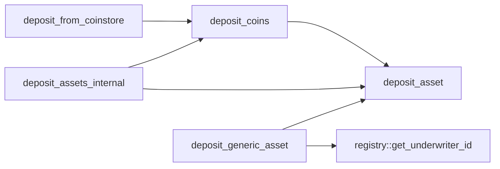
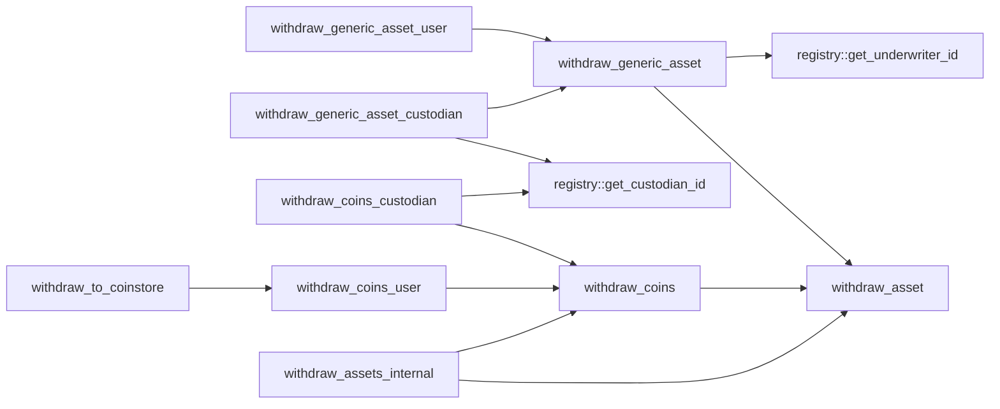
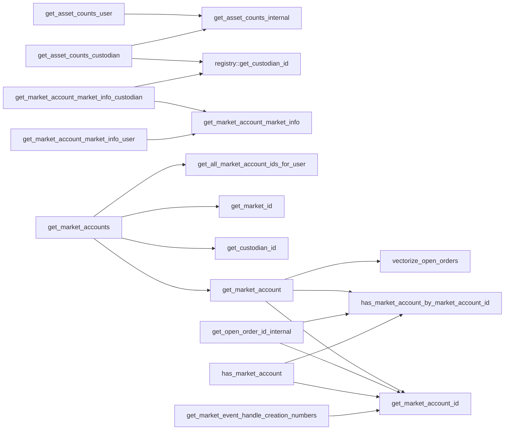
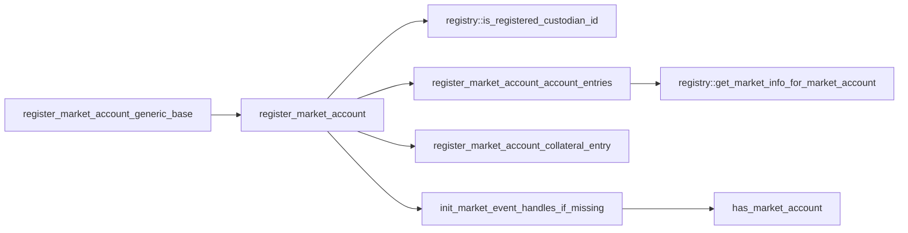
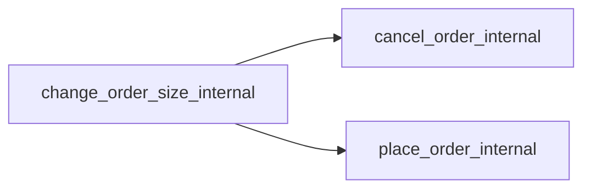
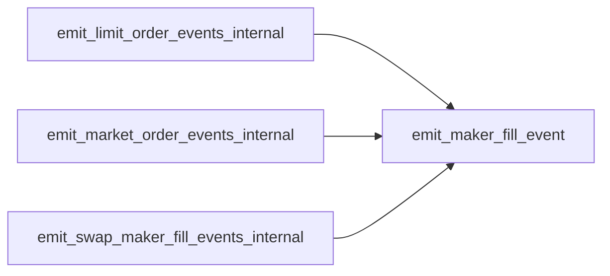

# Module `0x7b00569d23c3edd4538d0b6d8db15dd9f9c07e5d830f35b46afbaa670923b450::user`

User-side asset, collateral, and order management.

Contains data structures and functionality for tracking a user's
assets and open orders. Upon market account registration, users can
either preside over their own account, or delegate custody to a
custodian who manage their orders and withdrawals. For each market,
a user can open multiple market accounts, each with a unique
custodian.

## General overview sections

[Architecture](#architecture)

* [Market account IDs](#market-account-IDs)
* [Market accounts](#market-accounts)
* [Orders and access keys](#orders-and-access-keys)
* [Market order IDs](#market-order-IDs)

[Function index](#function-index)

* [View functions](#view-functions)
* [Public functions](#public-functions)
* [Public entry functions](#public-entry-functions)
* [Public friend functions](#public-friend-functions)
* [Dependency charts](#dependency-charts)

[Complete DocGen index](#complete-docgen-index)

## Architecture

### Market account IDs

Markets, defined in the global registry, are assigned a 1-indexed
<code>u64</code> market ID, as are custodians. The concatenated result of a
market ID and a custodian ID is known as a market account ID, which
is used as a key in assorted user-side lookup operations: the 64
least-significant bits in a market account ID are the custodian ID
for the given market account (<code><a href="user.md#0x7b00569d23c3edd4538d0b6d8db15dd9f9c07e5d830f35b46afbaa670923b450_user_NIL">NIL</a></code> if no delegated custodian),
while the 64 most-significant bits are the market ID. See
<code><a href="user.md#0x7b00569d23c3edd4538d0b6d8db15dd9f9c07e5d830f35b46afbaa670923b450_user_get_custodian_id">get_custodian_id</a>()</code>, <code><a href="user.md#0x7b00569d23c3edd4538d0b6d8db15dd9f9c07e5d830f35b46afbaa670923b450_user_get_market_account_id">get_market_account_id</a>()</code>, and
<code><a href="user.md#0x7b00569d23c3edd4538d0b6d8db15dd9f9c07e5d830f35b46afbaa670923b450_user_get_market_id">get_market_id</a>()</code> for implementation details.

### Market accounts

When a user opens a market account, a <code><a href="user.md#0x7b00569d23c3edd4538d0b6d8db15dd9f9c07e5d830f35b46afbaa670923b450_user_MarketAccount">MarketAccount</a></code> entry is
added to their <code><a href="user.md#0x7b00569d23c3edd4538d0b6d8db15dd9f9c07e5d830f35b46afbaa670923b450_user_MarketAccounts">MarketAccounts</a></code>, and a coin entry is added to their
<code><a href="user.md#0x7b00569d23c3edd4538d0b6d8db15dd9f9c07e5d830f35b46afbaa670923b450_user_Collateral">Collateral</a></code> for the given market's quote coin type. If the market's
base asset is a coin, a <code><a href="user.md#0x7b00569d23c3edd4538d0b6d8db15dd9f9c07e5d830f35b46afbaa670923b450_user_Collateral">Collateral</a></code> entry is similarly created for
the base coin type.

### Orders and access keys

When users place an order on the order book, an <code><a href="user.md#0x7b00569d23c3edd4538d0b6d8db15dd9f9c07e5d830f35b46afbaa670923b450_user_Order">Order</a></code> is added to
their corresponding <code><a href="user.md#0x7b00569d23c3edd4538d0b6d8db15dd9f9c07e5d830f35b46afbaa670923b450_user_MarketAccount">MarketAccount</a></code>. If they then cancel the order,
the corresponding <code><a href="user.md#0x7b00569d23c3edd4538d0b6d8db15dd9f9c07e5d830f35b46afbaa670923b450_user_Order">Order</a></code> is not deallocated, but rather, marked
"inactive" and pushed onto a stack of inactive orders for the
corresponding side (<code><a href="user.md#0x7b00569d23c3edd4538d0b6d8db15dd9f9c07e5d830f35b46afbaa670923b450_user_MarketAccount">MarketAccount</a>.asks_stack_top</code> or
<code><a href="user.md#0x7b00569d23c3edd4538d0b6d8db15dd9f9c07e5d830f35b46afbaa670923b450_user_MarketAccount">MarketAccount</a>.bids_stack_top</code>). Then, when a user places another
order, rather than allocating a new <code><a href="user.md#0x7b00569d23c3edd4538d0b6d8db15dd9f9c07e5d830f35b46afbaa670923b450_user_Order">Order</a></code>, the inactive order at
the top of the stack is popped off the stack and marked active.

This approach is motivated by global storage gas costs: as of the
time of this writing, per-item creations cost approximately 16.7
times as much as per-item writes, and there is no incentive to
deallocate from memory. Hence the inactive stack paradigm allows
for orders to be recycled in a way that reduces overall storage
costs. In practice, however, this means that each <code><a href="user.md#0x7b00569d23c3edd4538d0b6d8db15dd9f9c07e5d830f35b46afbaa670923b450_user_Order">Order</a></code> is
assigned a static "access key" that persists throughout subsequent
active order states: if a user places an order, cancels the order,
then places another order, the <code><a href="user.md#0x7b00569d23c3edd4538d0b6d8db15dd9f9c07e5d830f35b46afbaa670923b450_user_Order">Order</a></code> will have the same access key
in each active instance. In other words, access keys are the lookup
ID in the relevant <code><a href="user.md#0x7b00569d23c3edd4538d0b6d8db15dd9f9c07e5d830f35b46afbaa670923b450_user_Order">Order</a></code> data structure for the given side
(<code><a href="user.md#0x7b00569d23c3edd4538d0b6d8db15dd9f9c07e5d830f35b46afbaa670923b450_user_MarketAccount">MarketAccount</a>.asks</code> or <code><a href="user.md#0x7b00569d23c3edd4538d0b6d8db15dd9f9c07e5d830f35b46afbaa670923b450_user_MarketAccount">MarketAccount</a>.bids</code>), and are not
necessarily unique for orders across time.

### Market order IDs

Market order IDs, however, are unique across time for a given market
ID, and are tracked in a users' <code><a href="user.md#0x7b00569d23c3edd4538d0b6d8db15dd9f9c07e5d830f35b46afbaa670923b450_user_Order">Order</a>.market_order_id</code>. A market
order ID is a unique identifier for an order on a given order book.

## Function index

### View functions

Constant getters:

* <code><a href="user.md#0x7b00569d23c3edd4538d0b6d8db15dd9f9c07e5d830f35b46afbaa670923b450_user_get_ASK">get_ASK</a>()</code>
* <code><a href="user.md#0x7b00569d23c3edd4538d0b6d8db15dd9f9c07e5d830f35b46afbaa670923b450_user_get_BID">get_BID</a>()</code>
* <code><a href="user.md#0x7b00569d23c3edd4538d0b6d8db15dd9f9c07e5d830f35b46afbaa670923b450_user_get_CANCEL_REASON_EVICTION">get_CANCEL_REASON_EVICTION</a>()</code>
* <code><a href="user.md#0x7b00569d23c3edd4538d0b6d8db15dd9f9c07e5d830f35b46afbaa670923b450_user_get_CANCEL_REASON_IMMEDIATE_OR_CANCEL">get_CANCEL_REASON_IMMEDIATE_OR_CANCEL</a>()</code>
* <code><a href="user.md#0x7b00569d23c3edd4538d0b6d8db15dd9f9c07e5d830f35b46afbaa670923b450_user_get_CANCEL_REASON_MANUAL_CANCEL">get_CANCEL_REASON_MANUAL_CANCEL</a>()</code>
* <code><a href="user.md#0x7b00569d23c3edd4538d0b6d8db15dd9f9c07e5d830f35b46afbaa670923b450_user_get_CANCEL_REASON_MAX_QUOTE_TRADED">get_CANCEL_REASON_MAX_QUOTE_TRADED</a>()</code>
* <code><a href="user.md#0x7b00569d23c3edd4538d0b6d8db15dd9f9c07e5d830f35b46afbaa670923b450_user_get_CANCEL_REASON_NOT_ENOUGH_LIQUIDITY">get_CANCEL_REASON_NOT_ENOUGH_LIQUIDITY</a>()</code>
* <code><a href="user.md#0x7b00569d23c3edd4538d0b6d8db15dd9f9c07e5d830f35b46afbaa670923b450_user_get_CANCEL_REASON_SELF_MATCH_MAKER">get_CANCEL_REASON_SELF_MATCH_MAKER</a>()</code>
* <code><a href="user.md#0x7b00569d23c3edd4538d0b6d8db15dd9f9c07e5d830f35b46afbaa670923b450_user_get_CANCEL_REASON_SELF_MATCH_TAKER">get_CANCEL_REASON_SELF_MATCH_TAKER</a>()</code>
* <code><a href="user.md#0x7b00569d23c3edd4538d0b6d8db15dd9f9c07e5d830f35b46afbaa670923b450_user_get_CANCEL_REASON_TOO_SMALL_TO_FILL_LOT">get_CANCEL_REASON_TOO_SMALL_TO_FILL_LOT</a>()</code>
* <code><a href="user.md#0x7b00569d23c3edd4538d0b6d8db15dd9f9c07e5d830f35b46afbaa670923b450_user_get_CANCEL_REASON_VIOLATED_LIMIT_PRICE">get_CANCEL_REASON_VIOLATED_LIMIT_PRICE</a>()</code>
* <code><a href="user.md#0x7b00569d23c3edd4538d0b6d8db15dd9f9c07e5d830f35b46afbaa670923b450_user_get_NO_CUSTODIAN">get_NO_CUSTODIAN</a>()</code>

Market account lookup:

* <code><a href="user.md#0x7b00569d23c3edd4538d0b6d8db15dd9f9c07e5d830f35b46afbaa670923b450_user_get_all_market_account_ids_for_market_id">get_all_market_account_ids_for_market_id</a>()</code>
* <code><a href="user.md#0x7b00569d23c3edd4538d0b6d8db15dd9f9c07e5d830f35b46afbaa670923b450_user_get_all_market_account_ids_for_user">get_all_market_account_ids_for_user</a>()</code>
* <code><a href="user.md#0x7b00569d23c3edd4538d0b6d8db15dd9f9c07e5d830f35b46afbaa670923b450_user_get_market_account">get_market_account</a>()</code>
* <code><a href="user.md#0x7b00569d23c3edd4538d0b6d8db15dd9f9c07e5d830f35b46afbaa670923b450_user_get_market_accounts">get_market_accounts</a>()</code>
* <code>get_market_event_handle_creation_numbers()</code>
* <code><a href="user.md#0x7b00569d23c3edd4538d0b6d8db15dd9f9c07e5d830f35b46afbaa670923b450_user_has_market_account">has_market_account</a>()</code>
* <code><a href="user.md#0x7b00569d23c3edd4538d0b6d8db15dd9f9c07e5d830f35b46afbaa670923b450_user_has_market_account_by_market_account_id">has_market_account_by_market_account_id</a>()</code>
* <code><a href="user.md#0x7b00569d23c3edd4538d0b6d8db15dd9f9c07e5d830f35b46afbaa670923b450_user_has_market_account_by_market_id">has_market_account_by_market_id</a>()</code>

Market account ID lookup:

* <code><a href="user.md#0x7b00569d23c3edd4538d0b6d8db15dd9f9c07e5d830f35b46afbaa670923b450_user_get_custodian_id">get_custodian_id</a>()</code>
* <code><a href="user.md#0x7b00569d23c3edd4538d0b6d8db15dd9f9c07e5d830f35b46afbaa670923b450_user_get_market_account_id">get_market_account_id</a>()</code>
* <code><a href="user.md#0x7b00569d23c3edd4538d0b6d8db15dd9f9c07e5d830f35b46afbaa670923b450_user_get_market_id">get_market_id</a>()</code>

### Public functions

Market account lookup

* <code><a href="user.md#0x7b00569d23c3edd4538d0b6d8db15dd9f9c07e5d830f35b46afbaa670923b450_user_get_asset_counts_custodian">get_asset_counts_custodian</a>()</code>
* <code><a href="user.md#0x7b00569d23c3edd4538d0b6d8db15dd9f9c07e5d830f35b46afbaa670923b450_user_get_asset_counts_user">get_asset_counts_user</a>()</code>
* <code><a href="user.md#0x7b00569d23c3edd4538d0b6d8db15dd9f9c07e5d830f35b46afbaa670923b450_user_get_market_account_market_info_custodian">get_market_account_market_info_custodian</a>()</code>
* <code><a href="user.md#0x7b00569d23c3edd4538d0b6d8db15dd9f9c07e5d830f35b46afbaa670923b450_user_get_market_account_market_info_user">get_market_account_market_info_user</a>()</code>

Asset transfer:

* <code><a href="user.md#0x7b00569d23c3edd4538d0b6d8db15dd9f9c07e5d830f35b46afbaa670923b450_user_deposit_coins">deposit_coins</a>()</code>
* <code><a href="user.md#0x7b00569d23c3edd4538d0b6d8db15dd9f9c07e5d830f35b46afbaa670923b450_user_deposit_generic_asset">deposit_generic_asset</a>()</code>
* <code><a href="user.md#0x7b00569d23c3edd4538d0b6d8db15dd9f9c07e5d830f35b46afbaa670923b450_user_withdraw_coins_custodian">withdraw_coins_custodian</a>()</code>
* <code><a href="user.md#0x7b00569d23c3edd4538d0b6d8db15dd9f9c07e5d830f35b46afbaa670923b450_user_withdraw_coins_user">withdraw_coins_user</a>()</code>
* <code><a href="user.md#0x7b00569d23c3edd4538d0b6d8db15dd9f9c07e5d830f35b46afbaa670923b450_user_withdraw_generic_asset_custodian">withdraw_generic_asset_custodian</a>()</code>
* <code><a href="user.md#0x7b00569d23c3edd4538d0b6d8db15dd9f9c07e5d830f35b46afbaa670923b450_user_withdraw_generic_asset_user">withdraw_generic_asset_user</a>()</code>

### Public entry functions

Asset transfer:

* <code><a href="user.md#0x7b00569d23c3edd4538d0b6d8db15dd9f9c07e5d830f35b46afbaa670923b450_user_deposit_from_coinstore">deposit_from_coinstore</a>()</code>
* <code><a href="user.md#0x7b00569d23c3edd4538d0b6d8db15dd9f9c07e5d830f35b46afbaa670923b450_user_withdraw_to_coinstore">withdraw_to_coinstore</a>()</code>

Account registration:

* <code>init_market_event_handles_if_missing()</code>
* <code><a href="user.md#0x7b00569d23c3edd4538d0b6d8db15dd9f9c07e5d830f35b46afbaa670923b450_user_register_market_account">register_market_account</a>()</code>
* <code><a href="user.md#0x7b00569d23c3edd4538d0b6d8db15dd9f9c07e5d830f35b46afbaa670923b450_user_register_market_account_generic_base">register_market_account_generic_base</a>()</code>

### Public friend functions

Order management:

* <code><a href="user.md#0x7b00569d23c3edd4538d0b6d8db15dd9f9c07e5d830f35b46afbaa670923b450_user_cancel_order_internal">cancel_order_internal</a>()</code>
* <code><a href="user.md#0x7b00569d23c3edd4538d0b6d8db15dd9f9c07e5d830f35b46afbaa670923b450_user_change_order_size_internal">change_order_size_internal</a>()</code>
* <code><a href="user.md#0x7b00569d23c3edd4538d0b6d8db15dd9f9c07e5d830f35b46afbaa670923b450_user_get_open_order_id_internal">get_open_order_id_internal</a>()</code>
* <code><a href="user.md#0x7b00569d23c3edd4538d0b6d8db15dd9f9c07e5d830f35b46afbaa670923b450_user_fill_order_internal">fill_order_internal</a>()</code>
* <code><a href="user.md#0x7b00569d23c3edd4538d0b6d8db15dd9f9c07e5d830f35b46afbaa670923b450_user_place_order_internal">place_order_internal</a>()</code>

Asset management:

* <code><a href="user.md#0x7b00569d23c3edd4538d0b6d8db15dd9f9c07e5d830f35b46afbaa670923b450_user_deposit_assets_internal">deposit_assets_internal</a>()</code>
* <code><a href="user.md#0x7b00569d23c3edd4538d0b6d8db15dd9f9c07e5d830f35b46afbaa670923b450_user_get_asset_counts_internal">get_asset_counts_internal</a>()</code>
* <code><a href="user.md#0x7b00569d23c3edd4538d0b6d8db15dd9f9c07e5d830f35b46afbaa670923b450_user_withdraw_assets_internal">withdraw_assets_internal</a>()</code>

Order identifiers:

* <code><a href="user.md#0x7b00569d23c3edd4538d0b6d8db15dd9f9c07e5d830f35b46afbaa670923b450_user_get_next_order_access_key_internal">get_next_order_access_key_internal</a>()</code>
* <code><a href="user.md#0x7b00569d23c3edd4538d0b6d8db15dd9f9c07e5d830f35b46afbaa670923b450_user_get_active_market_order_ids_internal">get_active_market_order_ids_internal</a>()</code>

Market events:

* <code><a href="user.md#0x7b00569d23c3edd4538d0b6d8db15dd9f9c07e5d830f35b46afbaa670923b450_user_create_cancel_order_event_internal">create_cancel_order_event_internal</a>()</code>
* <code><a href="user.md#0x7b00569d23c3edd4538d0b6d8db15dd9f9c07e5d830f35b46afbaa670923b450_user_create_fill_event_internal">create_fill_event_internal</a>()</code>
* <code><a href="user.md#0x7b00569d23c3edd4538d0b6d8db15dd9f9c07e5d830f35b46afbaa670923b450_user_emit_limit_order_events_internal">emit_limit_order_events_internal</a>()</code>
* <code><a href="user.md#0x7b00569d23c3edd4538d0b6d8db15dd9f9c07e5d830f35b46afbaa670923b450_user_emit_market_order_events_internal">emit_market_order_events_internal</a>()</code>
* <code><a href="user.md#0x7b00569d23c3edd4538d0b6d8db15dd9f9c07e5d830f35b46afbaa670923b450_user_emit_swap_maker_fill_events_internal">emit_swap_maker_fill_events_internal</a>()</code>

### Dependency charts

The below dependency charts use <code>mermaid.js</code> syntax, which can be
automatically rendered into a diagram (depending on the browser)
when viewing the documentation file generated from source code. If
a browser renders the diagrams with coloring that makes it difficult
to read, try a different browser.

Deposits:

Withdrawals:

Market account lookup:

Market account registration:

Internal order management:

Market events:

## Complete DocGen index

The below index is automatically generated from source code:

-  [General overview sections](#@General_overview_sections_0)
-  [Architecture](#@Architecture_1)
    -  [Market account IDs](#@Market_account_IDs_2)
    -  [Market accounts](#@Market_accounts_3)
    -  [Orders and access keys](#@Orders_and_access_keys_4)
    -  [Market order IDs](#@Market_order_IDs_5)
-  [Function index](#@Function_index_6)
    -  [View functions](#@View_functions_7)
    -  [Public functions](#@Public_functions_8)
    -  [Public entry functions](#@Public_entry_functions_9)
    -  [Public friend functions](#@Public_friend_functions_10)
    -  [Dependency charts](#@Dependency_charts_11)
-  [Complete DocGen index](#@Complete_DocGen_index_12)
-  [Struct `CancelOrderEvent`](#0x7b00569d23c3edd4538d0b6d8db15dd9f9c07e5d830f35b46afbaa670923b450_user_CancelOrderEvent)
-  [Struct `ChangeOrderSizeEvent`](#0x7b00569d23c3edd4538d0b6d8db15dd9f9c07e5d830f35b46afbaa670923b450_user_ChangeOrderSizeEvent)
-  [Resource `Collateral`](#0x7b00569d23c3edd4538d0b6d8db15dd9f9c07e5d830f35b46afbaa670923b450_user_Collateral)
-  [Struct `FillEvent`](#0x7b00569d23c3edd4538d0b6d8db15dd9f9c07e5d830f35b46afbaa670923b450_user_FillEvent)
-  [Struct `MarketAccount`](#0x7b00569d23c3edd4538d0b6d8db15dd9f9c07e5d830f35b46afbaa670923b450_user_MarketAccount)
-  [Struct `MarketAccountView`](#0x7b00569d23c3edd4538d0b6d8db15dd9f9c07e5d830f35b46afbaa670923b450_user_MarketAccountView)
-  [Resource `MarketAccounts`](#0x7b00569d23c3edd4538d0b6d8db15dd9f9c07e5d830f35b46afbaa670923b450_user_MarketAccounts)
-  [Struct `Order`](#0x7b00569d23c3edd4538d0b6d8db15dd9f9c07e5d830f35b46afbaa670923b450_user_Order)
-  [Struct `PlaceLimitOrderEvent`](#0x7b00569d23c3edd4538d0b6d8db15dd9f9c07e5d830f35b46afbaa670923b450_user_PlaceLimitOrderEvent)
-  [Struct `PlaceMarketOrderEvent`](#0x7b00569d23c3edd4538d0b6d8db15dd9f9c07e5d830f35b46afbaa670923b450_user_PlaceMarketOrderEvent)
-  [Constants](#@Constants_13)
-  [Function `get_ASK`](#0x7b00569d23c3edd4538d0b6d8db15dd9f9c07e5d830f35b46afbaa670923b450_user_get_ASK)
    -  [Testing](#@Testing_14)
-  [Function `get_BID`](#0x7b00569d23c3edd4538d0b6d8db15dd9f9c07e5d830f35b46afbaa670923b450_user_get_BID)
    -  [Testing](#@Testing_15)
-  [Function `get_CANCEL_REASON_EVICTION`](#0x7b00569d23c3edd4538d0b6d8db15dd9f9c07e5d830f35b46afbaa670923b450_user_get_CANCEL_REASON_EVICTION)
    -  [Testing](#@Testing_16)
-  [Function `get_CANCEL_REASON_IMMEDIATE_OR_CANCEL`](#0x7b00569d23c3edd4538d0b6d8db15dd9f9c07e5d830f35b46afbaa670923b450_user_get_CANCEL_REASON_IMMEDIATE_OR_CANCEL)
    -  [Testing](#@Testing_17)
-  [Function `get_CANCEL_REASON_MANUAL_CANCEL`](#0x7b00569d23c3edd4538d0b6d8db15dd9f9c07e5d830f35b46afbaa670923b450_user_get_CANCEL_REASON_MANUAL_CANCEL)
    -  [Testing](#@Testing_18)
-  [Function `get_CANCEL_REASON_MAX_QUOTE_TRADED`](#0x7b00569d23c3edd4538d0b6d8db15dd9f9c07e5d830f35b46afbaa670923b450_user_get_CANCEL_REASON_MAX_QUOTE_TRADED)
    -  [Testing](#@Testing_19)
-  [Function `get_CANCEL_REASON_NOT_ENOUGH_LIQUIDITY`](#0x7b00569d23c3edd4538d0b6d8db15dd9f9c07e5d830f35b46afbaa670923b450_user_get_CANCEL_REASON_NOT_ENOUGH_LIQUIDITY)
    -  [Testing](#@Testing_20)
-  [Function `get_CANCEL_REASON_SELF_MATCH_MAKER`](#0x7b00569d23c3edd4538d0b6d8db15dd9f9c07e5d830f35b46afbaa670923b450_user_get_CANCEL_REASON_SELF_MATCH_MAKER)
    -  [Testing](#@Testing_21)
-  [Function `get_CANCEL_REASON_SELF_MATCH_TAKER`](#0x7b00569d23c3edd4538d0b6d8db15dd9f9c07e5d830f35b46afbaa670923b450_user_get_CANCEL_REASON_SELF_MATCH_TAKER)
    -  [Testing](#@Testing_22)
-  [Function `get_CANCEL_REASON_TOO_SMALL_TO_FILL_LOT`](#0x7b00569d23c3edd4538d0b6d8db15dd9f9c07e5d830f35b46afbaa670923b450_user_get_CANCEL_REASON_TOO_SMALL_TO_FILL_LOT)
    -  [Testing](#@Testing_23)
-  [Function `get_CANCEL_REASON_VIOLATED_LIMIT_PRICE`](#0x7b00569d23c3edd4538d0b6d8db15dd9f9c07e5d830f35b46afbaa670923b450_user_get_CANCEL_REASON_VIOLATED_LIMIT_PRICE)
    -  [Testing](#@Testing_24)
-  [Function `get_NO_CUSTODIAN`](#0x7b00569d23c3edd4538d0b6d8db15dd9f9c07e5d830f35b46afbaa670923b450_user_get_NO_CUSTODIAN)
    -  [Testing](#@Testing_25)
-  [Function `get_all_market_account_ids_for_market_id`](#0x7b00569d23c3edd4538d0b6d8db15dd9f9c07e5d830f35b46afbaa670923b450_user_get_all_market_account_ids_for_market_id)
    -  [Parameters](#@Parameters_26)
    -  [Returns](#@Returns_27)
    -  [Gas considerations](#@Gas_considerations_28)
    -  [Testing](#@Testing_29)
-  [Function `get_all_market_account_ids_for_user`](#0x7b00569d23c3edd4538d0b6d8db15dd9f9c07e5d830f35b46afbaa670923b450_user_get_all_market_account_ids_for_user)
    -  [Parameters](#@Parameters_30)
    -  [Returns](#@Returns_31)
    -  [Gas considerations](#@Gas_considerations_32)
    -  [Testing](#@Testing_33)
-  [Function `get_custodian_id`](#0x7b00569d23c3edd4538d0b6d8db15dd9f9c07e5d830f35b46afbaa670923b450_user_get_custodian_id)
    -  [Testing](#@Testing_34)
-  [Function `get_market_account_id`](#0x7b00569d23c3edd4538d0b6d8db15dd9f9c07e5d830f35b46afbaa670923b450_user_get_market_account_id)
    -  [Testing](#@Testing_35)
-  [Function `get_market_id`](#0x7b00569d23c3edd4538d0b6d8db15dd9f9c07e5d830f35b46afbaa670923b450_user_get_market_id)
    -  [Testing](#@Testing_36)
-  [Function `has_market_account`](#0x7b00569d23c3edd4538d0b6d8db15dd9f9c07e5d830f35b46afbaa670923b450_user_has_market_account)
    -  [Testing](#@Testing_37)
-  [Function `has_market_account_by_market_account_id`](#0x7b00569d23c3edd4538d0b6d8db15dd9f9c07e5d830f35b46afbaa670923b450_user_has_market_account_by_market_account_id)
    -  [Testing](#@Testing_38)
-  [Function `has_market_account_by_market_id`](#0x7b00569d23c3edd4538d0b6d8db15dd9f9c07e5d830f35b46afbaa670923b450_user_has_market_account_by_market_id)
    -  [Testing](#@Testing_39)
-  [Function `deposit_coins`](#0x7b00569d23c3edd4538d0b6d8db15dd9f9c07e5d830f35b46afbaa670923b450_user_deposit_coins)
    -  [Aborts](#@Aborts_40)
    -  [Testing](#@Testing_41)
-  [Function `deposit_generic_asset`](#0x7b00569d23c3edd4538d0b6d8db15dd9f9c07e5d830f35b46afbaa670923b450_user_deposit_generic_asset)
    -  [Testing](#@Testing_42)
-  [Function `get_asset_counts_custodian`](#0x7b00569d23c3edd4538d0b6d8db15dd9f9c07e5d830f35b46afbaa670923b450_user_get_asset_counts_custodian)
    -  [Testing](#@Testing_43)
-  [Function `get_asset_counts_user`](#0x7b00569d23c3edd4538d0b6d8db15dd9f9c07e5d830f35b46afbaa670923b450_user_get_asset_counts_user)
    -  [Testing](#@Testing_44)
-  [Function `get_market_account_market_info_custodian`](#0x7b00569d23c3edd4538d0b6d8db15dd9f9c07e5d830f35b46afbaa670923b450_user_get_market_account_market_info_custodian)
    -  [Testing](#@Testing_45)
-  [Function `get_market_account_market_info_user`](#0x7b00569d23c3edd4538d0b6d8db15dd9f9c07e5d830f35b46afbaa670923b450_user_get_market_account_market_info_user)
    -  [Testing](#@Testing_46)
-  [Function `withdraw_coins_custodian`](#0x7b00569d23c3edd4538d0b6d8db15dd9f9c07e5d830f35b46afbaa670923b450_user_withdraw_coins_custodian)
    -  [Testing](#@Testing_47)
-  [Function `withdraw_coins_user`](#0x7b00569d23c3edd4538d0b6d8db15dd9f9c07e5d830f35b46afbaa670923b450_user_withdraw_coins_user)
    -  [Testing](#@Testing_48)
-  [Function `withdraw_generic_asset_custodian`](#0x7b00569d23c3edd4538d0b6d8db15dd9f9c07e5d830f35b46afbaa670923b450_user_withdraw_generic_asset_custodian)
    -  [Testing](#@Testing_49)
-  [Function `withdraw_generic_asset_user`](#0x7b00569d23c3edd4538d0b6d8db15dd9f9c07e5d830f35b46afbaa670923b450_user_withdraw_generic_asset_user)
    -  [Testing](#@Testing_50)
-  [Function `deposit_from_coinstore`](#0x7b00569d23c3edd4538d0b6d8db15dd9f9c07e5d830f35b46afbaa670923b450_user_deposit_from_coinstore)
    -  [Testing](#@Testing_51)
-  [Function `register_market_account`](#0x7b00569d23c3edd4538d0b6d8db15dd9f9c07e5d830f35b46afbaa670923b450_user_register_market_account)
    -  [Type parameters](#@Type_parameters_52)
    -  [Parameters](#@Parameters_53)
    -  [Aborts](#@Aborts_54)
    -  [Testing](#@Testing_55)
-  [Function `register_market_account_generic_base`](#0x7b00569d23c3edd4538d0b6d8db15dd9f9c07e5d830f35b46afbaa670923b450_user_register_market_account_generic_base)
    -  [Testing](#@Testing_56)
-  [Function `withdraw_to_coinstore`](#0x7b00569d23c3edd4538d0b6d8db15dd9f9c07e5d830f35b46afbaa670923b450_user_withdraw_to_coinstore)
    -  [Testing](#@Testing_57)
-  [Function `cancel_order_internal`](#0x7b00569d23c3edd4538d0b6d8db15dd9f9c07e5d830f35b46afbaa670923b450_user_cancel_order_internal)
    -  [Parameters](#@Parameters_58)
    -  [Returns](#@Returns_59)
    -  [Terminology](#@Terminology_60)
    -  [Aborts](#@Aborts_61)
    -  [Emits](#@Emits_62)
    -  [Assumptions](#@Assumptions_63)
    -  [Expected value testing](#@Expected_value_testing_64)
    -  [Failure testing](#@Failure_testing_65)
-  [Function `change_order_size_internal`](#0x7b00569d23c3edd4538d0b6d8db15dd9f9c07e5d830f35b46afbaa670923b450_user_change_order_size_internal)
    -  [Parameters](#@Parameters_66)
    -  [Aborts](#@Aborts_67)
    -  [Emits](#@Emits_68)
    -  [Assumptions](#@Assumptions_69)
    -  [Testing](#@Testing_70)
-  [Function `create_cancel_order_event_internal`](#0x7b00569d23c3edd4538d0b6d8db15dd9f9c07e5d830f35b46afbaa670923b450_user_create_cancel_order_event_internal)
-  [Function `create_fill_event_internal`](#0x7b00569d23c3edd4538d0b6d8db15dd9f9c07e5d830f35b46afbaa670923b450_user_create_fill_event_internal)
-  [Function `deposit_assets_internal`](#0x7b00569d23c3edd4538d0b6d8db15dd9f9c07e5d830f35b46afbaa670923b450_user_deposit_assets_internal)
    -  [Type parameters](#@Type_parameters_71)
    -  [Parameters](#@Parameters_72)
    -  [Testing](#@Testing_73)
-  [Function `emit_limit_order_events_internal`](#0x7b00569d23c3edd4538d0b6d8db15dd9f9c07e5d830f35b46afbaa670923b450_user_emit_limit_order_events_internal)
    -  [Parameters](#@Parameters_74)
    -  [Emits](#@Emits_75)
-  [Function `emit_market_order_events_internal`](#0x7b00569d23c3edd4538d0b6d8db15dd9f9c07e5d830f35b46afbaa670923b450_user_emit_market_order_events_internal)
    -  [Parameters](#@Parameters_76)
    -  [Emits](#@Emits_77)
-  [Function `emit_swap_maker_fill_events_internal`](#0x7b00569d23c3edd4538d0b6d8db15dd9f9c07e5d830f35b46afbaa670923b450_user_emit_swap_maker_fill_events_internal)
-  [Function `fill_order_internal`](#0x7b00569d23c3edd4538d0b6d8db15dd9f9c07e5d830f35b46afbaa670923b450_user_fill_order_internal)
    -  [Type parameters](#@Type_parameters_78)
    -  [Parameters](#@Parameters_79)
    -  [Returns](#@Returns_80)
    -  [Aborts](#@Aborts_81)
    -  [Assumptions](#@Assumptions_82)
    -  [Testing](#@Testing_83)
-  [Function `get_asset_counts_internal`](#0x7b00569d23c3edd4538d0b6d8db15dd9f9c07e5d830f35b46afbaa670923b450_user_get_asset_counts_internal)
    -  [Parameters](#@Parameters_84)
    -  [Returns](#@Returns_85)
    -  [Aborts](#@Aborts_86)
    -  [Testing](#@Testing_87)
-  [Function `get_active_market_order_ids_internal`](#0x7b00569d23c3edd4538d0b6d8db15dd9f9c07e5d830f35b46afbaa670923b450_user_get_active_market_order_ids_internal)
    -  [Parameters](#@Parameters_88)
    -  [Returns](#@Returns_89)
    -  [Aborts](#@Aborts_90)
    -  [Testing](#@Testing_91)
-  [Function `get_next_order_access_key_internal`](#0x7b00569d23c3edd4538d0b6d8db15dd9f9c07e5d830f35b46afbaa670923b450_user_get_next_order_access_key_internal)
    -  [Parameters](#@Parameters_92)
    -  [Returns](#@Returns_93)
    -  [Aborts](#@Aborts_94)
    -  [Testing](#@Testing_95)
-  [Function `get_open_order_id_internal`](#0x7b00569d23c3edd4538d0b6d8db15dd9f9c07e5d830f35b46afbaa670923b450_user_get_open_order_id_internal)
    -  [Testing](#@Testing_96)
-  [Function `place_order_internal`](#0x7b00569d23c3edd4538d0b6d8db15dd9f9c07e5d830f35b46afbaa670923b450_user_place_order_internal)
    -  [Parameters](#@Parameters_97)
    -  [Terminology](#@Terminology_98)
    -  [Assumptions](#@Assumptions_99)
    -  [Aborts](#@Aborts_100)
    -  [Expected value testing](#@Expected_value_testing_101)
    -  [Failure testing](#@Failure_testing_102)
-  [Function `withdraw_assets_internal`](#0x7b00569d23c3edd4538d0b6d8db15dd9f9c07e5d830f35b46afbaa670923b450_user_withdraw_assets_internal)
    -  [Type parameters](#@Type_parameters_103)
    -  [Parameters](#@Parameters_104)
    -  [Returns](#@Returns_105)
    -  [Testing](#@Testing_106)

<pre><code><b>use</b> <a href="">0x1::coin</a>;
<b>use</b> <a href="">0x1::event</a>;
<b>use</b> <a href="">0x1::option</a>;
<b>use</b> <a href="">0x1::signer</a>;
<b>use</b> <a href="">0x1::string</a>;
<b>use</b> <a href="">0x1::table</a>;
<b>use</b> <a href="">0x1::type_info</a>;
<b>use</b> <a href="">0x1::vector</a>;
<b>use</b> <a href="registry.md#0x7b00569d23c3edd4538d0b6d8db15dd9f9c07e5d830f35b46afbaa670923b450_registry">0x7b00569d23c3edd4538d0b6d8db15dd9f9c07e5d830f35b46afbaa670923b450::registry</a>;
<b>use</b> <a href="tablist.md#0x7b00569d23c3edd4538d0b6d8db15dd9f9c07e5d830f35b46afbaa670923b450_tablist">0x7b00569d23c3edd4538d0b6d8db15dd9f9c07e5d830f35b46afbaa670923b450::tablist</a>;
</code></pre>

## Struct `CancelOrderEvent`

Emitted when an order is cancelled.

<pre><code>#[<a href="">event</a>]
<b>struct</b> <a href="user.md#0x7b00569d23c3edd4538d0b6d8db15dd9f9c07e5d830f35b46afbaa670923b450_user_CancelOrderEvent">CancelOrderEvent</a> <b>has</b> <b>copy</b>, drop, store
</code></pre>

## Struct `ChangeOrderSizeEvent`

Emitted when the size of an open order is manually changed.

<pre><code>#[<a href="">event</a>]
<b>struct</b> <a href="user.md#0x7b00569d23c3edd4538d0b6d8db15dd9f9c07e5d830f35b46afbaa670923b450_user_ChangeOrderSizeEvent">ChangeOrderSizeEvent</a> <b>has</b> <b>copy</b>, drop, store
</code></pre>

## Resource `Collateral`

All of a user's collateral across all market accounts.

<pre><code><b>struct</b> <a href="user.md#0x7b00569d23c3edd4538d0b6d8db15dd9f9c07e5d830f35b46afbaa670923b450_user_Collateral">Collateral</a>&lt;CoinType&gt; <b>has</b> key
</code></pre>

## Struct `FillEvent`

Emitted when one order fills against another.

<pre><code>#[<a href="">event</a>]
<b>struct</b> <a href="user.md#0x7b00569d23c3edd4538d0b6d8db15dd9f9c07e5d830f35b46afbaa670923b450_user_FillEvent">FillEvent</a> <b>has</b> <b>copy</b>, drop, store
</code></pre>

## Struct `MarketAccount`

Represents a user's open orders and asset counts for a given
market account ID. Contains <code><a href="registry.md#0x7b00569d23c3edd4538d0b6d8db15dd9f9c07e5d830f35b46afbaa670923b450_registry_MarketInfo">registry::MarketInfo</a></code> field
duplicates to reduce global storage item queries against the
registry.

<pre><code><b>struct</b> <a href="user.md#0x7b00569d23c3edd4538d0b6d8db15dd9f9c07e5d830f35b46afbaa670923b450_user_MarketAccount">MarketAccount</a> <b>has</b> store
</code></pre>

## Struct `MarketAccountView`

User-friendly market account view function return.

<pre><code><b>struct</b> <a href="user.md#0x7b00569d23c3edd4538d0b6d8db15dd9f9c07e5d830f35b46afbaa670923b450_user_MarketAccountView">MarketAccountView</a> <b>has</b> store
</code></pre>

## Resource `MarketAccounts`

All of a user's market accounts.

<pre><code><b>struct</b> <a href="user.md#0x7b00569d23c3edd4538d0b6d8db15dd9f9c07e5d830f35b46afbaa670923b450_user_MarketAccounts">MarketAccounts</a> <b>has</b> key
</code></pre>

## Struct `Order`

An open order, either ask or bid.

<pre><code><b>struct</b> <a href="user.md#0x7b00569d23c3edd4538d0b6d8db15dd9f9c07e5d830f35b46afbaa670923b450_user_Order">Order</a> <b>has</b> store
</code></pre>

## Struct `PlaceLimitOrderEvent`

Emitted when a limit order is placed.

<pre><code>#[<a href="">event</a>]
<b>struct</b> <a href="user.md#0x7b00569d23c3edd4538d0b6d8db15dd9f9c07e5d830f35b46afbaa670923b450_user_PlaceLimitOrderEvent">PlaceLimitOrderEvent</a> <b>has</b> <b>copy</b>, drop, store
</code></pre>

## Struct `PlaceMarketOrderEvent`

Emitted when a market order is placed.

<pre><code>#[<a href="">event</a>]
<b>struct</b> <a href="user.md#0x7b00569d23c3edd4538d0b6d8db15dd9f9c07e5d830f35b46afbaa670923b450_user_PlaceMarketOrderEvent">PlaceMarketOrderEvent</a> <b>has</b> <b>copy</b>, drop, store
</code></pre>

## Constants

<code>u64</code> bitmask with all bits set, generated in Python via
<code>hex(int('1' * 64, 2))</code>.

<pre><code><b>const</b> <a href="user.md#0x7b00569d23c3edd4538d0b6d8db15dd9f9c07e5d830f35b46afbaa670923b450_user_HI_64">HI_64</a>: u64 = 18446744073709551615;
</code></pre>

Flag for null value when null defined as 0.

<pre><code><b>const</b> <a href="user.md#0x7b00569d23c3edd4538d0b6d8db15dd9f9c07e5d830f35b46afbaa670923b450_user_NIL">NIL</a>: u64 = 0;
</code></pre>

Custodian ID flag for no custodian.

<pre><code><b>const</b> <a href="user.md#0x7b00569d23c3edd4538d0b6d8db15dd9f9c07e5d830f35b46afbaa670923b450_user_NO_CUSTODIAN">NO_CUSTODIAN</a>: u64 = 0;
</code></pre>

Underwriter ID flag for no underwriter.

<pre><code><b>const</b> <a href="user.md#0x7b00569d23c3edd4538d0b6d8db15dd9f9c07e5d830f35b46afbaa670923b450_user_NO_UNDERWRITER">NO_UNDERWRITER</a>: u64 = 0;
</code></pre>

Flag for ask side

<pre><code><b>const</b> <a href="user.md#0x7b00569d23c3edd4538d0b6d8db15dd9f9c07e5d830f35b46afbaa670923b450_user_ASK">ASK</a>: bool = <b>true</b>;
</code></pre>

Flag for bid side

<pre><code><b>const</b> <a href="user.md#0x7b00569d23c3edd4538d0b6d8db15dd9f9c07e5d830f35b46afbaa670923b450_user_BID">BID</a>: bool = <b>false</b>;
</code></pre>

Order cancelled because it was evicted from the price-time
priority queue.

<pre><code><b>const</b> <a href="user.md#0x7b00569d23c3edd4538d0b6d8db15dd9f9c07e5d830f35b46afbaa670923b450_user_CANCEL_REASON_EVICTION">CANCEL_REASON_EVICTION</a>: u8 = 1;
</code></pre>

Order cancelled because it was an immediate-or-cancel order
that did not immediately fill.

<pre><code><b>const</b> <a href="user.md#0x7b00569d23c3edd4538d0b6d8db15dd9f9c07e5d830f35b46afbaa670923b450_user_CANCEL_REASON_IMMEDIATE_OR_CANCEL">CANCEL_REASON_IMMEDIATE_OR_CANCEL</a>: u8 = 2;
</code></pre>

Order cancelled because it was manually cancelled by either
signing user or custodian.

<pre><code><b>const</b> <a href="user.md#0x7b00569d23c3edd4538d0b6d8db15dd9f9c07e5d830f35b46afbaa670923b450_user_CANCEL_REASON_MANUAL_CANCEL">CANCEL_REASON_MANUAL_CANCEL</a>: u8 = 3;
</code></pre>

Order cancelled because no more quote asset could be traded.

<pre><code><b>const</b> <a href="user.md#0x7b00569d23c3edd4538d0b6d8db15dd9f9c07e5d830f35b46afbaa670923b450_user_CANCEL_REASON_MAX_QUOTE_TRADED">CANCEL_REASON_MAX_QUOTE_TRADED</a>: u8 = 4;
</code></pre>

Order cancelled because there was not enough liquidity to take
from.

<pre><code><b>const</b> <a href="user.md#0x7b00569d23c3edd4538d0b6d8db15dd9f9c07e5d830f35b46afbaa670923b450_user_CANCEL_REASON_NOT_ENOUGH_LIQUIDITY">CANCEL_REASON_NOT_ENOUGH_LIQUIDITY</a>: u8 = 5;
</code></pre>

Order cancelled because it was on the maker side of an fill
where self match behavior indicated cancelling the maker order.

<pre><code><b>const</b> <a href="user.md#0x7b00569d23c3edd4538d0b6d8db15dd9f9c07e5d830f35b46afbaa670923b450_user_CANCEL_REASON_SELF_MATCH_MAKER">CANCEL_REASON_SELF_MATCH_MAKER</a>: u8 = 6;
</code></pre>

Order cancelled because it was on the taker side of an fill
where self match behavior indicated cancelling the taker order.

<pre><code><b>const</b> <a href="user.md#0x7b00569d23c3edd4538d0b6d8db15dd9f9c07e5d830f35b46afbaa670923b450_user_CANCEL_REASON_SELF_MATCH_TAKER">CANCEL_REASON_SELF_MATCH_TAKER</a>: u8 = 7;
</code></pre>

Flag to indicate that order is only temporarily cancelled from
market account memory because it will be subsequently re-placed
as part of a size change.

<pre><code><b>const</b> <a href="user.md#0x7b00569d23c3edd4538d0b6d8db15dd9f9c07e5d830f35b46afbaa670923b450_user_CANCEL_REASON_SIZE_CHANGE_INTERNAL">CANCEL_REASON_SIZE_CHANGE_INTERNAL</a>: u8 = 0;
</code></pre>

Swap order cancelled because the remaining base asset amount to
match was too small to fill a single lot.

<pre><code><b>const</b> <a href="user.md#0x7b00569d23c3edd4538d0b6d8db15dd9f9c07e5d830f35b46afbaa670923b450_user_CANCEL_REASON_TOO_SMALL_TO_FILL_LOT">CANCEL_REASON_TOO_SMALL_TO_FILL_LOT</a>: u8 = 8;
</code></pre>

Swap order cancelled because the next order on the book to match
against violated the swap order limit price.

<pre><code><b>const</b> <a href="user.md#0x7b00569d23c3edd4538d0b6d8db15dd9f9c07e5d830f35b46afbaa670923b450_user_CANCEL_REASON_VIOLATED_LIMIT_PRICE">CANCEL_REASON_VIOLATED_LIMIT_PRICE</a>: u8 = 9;
</code></pre>

Expected order access key does not match assigned order access
key.

<pre><code><b>const</b> <a href="user.md#0x7b00569d23c3edd4538d0b6d8db15dd9f9c07e5d830f35b46afbaa670923b450_user_E_ACCESS_KEY_MISMATCH">E_ACCESS_KEY_MISMATCH</a>: u64 = 17;
</code></pre>

Asset type is not in trading pair for market.

<pre><code><b>const</b> <a href="user.md#0x7b00569d23c3edd4538d0b6d8db15dd9f9c07e5d830f35b46afbaa670923b450_user_E_ASSET_NOT_IN_PAIR">E_ASSET_NOT_IN_PAIR</a>: u64 = 4;
</code></pre>

No change in order size.

<pre><code><b>const</b> <a href="user.md#0x7b00569d23c3edd4538d0b6d8db15dd9f9c07e5d830f35b46afbaa670923b450_user_E_CHANGE_ORDER_NO_CHANGE">E_CHANGE_ORDER_NO_CHANGE</a>: u64 = 14;
</code></pre>

Mismatch between coin value and indicated amount.

<pre><code><b>const</b> <a href="user.md#0x7b00569d23c3edd4538d0b6d8db15dd9f9c07e5d830f35b46afbaa670923b450_user_E_COIN_AMOUNT_MISMATCH">E_COIN_AMOUNT_MISMATCH</a>: u64 = 16;
</code></pre>

Coin type is generic asset.

<pre><code><b>const</b> <a href="user.md#0x7b00569d23c3edd4538d0b6d8db15dd9f9c07e5d830f35b46afbaa670923b450_user_E_COIN_TYPE_IS_GENERIC_ASSET">E_COIN_TYPE_IS_GENERIC_ASSET</a>: u64 = 18;
</code></pre>

Deposit would overflow asset ceiling.

<pre><code><b>const</b> <a href="user.md#0x7b00569d23c3edd4538d0b6d8db15dd9f9c07e5d830f35b46afbaa670923b450_user_E_DEPOSIT_OVERFLOW_ASSET_CEILING">E_DEPOSIT_OVERFLOW_ASSET_CEILING</a>: u64 = 5;
</code></pre>

Market account already exists.

<pre><code><b>const</b> <a href="user.md#0x7b00569d23c3edd4538d0b6d8db15dd9f9c07e5d830f35b46afbaa670923b450_user_E_EXISTS_MARKET_ACCOUNT">E_EXISTS_MARKET_ACCOUNT</a>: u64 = 0;
</code></pre>

Market order ID mismatch with user's open order.

<pre><code><b>const</b> <a href="user.md#0x7b00569d23c3edd4538d0b6d8db15dd9f9c07e5d830f35b46afbaa670923b450_user_E_INVALID_MARKET_ORDER_ID">E_INVALID_MARKET_ORDER_ID</a>: u64 = 15;
</code></pre>

Underwriter is not valid for indicated market.

<pre><code><b>const</b> <a href="user.md#0x7b00569d23c3edd4538d0b6d8db15dd9f9c07e5d830f35b46afbaa670923b450_user_E_INVALID_UNDERWRITER">E_INVALID_UNDERWRITER</a>: u64 = 6;
</code></pre>

Not enough asset to trade away.

<pre><code><b>const</b> <a href="user.md#0x7b00569d23c3edd4538d0b6d8db15dd9f9c07e5d830f35b46afbaa670923b450_user_E_NOT_ENOUGH_ASSET_OUT">E_NOT_ENOUGH_ASSET_OUT</a>: u64 = 13;
</code></pre>

No market account resource found.

<pre><code><b>const</b> <a href="user.md#0x7b00569d23c3edd4538d0b6d8db15dd9f9c07e5d830f35b46afbaa670923b450_user_E_NO_MARKET_ACCOUNT">E_NO_MARKET_ACCOUNT</a>: u64 = 3;
</code></pre>

No market accounts resource found.

<pre><code><b>const</b> <a href="user.md#0x7b00569d23c3edd4538d0b6d8db15dd9f9c07e5d830f35b46afbaa670923b450_user_E_NO_MARKET_ACCOUNTS">E_NO_MARKET_ACCOUNTS</a>: u64 = 2;
</code></pre>

Filling order would overflow asset received from trade.

<pre><code><b>const</b> <a href="user.md#0x7b00569d23c3edd4538d0b6d8db15dd9f9c07e5d830f35b46afbaa670923b450_user_E_OVERFLOW_ASSET_IN">E_OVERFLOW_ASSET_IN</a>: u64 = 12;
</code></pre>

Price is zero.

<pre><code><b>const</b> <a href="user.md#0x7b00569d23c3edd4538d0b6d8db15dd9f9c07e5d830f35b46afbaa670923b450_user_E_PRICE_0">E_PRICE_0</a>: u64 = 8;
</code></pre>

Price exceeds maximum possible price.

<pre><code><b>const</b> <a href="user.md#0x7b00569d23c3edd4538d0b6d8db15dd9f9c07e5d830f35b46afbaa670923b450_user_E_PRICE_TOO_HIGH">E_PRICE_TOO_HIGH</a>: u64 = 9;
</code></pre>

Mismatch between expected size before operation and actual size
before operation.

<pre><code><b>const</b> <a href="user.md#0x7b00569d23c3edd4538d0b6d8db15dd9f9c07e5d830f35b46afbaa670923b450_user_E_START_SIZE_MISMATCH">E_START_SIZE_MISMATCH</a>: u64 = 19;
</code></pre>

Ticks to fill an order overflows a <code>u64</code>.

<pre><code><b>const</b> <a href="user.md#0x7b00569d23c3edd4538d0b6d8db15dd9f9c07e5d830f35b46afbaa670923b450_user_E_TICKS_OVERFLOW">E_TICKS_OVERFLOW</a>: u64 = 11;
</code></pre>

Custodian ID has not been registered.

<pre><code><b>const</b> <a href="user.md#0x7b00569d23c3edd4538d0b6d8db15dd9f9c07e5d830f35b46afbaa670923b450_user_E_UNREGISTERED_CUSTODIAN">E_UNREGISTERED_CUSTODIAN</a>: u64 = 1;
</code></pre>

Too little available for withdrawal.

<pre><code><b>const</b> <a href="user.md#0x7b00569d23c3edd4538d0b6d8db15dd9f9c07e5d830f35b46afbaa670923b450_user_E_WITHDRAW_TOO_LITTLE_AVAILABLE">E_WITHDRAW_TOO_LITTLE_AVAILABLE</a>: u64 = 7;
</code></pre>

Maximum possible price that can be encoded in 32 bits. Generated
in Python via <code>hex(int('1' * 32, 2))</code>.

<pre><code><b>const</b> <a href="user.md#0x7b00569d23c3edd4538d0b6d8db15dd9f9c07e5d830f35b46afbaa670923b450_user_HI_PRICE">HI_PRICE</a>: u64 = 4294967295;
</code></pre>

Number of bits market ID is shifted in market account ID.

<pre><code><b>const</b> <a href="user.md#0x7b00569d23c3edd4538d0b6d8db15dd9f9c07e5d830f35b46afbaa670923b450_user_SHIFT_MARKET_ID">SHIFT_MARKET_ID</a>: u8 = 64;
</code></pre>

## Function `get_ASK`

Public constant getter for <code><a href="user.md#0x7b00569d23c3edd4538d0b6d8db15dd9f9c07e5d830f35b46afbaa670923b450_user_ASK">ASK</a></code>.

### Testing

* <code>test_get_ASK()</code>

<pre><code>#[view]
<b>public</b> <b>fun</b> <a href="user.md#0x7b00569d23c3edd4538d0b6d8db15dd9f9c07e5d830f35b46afbaa670923b450_user_get_ASK">get_ASK</a>(): bool
</code></pre>

## Function `get_BID`

Public constant getter for <code><a href="user.md#0x7b00569d23c3edd4538d0b6d8db15dd9f9c07e5d830f35b46afbaa670923b450_user_BID">BID</a></code>.

### Testing

* <code>test_get_BID()</code>

<pre><code>#[view]
<b>public</b> <b>fun</b> <a href="user.md#0x7b00569d23c3edd4538d0b6d8db15dd9f9c07e5d830f35b46afbaa670923b450_user_get_BID">get_BID</a>(): bool
</code></pre>

## Function `get_CANCEL_REASON_EVICTION`

Public constant getter for <code><a href="user.md#0x7b00569d23c3edd4538d0b6d8db15dd9f9c07e5d830f35b46afbaa670923b450_user_CANCEL_REASON_EVICTION">CANCEL_REASON_EVICTION</a></code>.

### Testing

* <code>test_get_cancel_reasons()</code>

<pre><code>#[view]
<b>public</b> <b>fun</b> <a href="user.md#0x7b00569d23c3edd4538d0b6d8db15dd9f9c07e5d830f35b46afbaa670923b450_user_get_CANCEL_REASON_EVICTION">get_CANCEL_REASON_EVICTION</a>(): u8
</code></pre>

## Function `get_CANCEL_REASON_IMMEDIATE_OR_CANCEL`

Public constant getter for <code><a href="user.md#0x7b00569d23c3edd4538d0b6d8db15dd9f9c07e5d830f35b46afbaa670923b450_user_CANCEL_REASON_IMMEDIATE_OR_CANCEL">CANCEL_REASON_IMMEDIATE_OR_CANCEL</a></code>.

### Testing

* <code>test_get_cancel_reasons()</code>

<pre><code>#[view]
<b>public</b> <b>fun</b> <a href="user.md#0x7b00569d23c3edd4538d0b6d8db15dd9f9c07e5d830f35b46afbaa670923b450_user_get_CANCEL_REASON_IMMEDIATE_OR_CANCEL">get_CANCEL_REASON_IMMEDIATE_OR_CANCEL</a>(): u8
</code></pre>

## Function `get_CANCEL_REASON_MANUAL_CANCEL`

Public constant getter for <code><a href="user.md#0x7b00569d23c3edd4538d0b6d8db15dd9f9c07e5d830f35b46afbaa670923b450_user_CANCEL_REASON_MANUAL_CANCEL">CANCEL_REASON_MANUAL_CANCEL</a></code>.

### Testing

* <code>test_get_cancel_reasons()</code>

<pre><code>#[view]
<b>public</b> <b>fun</b> <a href="user.md#0x7b00569d23c3edd4538d0b6d8db15dd9f9c07e5d830f35b46afbaa670923b450_user_get_CANCEL_REASON_MANUAL_CANCEL">get_CANCEL_REASON_MANUAL_CANCEL</a>(): u8
</code></pre>

## Function `get_CANCEL_REASON_MAX_QUOTE_TRADED`

Public constant getter for <code><a href="user.md#0x7b00569d23c3edd4538d0b6d8db15dd9f9c07e5d830f35b46afbaa670923b450_user_CANCEL_REASON_MAX_QUOTE_TRADED">CANCEL_REASON_MAX_QUOTE_TRADED</a></code>.

### Testing

* <code>test_get_cancel_reasons()</code>

<pre><code>#[view]
<b>public</b> <b>fun</b> <a href="user.md#0x7b00569d23c3edd4538d0b6d8db15dd9f9c07e5d830f35b46afbaa670923b450_user_get_CANCEL_REASON_MAX_QUOTE_TRADED">get_CANCEL_REASON_MAX_QUOTE_TRADED</a>(): u8
</code></pre>

## Function `get_CANCEL_REASON_NOT_ENOUGH_LIQUIDITY`

Public constant getter for <code><a href="user.md#0x7b00569d23c3edd4538d0b6d8db15dd9f9c07e5d830f35b46afbaa670923b450_user_CANCEL_REASON_NOT_ENOUGH_LIQUIDITY">CANCEL_REASON_NOT_ENOUGH_LIQUIDITY</a></code>.

### Testing

* <code>test_get_cancel_reasons()</code>

<pre><code>#[view]
<b>public</b> <b>fun</b> <a href="user.md#0x7b00569d23c3edd4538d0b6d8db15dd9f9c07e5d830f35b46afbaa670923b450_user_get_CANCEL_REASON_NOT_ENOUGH_LIQUIDITY">get_CANCEL_REASON_NOT_ENOUGH_LIQUIDITY</a>(): u8
</code></pre>

## Function `get_CANCEL_REASON_SELF_MATCH_MAKER`

Public constant getter for <code><a href="user.md#0x7b00569d23c3edd4538d0b6d8db15dd9f9c07e5d830f35b46afbaa670923b450_user_CANCEL_REASON_SELF_MATCH_MAKER">CANCEL_REASON_SELF_MATCH_MAKER</a></code>.

### Testing

* <code>test_get_cancel_reasons()</code>

<pre><code>#[view]
<b>public</b> <b>fun</b> <a href="user.md#0x7b00569d23c3edd4538d0b6d8db15dd9f9c07e5d830f35b46afbaa670923b450_user_get_CANCEL_REASON_SELF_MATCH_MAKER">get_CANCEL_REASON_SELF_MATCH_MAKER</a>(): u8
</code></pre>

## Function `get_CANCEL_REASON_SELF_MATCH_TAKER`

Public constant getter for <code><a href="user.md#0x7b00569d23c3edd4538d0b6d8db15dd9f9c07e5d830f35b46afbaa670923b450_user_CANCEL_REASON_SELF_MATCH_TAKER">CANCEL_REASON_SELF_MATCH_TAKER</a></code>.

### Testing

* <code>test_get_cancel_reasons()</code>

<pre><code>#[view]
<b>public</b> <b>fun</b> <a href="user.md#0x7b00569d23c3edd4538d0b6d8db15dd9f9c07e5d830f35b46afbaa670923b450_user_get_CANCEL_REASON_SELF_MATCH_TAKER">get_CANCEL_REASON_SELF_MATCH_TAKER</a>(): u8
</code></pre>

## Function `get_CANCEL_REASON_TOO_SMALL_TO_FILL_LOT`

Public constant getter for
<code><a href="user.md#0x7b00569d23c3edd4538d0b6d8db15dd9f9c07e5d830f35b46afbaa670923b450_user_CANCEL_REASON_TOO_SMALL_TO_FILL_LOT">CANCEL_REASON_TOO_SMALL_TO_FILL_LOT</a></code>.

### Testing

* <code>test_get_cancel_reasons()</code>

<pre><code>#[view]
<b>public</b> <b>fun</b> <a href="user.md#0x7b00569d23c3edd4538d0b6d8db15dd9f9c07e5d830f35b46afbaa670923b450_user_get_CANCEL_REASON_TOO_SMALL_TO_FILL_LOT">get_CANCEL_REASON_TOO_SMALL_TO_FILL_LOT</a>(): u8
</code></pre>

## Function `get_CANCEL_REASON_VIOLATED_LIMIT_PRICE`

Public constant getter for <code><a href="user.md#0x7b00569d23c3edd4538d0b6d8db15dd9f9c07e5d830f35b46afbaa670923b450_user_CANCEL_REASON_VIOLATED_LIMIT_PRICE">CANCEL_REASON_VIOLATED_LIMIT_PRICE</a></code>.

### Testing

* <code>test_get_cancel_reasons()</code>

<pre><code>#[view]
<b>public</b> <b>fun</b> <a href="user.md#0x7b00569d23c3edd4538d0b6d8db15dd9f9c07e5d830f35b46afbaa670923b450_user_get_CANCEL_REASON_VIOLATED_LIMIT_PRICE">get_CANCEL_REASON_VIOLATED_LIMIT_PRICE</a>(): u8
</code></pre>

## Function `get_NO_CUSTODIAN`

Public constant getter for <code><a href="user.md#0x7b00569d23c3edd4538d0b6d8db15dd9f9c07e5d830f35b46afbaa670923b450_user_NO_CUSTODIAN">NO_CUSTODIAN</a></code>.

### Testing

* <code>test_get_NO_CUSTODIAN()</code>

<pre><code>#[view]
<b>public</b> <b>fun</b> <a href="user.md#0x7b00569d23c3edd4538d0b6d8db15dd9f9c07e5d830f35b46afbaa670923b450_user_get_NO_CUSTODIAN">get_NO_CUSTODIAN</a>(): u64
</code></pre>

## Function `get_all_market_account_ids_for_market_id`

Return all market account IDs associated with market ID.

### Parameters

* <code><a href="user.md#0x7b00569d23c3edd4538d0b6d8db15dd9f9c07e5d830f35b46afbaa670923b450_user">user</a></code>: Address of user to check market account IDs for.
* <code>market_id</code>: Market ID to check market accounts for.

### Returns

* <code><a href="">vector</a>&lt;u128&gt;</code>: Vector of user's market account IDs for given
market, empty if no market accounts.

### Gas considerations

Loops over all elements within a vector that is itself a single
item in global storage, and returns a vector via pass-by-value.

### Testing

* <code>test_market_account_getters()</code>

<pre><code>#[view]
<b>public</b> <b>fun</b> <a href="user.md#0x7b00569d23c3edd4538d0b6d8db15dd9f9c07e5d830f35b46afbaa670923b450_user_get_all_market_account_ids_for_market_id">get_all_market_account_ids_for_market_id</a>(<a href="user.md#0x7b00569d23c3edd4538d0b6d8db15dd9f9c07e5d830f35b46afbaa670923b450_user">user</a>: <b>address</b>, market_id: u64): <a href="">vector</a>&lt;u128&gt;
</code></pre>

## Function `get_all_market_account_ids_for_user`

Return all of a user's market account IDs.

### Parameters

* <code><a href="user.md#0x7b00569d23c3edd4538d0b6d8db15dd9f9c07e5d830f35b46afbaa670923b450_user">user</a></code>: Address of user to check market account IDs for.

### Returns

* <code><a href="">vector</a>&lt;u128&gt;</code>: Vector of user's market account IDs, empty if
no market accounts.

### Gas considerations

For each market that a user has market accounts for, loops over
a separate item in global storage, incurring a per-item read
cost. Additionally loops over a vector for each such per-item
read, incurring linearly-scaled vector operation costs. Returns
a vector via pass-by-value.

### Testing

* <code>test_market_account_getters()</code>

<pre><code>#[view]
<b>public</b> <b>fun</b> <a href="user.md#0x7b00569d23c3edd4538d0b6d8db15dd9f9c07e5d830f35b46afbaa670923b450_user_get_all_market_account_ids_for_user">get_all_market_account_ids_for_user</a>(<a href="user.md#0x7b00569d23c3edd4538d0b6d8db15dd9f9c07e5d830f35b46afbaa670923b450_user">user</a>: <b>address</b>): <a href="">vector</a>&lt;u128&gt;
</code></pre>

## Function `get_custodian_id`

Return custodian ID encoded in market account ID.

### Testing

* <code>test_market_account_id_getters()</code>

<pre><code>#[view]
<b>public</b> <b>fun</b> <a href="user.md#0x7b00569d23c3edd4538d0b6d8db15dd9f9c07e5d830f35b46afbaa670923b450_user_get_custodian_id">get_custodian_id</a>(market_account_id: u128): u64
</code></pre>

## Function `get_market_account_id`

Return market account ID with encoded market and custodian IDs.

### Testing

* <code>test_market_account_id_getters()</code>

<pre><code>#[view]
<b>public</b> <b>fun</b> <a href="user.md#0x7b00569d23c3edd4538d0b6d8db15dd9f9c07e5d830f35b46afbaa670923b450_user_get_market_account_id">get_market_account_id</a>(market_id: u64, custodian_id: u64): u128
</code></pre>

## Function `get_market_id`

Return market ID encoded in market account ID.

### Testing

* <code>test_market_account_id_getters()</code>

<pre><code>#[view]
<b>public</b> <b>fun</b> <a href="user.md#0x7b00569d23c3edd4538d0b6d8db15dd9f9c07e5d830f35b46afbaa670923b450_user_get_market_id">get_market_id</a>(market_account_id: u128): u64
</code></pre>

## Function `has_market_account`

Return <code><b>true</b></code> if <code><a href="user.md#0x7b00569d23c3edd4538d0b6d8db15dd9f9c07e5d830f35b46afbaa670923b450_user">user</a></code> has market account registered with
given <code>market_id</code> and <code>custodian_id</code>.

### Testing

* <code>test_market_account_getters()</code>

<pre><code>#[view]
<b>public</b> <b>fun</b> <a href="user.md#0x7b00569d23c3edd4538d0b6d8db15dd9f9c07e5d830f35b46afbaa670923b450_user_has_market_account">has_market_account</a>(<a href="user.md#0x7b00569d23c3edd4538d0b6d8db15dd9f9c07e5d830f35b46afbaa670923b450_user">user</a>: <b>address</b>, market_id: u64, custodian_id: u64): bool
</code></pre>

## Function `has_market_account_by_market_account_id`

Return <code><b>true</b></code> if <code><a href="user.md#0x7b00569d23c3edd4538d0b6d8db15dd9f9c07e5d830f35b46afbaa670923b450_user">user</a></code> has market account registered with
given <code>market_account_id</code>.

### Testing

* <code>test_market_account_getters()</code>

<pre><code>#[view]
<b>public</b> <b>fun</b> <a href="user.md#0x7b00569d23c3edd4538d0b6d8db15dd9f9c07e5d830f35b46afbaa670923b450_user_has_market_account_by_market_account_id">has_market_account_by_market_account_id</a>(<a href="user.md#0x7b00569d23c3edd4538d0b6d8db15dd9f9c07e5d830f35b46afbaa670923b450_user">user</a>: <b>address</b>, market_account_id: u128): bool
</code></pre>

## Function `has_market_account_by_market_id`

Return <code><b>true</b></code> if <code><a href="user.md#0x7b00569d23c3edd4538d0b6d8db15dd9f9c07e5d830f35b46afbaa670923b450_user">user</a></code> has at least one market account
registered with given <code>market_id</code>.

### Testing

* <code>test_market_account_getters()</code>

<pre><code>#[view]
<b>public</b> <b>fun</b> <a href="user.md#0x7b00569d23c3edd4538d0b6d8db15dd9f9c07e5d830f35b46afbaa670923b450_user_has_market_account_by_market_id">has_market_account_by_market_id</a>(<a href="user.md#0x7b00569d23c3edd4538d0b6d8db15dd9f9c07e5d830f35b46afbaa670923b450_user">user</a>: <b>address</b>, market_id: u64): bool
</code></pre>

## Function `deposit_coins`

Wrapped call to <code><a href="user.md#0x7b00569d23c3edd4538d0b6d8db15dd9f9c07e5d830f35b46afbaa670923b450_user_deposit_asset">deposit_asset</a>()</code> for depositing coins.

### Aborts

* <code><a href="user.md#0x7b00569d23c3edd4538d0b6d8db15dd9f9c07e5d830f35b46afbaa670923b450_user_E_COIN_TYPE_IS_GENERIC_ASSET">E_COIN_TYPE_IS_GENERIC_ASSET</a></code>: Coin type is generic asset,
corresponding to the Econia account having initialized a coin
of type <code>GenericAsset</code>.

### Testing

* <code>test_deposit_coins_generic()</code>
* <code>test_deposits()</code>

<pre><code><b>public</b> <b>fun</b> <a href="user.md#0x7b00569d23c3edd4538d0b6d8db15dd9f9c07e5d830f35b46afbaa670923b450_user_deposit_coins">deposit_coins</a>&lt;CoinType&gt;(user_address: <b>address</b>, market_id: u64, custodian_id: u64, coins: <a href="_Coin">coin::Coin</a>&lt;CoinType&gt;)
</code></pre>

## Function `deposit_generic_asset`

Wrapped call to <code><a href="user.md#0x7b00569d23c3edd4538d0b6d8db15dd9f9c07e5d830f35b46afbaa670923b450_user_deposit_asset">deposit_asset</a>()</code> for depositing generic asset.

### Testing

* <code>test_deposits()</code>

<pre><code><b>public</b> <b>fun</b> <a href="user.md#0x7b00569d23c3edd4538d0b6d8db15dd9f9c07e5d830f35b46afbaa670923b450_user_deposit_generic_asset">deposit_generic_asset</a>(user_address: <b>address</b>, market_id: u64, custodian_id: u64, amount: u64, underwriter_capability_ref: &<a href="registry.md#0x7b00569d23c3edd4538d0b6d8db15dd9f9c07e5d830f35b46afbaa670923b450_registry_UnderwriterCapability">registry::UnderwriterCapability</a>)
</code></pre>

## Function `get_asset_counts_custodian`

Wrapped call to <code><a href="user.md#0x7b00569d23c3edd4538d0b6d8db15dd9f9c07e5d830f35b46afbaa670923b450_user_get_asset_counts_internal">get_asset_counts_internal</a>()</code> for custodian.

Restricted to custodian for given market account to prevent
excessive public queries and thus transaction collisions.

### Testing

* <code>test_deposits()</code>

<pre><code><b>public</b> <b>fun</b> <a href="user.md#0x7b00569d23c3edd4538d0b6d8db15dd9f9c07e5d830f35b46afbaa670923b450_user_get_asset_counts_custodian">get_asset_counts_custodian</a>(user_address: <b>address</b>, market_id: u64, custodian_capability_ref: &<a href="registry.md#0x7b00569d23c3edd4538d0b6d8db15dd9f9c07e5d830f35b46afbaa670923b450_registry_CustodianCapability">registry::CustodianCapability</a>): (u64, u64, u64, u64, u64, u64)
</code></pre>

## Function `get_asset_counts_user`

Wrapped call to <code><a href="user.md#0x7b00569d23c3edd4538d0b6d8db15dd9f9c07e5d830f35b46afbaa670923b450_user_get_asset_counts_internal">get_asset_counts_internal</a>()</code> for signing user.

Restricted to signing user for given market account to prevent
excessive public queries and thus transaction collisions.

### Testing

* <code>test_deposits()</code>

<pre><code><b>public</b> <b>fun</b> <a href="user.md#0x7b00569d23c3edd4538d0b6d8db15dd9f9c07e5d830f35b46afbaa670923b450_user_get_asset_counts_user">get_asset_counts_user</a>(<a href="user.md#0x7b00569d23c3edd4538d0b6d8db15dd9f9c07e5d830f35b46afbaa670923b450_user">user</a>: &<a href="">signer</a>, market_id: u64): (u64, u64, u64, u64, u64, u64)
</code></pre>

## Function `get_market_account_market_info_custodian`

Wrapped call to <code><a href="user.md#0x7b00569d23c3edd4538d0b6d8db15dd9f9c07e5d830f35b46afbaa670923b450_user_get_market_account_market_info">get_market_account_market_info</a>()</code> for
custodian.

Restricted to custodian for given market account to prevent
excessive public queries and thus transaction collisions.

### Testing

* <code>test_register_market_accounts()</code>

<pre><code><b>public</b> <b>fun</b> <a href="user.md#0x7b00569d23c3edd4538d0b6d8db15dd9f9c07e5d830f35b46afbaa670923b450_user_get_market_account_market_info_custodian">get_market_account_market_info_custodian</a>(user_address: <b>address</b>, market_id: u64, custodian_capability_ref: &<a href="registry.md#0x7b00569d23c3edd4538d0b6d8db15dd9f9c07e5d830f35b46afbaa670923b450_registry_CustodianCapability">registry::CustodianCapability</a>): (<a href="_TypeInfo">type_info::TypeInfo</a>, <a href="_String">string::String</a>, <a href="_TypeInfo">type_info::TypeInfo</a>, u64, u64, u64, u64)
</code></pre>

## Function `get_market_account_market_info_user`

Wrapped call to <code><a href="user.md#0x7b00569d23c3edd4538d0b6d8db15dd9f9c07e5d830f35b46afbaa670923b450_user_get_market_account_market_info">get_market_account_market_info</a>()</code> for signing
user.

Restricted to signing user for given market account to prevent
excessive public queries and thus transaction collisions.

### Testing

* <code>test_register_market_accounts()</code>

<pre><code><b>public</b> <b>fun</b> <a href="user.md#0x7b00569d23c3edd4538d0b6d8db15dd9f9c07e5d830f35b46afbaa670923b450_user_get_market_account_market_info_user">get_market_account_market_info_user</a>(<a href="user.md#0x7b00569d23c3edd4538d0b6d8db15dd9f9c07e5d830f35b46afbaa670923b450_user">user</a>: &<a href="">signer</a>, market_id: u64): (<a href="_TypeInfo">type_info::TypeInfo</a>, <a href="_String">string::String</a>, <a href="_TypeInfo">type_info::TypeInfo</a>, u64, u64, u64, u64)
</code></pre>

## Function `withdraw_coins_custodian`

Wrapped call to <code><a href="user.md#0x7b00569d23c3edd4538d0b6d8db15dd9f9c07e5d830f35b46afbaa670923b450_user_withdraw_coins">withdraw_coins</a>()</code> for withdrawing under
authority of delegated custodian.

### Testing

* <code>test_withdrawals()</code>

<pre><code><b>public</b> <b>fun</b> <a href="user.md#0x7b00569d23c3edd4538d0b6d8db15dd9f9c07e5d830f35b46afbaa670923b450_user_withdraw_coins_custodian">withdraw_coins_custodian</a>&lt;CoinType&gt;(user_address: <b>address</b>, market_id: u64, amount: u64, custodian_capability_ref: &<a href="registry.md#0x7b00569d23c3edd4538d0b6d8db15dd9f9c07e5d830f35b46afbaa670923b450_registry_CustodianCapability">registry::CustodianCapability</a>): <a href="_Coin">coin::Coin</a>&lt;CoinType&gt;
</code></pre>

## Function `withdraw_coins_user`

Wrapped call to <code><a href="user.md#0x7b00569d23c3edd4538d0b6d8db15dd9f9c07e5d830f35b46afbaa670923b450_user_withdraw_coins">withdraw_coins</a>()</code> for withdrawing under
authority of signing user.

### Testing

* <code>test_withdrawals()</code>

<pre><code><b>public</b> <b>fun</b> <a href="user.md#0x7b00569d23c3edd4538d0b6d8db15dd9f9c07e5d830f35b46afbaa670923b450_user_withdraw_coins_user">withdraw_coins_user</a>&lt;CoinType&gt;(<a href="user.md#0x7b00569d23c3edd4538d0b6d8db15dd9f9c07e5d830f35b46afbaa670923b450_user">user</a>: &<a href="">signer</a>, market_id: u64, amount: u64): <a href="_Coin">coin::Coin</a>&lt;CoinType&gt;
</code></pre>

## Function `withdraw_generic_asset_custodian`

Wrapped call to <code><a href="user.md#0x7b00569d23c3edd4538d0b6d8db15dd9f9c07e5d830f35b46afbaa670923b450_user_withdraw_generic_asset">withdraw_generic_asset</a>()</code> for withdrawing under
authority of delegated custodian.

### Testing

* <code>test_withdrawals()</code>

<pre><code><b>public</b> <b>fun</b> <a href="user.md#0x7b00569d23c3edd4538d0b6d8db15dd9f9c07e5d830f35b46afbaa670923b450_user_withdraw_generic_asset_custodian">withdraw_generic_asset_custodian</a>(user_address: <b>address</b>, market_id: u64, amount: u64, custodian_capability_ref: &<a href="registry.md#0x7b00569d23c3edd4538d0b6d8db15dd9f9c07e5d830f35b46afbaa670923b450_registry_CustodianCapability">registry::CustodianCapability</a>, underwriter_capability_ref: &<a href="registry.md#0x7b00569d23c3edd4538d0b6d8db15dd9f9c07e5d830f35b46afbaa670923b450_registry_UnderwriterCapability">registry::UnderwriterCapability</a>)
</code></pre>

## Function `withdraw_generic_asset_user`

Wrapped call to <code><a href="user.md#0x7b00569d23c3edd4538d0b6d8db15dd9f9c07e5d830f35b46afbaa670923b450_user_withdraw_generic_asset">withdraw_generic_asset</a>()</code> for withdrawing under
authority of signing user.

### Testing

* <code>test_withdrawals()</code>

<pre><code><b>public</b> <b>fun</b> <a href="user.md#0x7b00569d23c3edd4538d0b6d8db15dd9f9c07e5d830f35b46afbaa670923b450_user_withdraw_generic_asset_user">withdraw_generic_asset_user</a>(<a href="user.md#0x7b00569d23c3edd4538d0b6d8db15dd9f9c07e5d830f35b46afbaa670923b450_user">user</a>: &<a href="">signer</a>, market_id: u64, amount: u64, underwriter_capability_ref: &<a href="registry.md#0x7b00569d23c3edd4538d0b6d8db15dd9f9c07e5d830f35b46afbaa670923b450_registry_UnderwriterCapability">registry::UnderwriterCapability</a>)
</code></pre>

## Function `deposit_from_coinstore`

Wrapped call to <code><a href="user.md#0x7b00569d23c3edd4538d0b6d8db15dd9f9c07e5d830f35b46afbaa670923b450_user_deposit_coins">deposit_coins</a>()</code> for depositing from an
<code>supra_framework::coin::CoinStore</code>.

### Testing

* <code>test_deposits()</code>

<pre><code><b>public</b> entry <b>fun</b> <a href="user.md#0x7b00569d23c3edd4538d0b6d8db15dd9f9c07e5d830f35b46afbaa670923b450_user_deposit_from_coinstore">deposit_from_coinstore</a>&lt;CoinType&gt;(<a href="user.md#0x7b00569d23c3edd4538d0b6d8db15dd9f9c07e5d830f35b46afbaa670923b450_user">user</a>: &<a href="">signer</a>, market_id: u64, custodian_id: u64, amount: u64)
</code></pre>

## Function `register_market_account`

Register market account for indicated market and custodian.

Verifies market ID and asset types via internal call to
<code><a href="user.md#0x7b00569d23c3edd4538d0b6d8db15dd9f9c07e5d830f35b46afbaa670923b450_user_register_market_account_account_entries">register_market_account_account_entries</a>()</code>.

### Type parameters

* <code>BaseType</code>: Base type for indicated market. If base asset is
a generic asset, must be passed as <code><a href="registry.md#0x7b00569d23c3edd4538d0b6d8db15dd9f9c07e5d830f35b46afbaa670923b450_registry_GenericAsset">registry::GenericAsset</a></code>
(alternatively use <code>register_market_account_base_generic()</code>).
* <code>QuoteType</code>: Quote type for indicated market.

### Parameters

* <code><a href="user.md#0x7b00569d23c3edd4538d0b6d8db15dd9f9c07e5d830f35b46afbaa670923b450_user">user</a></code>: User registering a market account.
* <code>market_id</code>: Market ID for given market.
* <code>custodian_id</code>: Custodian ID to register account with, or
<code><a href="user.md#0x7b00569d23c3edd4538d0b6d8db15dd9f9c07e5d830f35b46afbaa670923b450_user_NO_CUSTODIAN">NO_CUSTODIAN</a></code>.

### Aborts

* <code><a href="user.md#0x7b00569d23c3edd4538d0b6d8db15dd9f9c07e5d830f35b46afbaa670923b450_user_E_UNREGISTERED_CUSTODIAN">E_UNREGISTERED_CUSTODIAN</a></code>: Custodian ID has not been
registered.

### Testing

* <code>test_register_market_account_unregistered_custodian()</code>
* <code>test_register_market_accounts()</code>

<pre><code><b>public</b> entry <b>fun</b> <a href="user.md#0x7b00569d23c3edd4538d0b6d8db15dd9f9c07e5d830f35b46afbaa670923b450_user_register_market_account">register_market_account</a>&lt;BaseType, QuoteType&gt;(<a href="user.md#0x7b00569d23c3edd4538d0b6d8db15dd9f9c07e5d830f35b46afbaa670923b450_user">user</a>: &<a href="">signer</a>, market_id: u64, custodian_id: u64)
</code></pre>

## Function `register_market_account_generic_base`

Wrapped <code><a href="user.md#0x7b00569d23c3edd4538d0b6d8db15dd9f9c07e5d830f35b46afbaa670923b450_user_register_market_account">register_market_account</a>()</code> call for generic base asset.

### Testing

* <code>test_register_market_accounts()</code>

<pre><code><b>public</b> entry <b>fun</b> <a href="user.md#0x7b00569d23c3edd4538d0b6d8db15dd9f9c07e5d830f35b46afbaa670923b450_user_register_market_account_generic_base">register_market_account_generic_base</a>&lt;QuoteType&gt;(<a href="user.md#0x7b00569d23c3edd4538d0b6d8db15dd9f9c07e5d830f35b46afbaa670923b450_user">user</a>: &<a href="">signer</a>, market_id: u64, custodian_id: u64)
</code></pre>

## Function `withdraw_to_coinstore`

Wrapped call to <code><a href="user.md#0x7b00569d23c3edd4538d0b6d8db15dd9f9c07e5d830f35b46afbaa670923b450_user_withdraw_coins_user">withdraw_coins_user</a>()</code> for withdrawing from
market account to user's <code>supra_framework::coin::CoinStore</code>.

### Testing

* <code>test_withdrawals()</code>

<pre><code><b>public</b> entry <b>fun</b> <a href="user.md#0x7b00569d23c3edd4538d0b6d8db15dd9f9c07e5d830f35b46afbaa670923b450_user_withdraw_to_coinstore">withdraw_to_coinstore</a>&lt;CoinType&gt;(<a href="user.md#0x7b00569d23c3edd4538d0b6d8db15dd9f9c07e5d830f35b46afbaa670923b450_user">user</a>: &<a href="">signer</a>, market_id: u64, amount: u64)
</code></pre>

## Function `cancel_order_internal`

Cancel order from a user's tablist of open orders on given side.

Updates asset counts, pushes order onto top of inactive orders
stack, and overwrites its fields accordingly.

Accepts as an argument a market order ID, which is checked
against the market order ID in the user's corresponding <code><a href="user.md#0x7b00569d23c3edd4538d0b6d8db15dd9f9c07e5d830f35b46afbaa670923b450_user_Order">Order</a></code>.
This check is bypassed when the market order ID is passed as
<code><a href="user.md#0x7b00569d23c3edd4538d0b6d8db15dd9f9c07e5d830f35b46afbaa670923b450_user_NIL">NIL</a></code>, which should only happen when cancellation is motivated
by an eviction or by a self match cancel: market order IDs are
not tracked in order book state, so during these two operations,
<code><a href="user.md#0x7b00569d23c3edd4538d0b6d8db15dd9f9c07e5d830f35b46afbaa670923b450_user_cancel_order_internal">cancel_order_internal</a>()</code> is simply called with a <code><a href="user.md#0x7b00569d23c3edd4538d0b6d8db15dd9f9c07e5d830f35b46afbaa670923b450_user_NIL">NIL</a></code> market
order ID argument. Custodians or users who manually trigger
order cancellations for their own order do have to pass market
order IDs, however, to verify that they are not passing a
malicious market order ID (portions of which essentially
function as pointers into AVL queue state).

### Parameters

* <code>user_address</code>: User address for market account.
* <code>market_id</code>: Market ID for market account.
* <code>custodian_id</code>: Custodian ID for market account.
* <code>side</code>: <code><a href="user.md#0x7b00569d23c3edd4538d0b6d8db15dd9f9c07e5d830f35b46afbaa670923b450_user_ASK">ASK</a></code> or <code><a href="user.md#0x7b00569d23c3edd4538d0b6d8db15dd9f9c07e5d830f35b46afbaa670923b450_user_BID">BID</a></code>, the side on which an order was placed.
* <code>start_size</code>: The open order size before filling.
* <code>price</code>: Order price, in ticks per lot.
* <code>order_access_key</code>: Order access key for user order lookup.
* <code>market_order_id</code>: <code><a href="user.md#0x7b00569d23c3edd4538d0b6d8db15dd9f9c07e5d830f35b46afbaa670923b450_user_NIL">NIL</a></code> if order cancellation originates from
an eviction or a self match cancel, otherwise the market order
ID encoded in the user's <code><a href="user.md#0x7b00569d23c3edd4538d0b6d8db15dd9f9c07e5d830f35b46afbaa670923b450_user_Order">Order</a></code>.
* <code>cancel_reason</code>: The reason for the cancel. Note that
user-side open order size changes are processed via
<code><a href="user.md#0x7b00569d23c3edd4538d0b6d8db15dd9f9c07e5d830f35b46afbaa670923b450_user_change_order_size_internal">change_order_size_internal</a>()</code> as a cancellation followed by
immediate re-placement, corresponding to the cancel reason
<code><a href="user.md#0x7b00569d23c3edd4538d0b6d8db15dd9f9c07e5d830f35b46afbaa670923b450_user_CANCEL_REASON_SIZE_CHANGE_INTERNAL">CANCEL_REASON_SIZE_CHANGE_INTERNAL</a></code>. When this is the case
no cancel event is emitted.

### Returns

* <code>u128</code>: Market order ID for corresponding order.

### Terminology

* The "inbound" asset is the asset that would have been received
from a trade if the cancelled order had been filled.
* The "outbound" asset is the asset that would have been traded
away if the cancelled order had been filled.

### Aborts

* <code><a href="user.md#0x7b00569d23c3edd4538d0b6d8db15dd9f9c07e5d830f35b46afbaa670923b450_user_E_START_SIZE_MISMATCH">E_START_SIZE_MISMATCH</a></code>: Mismatch between expected size before
operation and actual size before operation.
* <code><a href="user.md#0x7b00569d23c3edd4538d0b6d8db15dd9f9c07e5d830f35b46afbaa670923b450_user_E_INVALID_MARKET_ORDER_ID">E_INVALID_MARKET_ORDER_ID</a></code>: Market order ID mismatch with
user's open order, when market order ID not passed as <code><a href="user.md#0x7b00569d23c3edd4538d0b6d8db15dd9f9c07e5d830f35b46afbaa670923b450_user_NIL">NIL</a></code>.

### Emits

* <code><a href="user.md#0x7b00569d23c3edd4538d0b6d8db15dd9f9c07e5d830f35b46afbaa670923b450_user_CancelOrderEvent">CancelOrderEvent</a></code>: Information about a cancelled order.

### Assumptions

* Only called when also cancelling an order from the order book.
* User has an open order under indicated market account with
provided access key, but not necessarily with provided market
order ID (if market order ID is not <code><a href="user.md#0x7b00569d23c3edd4538d0b6d8db15dd9f9c07e5d830f35b46afbaa670923b450_user_NIL">NIL</a></code>): if order
cancellation is manually actuated by a custodian or user,
then it had to have been successfully placed on the book to
begin with for the given access key. Market order IDs,
however, are not maintained in order book state and so could
be potentially be passed by a malicious user or custodian who
intends to alter order book state per above.
* If market order ID is <code><a href="user.md#0x7b00569d23c3edd4538d0b6d8db15dd9f9c07e5d830f35b46afbaa670923b450_user_NIL">NIL</a></code>, is only called during an eviction
or a self match cancel.
* <code>price</code> matches that encoded in market order ID from cancelled
order if market order ID is not <code><a href="user.md#0x7b00569d23c3edd4538d0b6d8db15dd9f9c07e5d830f35b46afbaa670923b450_user_NIL">NIL</a></code>.

### Expected value testing

* <code>test_place_cancel_order_ask()</code>
* <code>test_place_cancel_order_bid()</code>
* <code>test_place_cancel_order_stack()</code>

### Failure testing

* <code>test_cancel_order_internal_invalid_market_order_id()</code>
* <code>test_cancel_order_internal_start_size_mismatch()</code>

<pre><code><b>public</b>(<b>friend</b>) <b>fun</b> <a href="user.md#0x7b00569d23c3edd4538d0b6d8db15dd9f9c07e5d830f35b46afbaa670923b450_user_cancel_order_internal">cancel_order_internal</a>(user_address: <b>address</b>, market_id: u64, custodian_id: u64, side: bool, start_size: u64, price: u64, order_access_key: u64, market_order_id: u128, reason: u8): u128
</code></pre>

## Function `change_order_size_internal`

Change the size of a user's open order on given side.

### Parameters

* <code>user_address</code>: User address for market account.
* <code>market_id</code>: Market ID for market account.
* <code>custodian_id</code>: Custodian ID for market account.
* <code>side</code>: <code><a href="user.md#0x7b00569d23c3edd4538d0b6d8db15dd9f9c07e5d830f35b46afbaa670923b450_user_ASK">ASK</a></code> or <code><a href="user.md#0x7b00569d23c3edd4538d0b6d8db15dd9f9c07e5d830f35b46afbaa670923b450_user_BID">BID</a></code>, the side on which an order was placed.
* <code>start_size</code>: The open order size before size change.
* <code>new_size</code>: New order size, in lots, checked during inner call
to <code><a href="user.md#0x7b00569d23c3edd4538d0b6d8db15dd9f9c07e5d830f35b46afbaa670923b450_user_place_order_internal">place_order_internal</a>()</code>.
* <code>price</code>: Order price, in ticks per lot.
* <code>order_access_key</code>: Order access key for user order lookup.
* <code>market_order_id</code>: Market order ID for order book lookup.

### Aborts

* <code><a href="user.md#0x7b00569d23c3edd4538d0b6d8db15dd9f9c07e5d830f35b46afbaa670923b450_user_E_CHANGE_ORDER_NO_CHANGE">E_CHANGE_ORDER_NO_CHANGE</a></code>: No change in order size.

### Emits

* <code><a href="user.md#0x7b00569d23c3edd4538d0b6d8db15dd9f9c07e5d830f35b46afbaa670923b450_user_ChangeOrderSizeEvent">ChangeOrderSizeEvent</a></code>: Information about an order that had a
manual size change.

### Assumptions

* Only called when also changing order size on the order book.
* User has an open order under indicated market account with
provided access key, but not necessarily with provided market
order ID, which is checked in <code><a href="user.md#0x7b00569d23c3edd4538d0b6d8db15dd9f9c07e5d830f35b46afbaa670923b450_user_cancel_order_internal">cancel_order_internal</a>()</code>.
* <code>price</code> matches that encoded in market order ID for changed
order.

### Testing

* <code>test_change_order_size_internal_ask()</code>
* <code>test_change_order_size_internal_bid()</code>
* <code>test_change_order_size_internal_no_change()</code>

<pre><code><b>public</b>(<b>friend</b>) <b>fun</b> <a href="user.md#0x7b00569d23c3edd4538d0b6d8db15dd9f9c07e5d830f35b46afbaa670923b450_user_change_order_size_internal">change_order_size_internal</a>(user_address: <b>address</b>, market_id: u64, custodian_id: u64, side: bool, start_size: u64, new_size: u64, price: u64, order_access_key: u64, market_order_id: u128)
</code></pre>

## Function `create_cancel_order_event_internal`

Return a <code><a href="user.md#0x7b00569d23c3edd4538d0b6d8db15dd9f9c07e5d830f35b46afbaa670923b450_user_CancelOrderEvent">CancelOrderEvent</a></code> with the indicated fields.

<pre><code><b>public</b>(<b>friend</b>) <b>fun</b> <a href="user.md#0x7b00569d23c3edd4538d0b6d8db15dd9f9c07e5d830f35b46afbaa670923b450_user_create_cancel_order_event_internal">create_cancel_order_event_internal</a>(market_id: u64, order_id: u128, <a href="user.md#0x7b00569d23c3edd4538d0b6d8db15dd9f9c07e5d830f35b46afbaa670923b450_user">user</a>: <b>address</b>, custodian_id: u64, reason: u8): <a href="user.md#0x7b00569d23c3edd4538d0b6d8db15dd9f9c07e5d830f35b46afbaa670923b450_user_CancelOrderEvent">user::CancelOrderEvent</a>
</code></pre>

## Function `create_fill_event_internal`

Return a <code><a href="user.md#0x7b00569d23c3edd4538d0b6d8db15dd9f9c07e5d830f35b46afbaa670923b450_user_FillEvent">FillEvent</a></code> with the indicated fields.

<pre><code><b>public</b>(<b>friend</b>) <b>fun</b> <a href="user.md#0x7b00569d23c3edd4538d0b6d8db15dd9f9c07e5d830f35b46afbaa670923b450_user_create_fill_event_internal">create_fill_event_internal</a>(market_id: u64, size: u64, price: u64, maker_side: bool, maker: <b>address</b>, maker_custodian_id: u64, maker_order_id: u128, taker: <b>address</b>, taker_custodian_id: u64, taker_order_id: u128, taker_quote_fees_paid: u64, sequence_number_for_trade: u64): <a href="user.md#0x7b00569d23c3edd4538d0b6d8db15dd9f9c07e5d830f35b46afbaa670923b450_user_FillEvent">user::FillEvent</a>
</code></pre>

## Function `deposit_assets_internal`

Deposit base asset and quote coins when matching.

Should only be called by the matching engine when matching from
a user's market account.

### Type parameters

* <code>BaseType</code>: Base type for market.
* <code>QuoteType</code>: Quote type for market.

### Parameters

* <code>user_address</code>: User address for market account.
* <code>market_id</code>: Market ID for market account.
* <code>custodian_id</code>: Custodian ID for market account.
* <code>base_amount</code>: Base asset amount to deposit.
* <code>optional_base_coins</code>: Optional base coins to deposit.
* <code>quote_coins</code>: Quote coins to deposit.
* <code>underwriter_id</code>: Underwriter ID for market.

### Testing

* <code>test_deposit_withdraw_assets_internal()</code>

<pre><code><b>public</b>(<b>friend</b>) <b>fun</b> <a href="user.md#0x7b00569d23c3edd4538d0b6d8db15dd9f9c07e5d830f35b46afbaa670923b450_user_deposit_assets_internal">deposit_assets_internal</a>&lt;BaseType, QuoteType&gt;(user_address: <b>address</b>, market_id: u64, custodian_id: u64, base_amount: u64, optional_base_coins: <a href="_Option">option::Option</a>&lt;<a href="_Coin">coin::Coin</a>&lt;BaseType&gt;&gt;, quote_coins: <a href="_Coin">coin::Coin</a>&lt;QuoteType&gt;, underwriter_id: u64)
</code></pre>

## Function `emit_limit_order_events_internal`

Emit limit order events to a user's market event handles.

### Parameters

* <code>market_id</code>: <code><a href="user.md#0x7b00569d23c3edd4538d0b6d8db15dd9f9c07e5d830f35b46afbaa670923b450_user_PlaceLimitOrderEvent">PlaceLimitOrderEvent</a>.market_id</code>.
* <code><a href="user.md#0x7b00569d23c3edd4538d0b6d8db15dd9f9c07e5d830f35b46afbaa670923b450_user">user</a></code>: <code><a href="user.md#0x7b00569d23c3edd4538d0b6d8db15dd9f9c07e5d830f35b46afbaa670923b450_user_PlaceLimitOrderEvent">PlaceLimitOrderEvent</a>.<a href="user.md#0x7b00569d23c3edd4538d0b6d8db15dd9f9c07e5d830f35b46afbaa670923b450_user">user</a></code>.
* <code>custodian_id</code>: <code><a href="user.md#0x7b00569d23c3edd4538d0b6d8db15dd9f9c07e5d830f35b46afbaa670923b450_user_PlaceLimitOrderEvent">PlaceLimitOrderEvent</a>.custodian_id</code>.
* <code>integrator</code>: <code><a href="user.md#0x7b00569d23c3edd4538d0b6d8db15dd9f9c07e5d830f35b46afbaa670923b450_user_PlaceLimitOrderEvent">PlaceLimitOrderEvent</a>.integrator</code>.
* <code>side</code>: <code><a href="user.md#0x7b00569d23c3edd4538d0b6d8db15dd9f9c07e5d830f35b46afbaa670923b450_user_PlaceLimitOrderEvent">PlaceLimitOrderEvent</a>.side</code>.
* <code>size</code>: <code><a href="user.md#0x7b00569d23c3edd4538d0b6d8db15dd9f9c07e5d830f35b46afbaa670923b450_user_PlaceLimitOrderEvent">PlaceLimitOrderEvent</a>.size</code>.
* <code>price</code>: <code><a href="user.md#0x7b00569d23c3edd4538d0b6d8db15dd9f9c07e5d830f35b46afbaa670923b450_user_PlaceLimitOrderEvent">PlaceLimitOrderEvent</a>.price</code>.
* <code>restriction</code>: <code><a href="user.md#0x7b00569d23c3edd4538d0b6d8db15dd9f9c07e5d830f35b46afbaa670923b450_user_PlaceLimitOrderEvent">PlaceLimitOrderEvent</a>.restriction</code>.
* <code>self_match_behavior</code>:
<code><a href="user.md#0x7b00569d23c3edd4538d0b6d8db15dd9f9c07e5d830f35b46afbaa670923b450_user_PlaceLimitOrderEvent">PlaceLimitOrderEvent</a>.self_match_behavior</code>.
* <code>remaining_size</code>: <code><a href="user.md#0x7b00569d23c3edd4538d0b6d8db15dd9f9c07e5d830f35b46afbaa670923b450_user_PlaceLimitOrderEvent">PlaceLimitOrderEvent</a>.remaining_size</code>.
* <code>order_id</code>: <code><a href="user.md#0x7b00569d23c3edd4538d0b6d8db15dd9f9c07e5d830f35b46afbaa670923b450_user_PlaceLimitOrderEvent">PlaceLimitOrderEvent</a>.order_id</code>.
* <code>fill_event_queue_ref</code>: Immutable reference to a vector of
<code><a href="user.md#0x7b00569d23c3edd4538d0b6d8db15dd9f9c07e5d830f35b46afbaa670923b450_user_FillEvent">FillEvent</a></code>s to emit as part of a limit order that filled
across the spread, may be empty.
* <code>cancel_reason_option_ref</code>: Immutable reference to an optional
cancel reason associated with a <code><a href="user.md#0x7b00569d23c3edd4538d0b6d8db15dd9f9c07e5d830f35b46afbaa670923b450_user_CancelOrderEvent">CancelOrderEvent</a></code>.

### Emits

* <code><a href="user.md#0x7b00569d23c3edd4538d0b6d8db15dd9f9c07e5d830f35b46afbaa670923b450_user_PlaceLimitOrderEvent">PlaceLimitOrderEvent</a></code>: Information about the limit order that
was placed.
* <code><a href="user.md#0x7b00569d23c3edd4538d0b6d8db15dd9f9c07e5d830f35b46afbaa670923b450_user_FillEvent">FillEvent</a></code>(s): Information about fill(s) across the spread as
a taker.
* <code><a href="user.md#0x7b00569d23c3edd4538d0b6d8db15dd9f9c07e5d830f35b46afbaa670923b450_user_CancelOrderEvent">CancelOrderEvent</a></code>: Optionally, information about why the
limit order may have had to be cancelled during the
transaction in which it was placed.

<pre><code><b>public</b>(<b>friend</b>) <b>fun</b> <a href="user.md#0x7b00569d23c3edd4538d0b6d8db15dd9f9c07e5d830f35b46afbaa670923b450_user_emit_limit_order_events_internal">emit_limit_order_events_internal</a>(market_id: u64, <a href="user.md#0x7b00569d23c3edd4538d0b6d8db15dd9f9c07e5d830f35b46afbaa670923b450_user">user</a>: <b>address</b>, custodian_id: u64, integrator: <b>address</b>, side: bool, size: u64, price: u64, restriction: u8, self_match_behavior: u8, remaining_size: u64, order_id: u128, fill_event_queue_ref: &<a href="">vector</a>&lt;<a href="user.md#0x7b00569d23c3edd4538d0b6d8db15dd9f9c07e5d830f35b46afbaa670923b450_user_FillEvent">user::FillEvent</a>&gt;, cancel_reason_option_ref: &<a href="_Option">option::Option</a>&lt;u8&gt;)
</code></pre>

## Function `emit_market_order_events_internal`

Emit market order events to a user's market event handles.

### Parameters

* <code>market_id</code>: <code><a href="user.md#0x7b00569d23c3edd4538d0b6d8db15dd9f9c07e5d830f35b46afbaa670923b450_user_PlaceMarketOrderEvent">PlaceMarketOrderEvent</a>.market_id</code>.
* <code><a href="user.md#0x7b00569d23c3edd4538d0b6d8db15dd9f9c07e5d830f35b46afbaa670923b450_user">user</a></code>: <code><a href="user.md#0x7b00569d23c3edd4538d0b6d8db15dd9f9c07e5d830f35b46afbaa670923b450_user_PlaceMarketOrderEvent">PlaceMarketOrderEvent</a>.<a href="user.md#0x7b00569d23c3edd4538d0b6d8db15dd9f9c07e5d830f35b46afbaa670923b450_user">user</a></code>.
* <code>custodian_id</code>: <code><a href="user.md#0x7b00569d23c3edd4538d0b6d8db15dd9f9c07e5d830f35b46afbaa670923b450_user_PlaceMarketOrderEvent">PlaceMarketOrderEvent</a>.custodian_id</code>.
* <code>integrator</code>: <code><a href="user.md#0x7b00569d23c3edd4538d0b6d8db15dd9f9c07e5d830f35b46afbaa670923b450_user_PlaceMarketOrderEvent">PlaceMarketOrderEvent</a>.integrator</code>.
* <code>direction</code>: <code><a href="user.md#0x7b00569d23c3edd4538d0b6d8db15dd9f9c07e5d830f35b46afbaa670923b450_user_PlaceMarketOrderEvent">PlaceMarketOrderEvent</a>.direction</code>.
* <code>size</code>: <code><a href="user.md#0x7b00569d23c3edd4538d0b6d8db15dd9f9c07e5d830f35b46afbaa670923b450_user_PlaceMarketOrderEvent">PlaceMarketOrderEvent</a>.size</code>.
* <code>self_match_behavior</code>:
<code><a href="user.md#0x7b00569d23c3edd4538d0b6d8db15dd9f9c07e5d830f35b46afbaa670923b450_user_PlaceMarketOrderEvent">PlaceMarketOrderEvent</a>.self_match_behavior</code>.
* <code>order_id</code>: <code><a href="user.md#0x7b00569d23c3edd4538d0b6d8db15dd9f9c07e5d830f35b46afbaa670923b450_user_PlaceMarketOrderEvent">PlaceMarketOrderEvent</a>.order_id</code>.
* <code>fill_event_queue_ref</code>: Immutable reference to a vector of
<code><a href="user.md#0x7b00569d23c3edd4538d0b6d8db15dd9f9c07e5d830f35b46afbaa670923b450_user_FillEvent">FillEvent</a></code>s to emit, may be empty.
* <code>cancel_reason_option_ref</code>: Immutable reference to an optional
cancel reason associated with a <code><a href="user.md#0x7b00569d23c3edd4538d0b6d8db15dd9f9c07e5d830f35b46afbaa670923b450_user_CancelOrderEvent">CancelOrderEvent</a></code>.

### Emits

* <code><a href="user.md#0x7b00569d23c3edd4538d0b6d8db15dd9f9c07e5d830f35b46afbaa670923b450_user_PlaceMarketOrderEvent">PlaceMarketOrderEvent</a></code>: Information about the market order
that was placed.
* <code><a href="user.md#0x7b00569d23c3edd4538d0b6d8db15dd9f9c07e5d830f35b46afbaa670923b450_user_FillEvent">FillEvent</a></code>(s): Information about fill(s).
* <code><a href="user.md#0x7b00569d23c3edd4538d0b6d8db15dd9f9c07e5d830f35b46afbaa670923b450_user_CancelOrderEvent">CancelOrderEvent</a></code>: Optionally, information about why the
market order was cancelled without completely filling.

<pre><code><b>public</b>(<b>friend</b>) <b>fun</b> <a href="user.md#0x7b00569d23c3edd4538d0b6d8db15dd9f9c07e5d830f35b46afbaa670923b450_user_emit_market_order_events_internal">emit_market_order_events_internal</a>(market_id: u64, <a href="user.md#0x7b00569d23c3edd4538d0b6d8db15dd9f9c07e5d830f35b46afbaa670923b450_user">user</a>: <b>address</b>, custodian_id: u64, integrator: <b>address</b>, direction: bool, size: u64, self_match_behavior: u8, order_id: u128, fill_event_queue_ref: &<a href="">vector</a>&lt;<a href="user.md#0x7b00569d23c3edd4538d0b6d8db15dd9f9c07e5d830f35b46afbaa670923b450_user_FillEvent">user::FillEvent</a>&gt;, cancel_reason_option_ref: &<a href="_Option">option::Option</a>&lt;u8&gt;)
</code></pre>

## Function `emit_swap_maker_fill_events_internal`

Emit a <code><a href="user.md#0x7b00569d23c3edd4538d0b6d8db15dd9f9c07e5d830f35b46afbaa670923b450_user_FillEvent">FillEvent</a></code> for each maker associated with a swap.

<pre><code><b>public</b>(<b>friend</b>) <b>fun</b> <a href="user.md#0x7b00569d23c3edd4538d0b6d8db15dd9f9c07e5d830f35b46afbaa670923b450_user_emit_swap_maker_fill_events_internal">emit_swap_maker_fill_events_internal</a>(fill_event_queue_ref: &<a href="">vector</a>&lt;<a href="user.md#0x7b00569d23c3edd4538d0b6d8db15dd9f9c07e5d830f35b46afbaa670923b450_user_FillEvent">user::FillEvent</a>&gt;)
</code></pre>

## Function `fill_order_internal`

Fill a user's order, routing collateral appropriately.

Updates asset counts in a user's market account. Transfers
coins as needed between a user's collateral, and an external
source of coins passing through the matching engine. If a
complete fill, pushes the newly inactive order to the top of the
inactive orders stack for the given side.

Should only be called by the matching engine, which has already
calculated the corresponding amount of assets to fill. If the
matching engine gets to this stage, then the user has an open
order as indicated with sufficient assets to fill it. Hence no
error checking.

### Type parameters

* <code>BaseType</code>: Base type for indicated market.
* <code>QuoteType</code>: Quote type for indicated market.

### Parameters

* <code>user_address</code>: User address for market account.
* <code>market_id</code>: Market ID for market account.
* <code>custodian_id</code>: Custodian ID for market account.
* <code>side</code>: <code><a href="user.md#0x7b00569d23c3edd4538d0b6d8db15dd9f9c07e5d830f35b46afbaa670923b450_user_ASK">ASK</a></code> or <code><a href="user.md#0x7b00569d23c3edd4538d0b6d8db15dd9f9c07e5d830f35b46afbaa670923b450_user_BID">BID</a></code>, the side of the open order.
* <code>order_access_key</code>: The open order's access key.
* <code>start_size</code>: The open order size before filling.
* <code>fill_size</code>: The number of lots filled.
* <code>complete_fill</code>: <code><b>true</b></code> if order is completely filled.
* <code>optional_base_coins</code>: Optional external base coins passing
through the matching engine.
* <code>quote_coins</code>: External quote coins passing through the
matching engine.
* <code>base_to_route</code>: Amount of base asset filled.
* <code>quote_to_route</code>: Amount of quote asset filled.

### Returns

* <code>Option&lt;Coin&lt;BaseType&gt;&gt;</code>: Optional external base coins passing
through the matching engine.
* <code>Coin&lt;QuoteType&gt;</code>: External quote coins passing through the
matching engine.
* <code>u128</code>: Market order ID just filled against.

### Aborts

* <code><a href="user.md#0x7b00569d23c3edd4538d0b6d8db15dd9f9c07e5d830f35b46afbaa670923b450_user_E_START_SIZE_MISMATCH">E_START_SIZE_MISMATCH</a></code>: Mismatch between expected size before
operation and actual size before operation.

### Assumptions

* Only called by the matching engine as described above.

### Testing

* <code>test_fill_order_internal_ask_complete_base_coin()</code>
* <code>test_fill_order_internal_bid_complete_base_coin()</code>
* <code>test_fill_order_internal_bid_partial_base_generic()</code>
* <code>test_fill_order_internal_start_size_mismatch()</code>

<pre><code><b>public</b>(<b>friend</b>) <b>fun</b> <a href="user.md#0x7b00569d23c3edd4538d0b6d8db15dd9f9c07e5d830f35b46afbaa670923b450_user_fill_order_internal">fill_order_internal</a>&lt;BaseType, QuoteType&gt;(user_address: <b>address</b>, market_id: u64, custodian_id: u64, side: bool, order_access_key: u64, start_size: u64, fill_size: u64, complete_fill: bool, optional_base_coins: <a href="_Option">option::Option</a>&lt;<a href="_Coin">coin::Coin</a>&lt;BaseType&gt;&gt;, quote_coins: <a href="_Coin">coin::Coin</a>&lt;QuoteType&gt;, base_to_route: u64, quote_to_route: u64): (<a href="_Option">option::Option</a>&lt;<a href="_Coin">coin::Coin</a>&lt;BaseType&gt;&gt;, <a href="_Coin">coin::Coin</a>&lt;QuoteType&gt;, u128)
</code></pre>

## Function `get_asset_counts_internal`

Return asset counts for specified market account.

### Parameters

* <code>user_address</code>: User address for market account.
* <code>market_id</code>: Market ID for market account.
* <code>custodian_id</code>: Custodian ID for market account.

### Returns

* <code><a href="user.md#0x7b00569d23c3edd4538d0b6d8db15dd9f9c07e5d830f35b46afbaa670923b450_user_MarketAccount">MarketAccount</a>.base_total</code>
* <code><a href="user.md#0x7b00569d23c3edd4538d0b6d8db15dd9f9c07e5d830f35b46afbaa670923b450_user_MarketAccount">MarketAccount</a>.base_available</code>
* <code><a href="user.md#0x7b00569d23c3edd4538d0b6d8db15dd9f9c07e5d830f35b46afbaa670923b450_user_MarketAccount">MarketAccount</a>.base_ceiling</code>
* <code><a href="user.md#0x7b00569d23c3edd4538d0b6d8db15dd9f9c07e5d830f35b46afbaa670923b450_user_MarketAccount">MarketAccount</a>.quote_total</code>
* <code><a href="user.md#0x7b00569d23c3edd4538d0b6d8db15dd9f9c07e5d830f35b46afbaa670923b450_user_MarketAccount">MarketAccount</a>.quote_available</code>
* <code><a href="user.md#0x7b00569d23c3edd4538d0b6d8db15dd9f9c07e5d830f35b46afbaa670923b450_user_MarketAccount">MarketAccount</a>.quote_ceiling</code>

### Aborts

* <code><a href="user.md#0x7b00569d23c3edd4538d0b6d8db15dd9f9c07e5d830f35b46afbaa670923b450_user_E_NO_MARKET_ACCOUNTS">E_NO_MARKET_ACCOUNTS</a></code>: No market accounts resource found.
* <code><a href="user.md#0x7b00569d23c3edd4538d0b6d8db15dd9f9c07e5d830f35b46afbaa670923b450_user_E_NO_MARKET_ACCOUNT">E_NO_MARKET_ACCOUNT</a></code>: No market account resource found.

### Testing

* <code>test_deposits()</code>
* <code>test_get_asset_counts_internal_no_account()</code>
* <code>test_get_asset_counts_internal_no_accounts()</code>

<pre><code><b>public</b>(<b>friend</b>) <b>fun</b> <a href="user.md#0x7b00569d23c3edd4538d0b6d8db15dd9f9c07e5d830f35b46afbaa670923b450_user_get_asset_counts_internal">get_asset_counts_internal</a>(user_address: <b>address</b>, market_id: u64, custodian_id: u64): (u64, u64, u64, u64, u64, u64)
</code></pre>

## Function `get_active_market_order_ids_internal`

Return all active market order IDs for given market account.

### Parameters

* <code>user_address</code>: User address for market account.
* <code>market_id</code>: Market ID for market account.
* <code>custodian_id</code>: Custodian ID for market account.
* <code>side</code>: <code><a href="user.md#0x7b00569d23c3edd4538d0b6d8db15dd9f9c07e5d830f35b46afbaa670923b450_user_ASK">ASK</a></code> or <code><a href="user.md#0x7b00569d23c3edd4538d0b6d8db15dd9f9c07e5d830f35b46afbaa670923b450_user_BID">BID</a></code>, the side on which to check.

### Returns

* <code><a href="">vector</a>&lt;u128&gt;</code>: Vector of all active market order IDs for
given market account and side, empty if none.

### Aborts

* <code><a href="user.md#0x7b00569d23c3edd4538d0b6d8db15dd9f9c07e5d830f35b46afbaa670923b450_user_E_NO_MARKET_ACCOUNTS">E_NO_MARKET_ACCOUNTS</a></code>: No market accounts resource found.
* <code><a href="user.md#0x7b00569d23c3edd4538d0b6d8db15dd9f9c07e5d830f35b46afbaa670923b450_user_E_NO_MARKET_ACCOUNT">E_NO_MARKET_ACCOUNT</a></code>: No market account resource found.

### Testing

* <code>test_get_active_market_order_ids_internal()</code>
* <code>test_get_active_market_order_ids_internal_no_account()</code>
* <code>test_get_active_market_order_ids_internal_no_accounts()</code>

<pre><code><b>public</b>(<b>friend</b>) <b>fun</b> <a href="user.md#0x7b00569d23c3edd4538d0b6d8db15dd9f9c07e5d830f35b46afbaa670923b450_user_get_active_market_order_ids_internal">get_active_market_order_ids_internal</a>(user_address: <b>address</b>, market_id: u64, custodian_id: u64, side: bool): <a href="">vector</a>&lt;u128&gt;
</code></pre>

## Function `get_next_order_access_key_internal`

Return order access key for next placed order.

If inactive orders stack top is empty, will be next 1-indexed
order access key to be allocated. Otherwise is order access key
at top of inactive order stack.

### Parameters

* <code>user_address</code>: User address for market account.
* <code>market_id</code>: Market ID for market account.
* <code>custodian_id</code>: Custodian ID for market account.
* <code>side</code>: <code><a href="user.md#0x7b00569d23c3edd4538d0b6d8db15dd9f9c07e5d830f35b46afbaa670923b450_user_ASK">ASK</a></code> or <code><a href="user.md#0x7b00569d23c3edd4538d0b6d8db15dd9f9c07e5d830f35b46afbaa670923b450_user_BID">BID</a></code>, the side on which an order will be
placed.

### Returns

* <code>u64</code>: Order access key of next order to be placed.

### Aborts

* <code><a href="user.md#0x7b00569d23c3edd4538d0b6d8db15dd9f9c07e5d830f35b46afbaa670923b450_user_E_NO_MARKET_ACCOUNTS">E_NO_MARKET_ACCOUNTS</a></code>: No market accounts resource found.
* <code><a href="user.md#0x7b00569d23c3edd4538d0b6d8db15dd9f9c07e5d830f35b46afbaa670923b450_user_E_NO_MARKET_ACCOUNT">E_NO_MARKET_ACCOUNT</a></code>: No market account resource found.

### Testing

* <code>test_get_next_order_access_key_internal_no_account()</code>
* <code>test_get_next_order_access_key_internal_no_accounts()</code>
* <code>test_place_cancel_order_ask()</code>
* <code>test_place_cancel_order_stack()</code>

<pre><code><b>public</b>(<b>friend</b>) <b>fun</b> <a href="user.md#0x7b00569d23c3edd4538d0b6d8db15dd9f9c07e5d830f35b46afbaa670923b450_user_get_next_order_access_key_internal">get_next_order_access_key_internal</a>(user_address: <b>address</b>, market_id: u64, custodian_id: u64, side: bool): u64
</code></pre>

## Function `get_open_order_id_internal`

Return optional market order ID corresponding to open order for
<code><a href="user.md#0x7b00569d23c3edd4538d0b6d8db15dd9f9c07e5d830f35b46afbaa670923b450_user">user</a></code>, <code>market_id</code>, <code>custodian_id</code>, <code>side</code>, and
<code>order_access_key</code>, if one exists.

Restricted to public friend to prevent runtime user state
contention.

### Testing

* <code>test_market_account_getters()</code>
* <code>test_change_order_size_internal_ask()</code>
* <code>test_change_order_size_internal_bid()</code>

<pre><code><b>public</b>(<b>friend</b>) <b>fun</b> <a href="user.md#0x7b00569d23c3edd4538d0b6d8db15dd9f9c07e5d830f35b46afbaa670923b450_user_get_open_order_id_internal">get_open_order_id_internal</a>(<a href="user.md#0x7b00569d23c3edd4538d0b6d8db15dd9f9c07e5d830f35b46afbaa670923b450_user">user</a>: <b>address</b>, market_id: u64, custodian_id: u64, side: bool, order_access_key: u64): <a href="_Option">option::Option</a>&lt;u128&gt;
</code></pre>

## Function `place_order_internal`

Place order in user's tablist of open orders on given side.

Range checks order parameters and updates asset counts
accordingly.

Allocates a new order if the inactive order stack is empty,
otherwise pops one off the top of the stack and overwrites it.

Should only be called when attempting to place an order on the
order book. Since order book entries list order access keys for
each corresponding user, <code><a href="user.md#0x7b00569d23c3edd4538d0b6d8db15dd9f9c07e5d830f35b46afbaa670923b450_user_get_next_order_access_key_internal">get_next_order_access_key_internal</a>()</code>
needs to be called when generating an entry on the order book:
to insert to the order book, an order access key is first
required. Once an order book entry has been created, a market
order ID will then be made available.

### Parameters

* <code>user_address</code>: User address for market account.
* <code>market_id</code>: Market ID for market account.
* <code>custodian_id</code>: Custodian ID for market account.
* <code>side</code>: <code><a href="user.md#0x7b00569d23c3edd4538d0b6d8db15dd9f9c07e5d830f35b46afbaa670923b450_user_ASK">ASK</a></code> or <code><a href="user.md#0x7b00569d23c3edd4538d0b6d8db15dd9f9c07e5d830f35b46afbaa670923b450_user_BID">BID</a></code>, the side on which an order is placed.
* <code>size</code>: Order size, in lots.
* <code>price</code>: Order price, in ticks per lot.
* <code>market_order_id</code>: Market order ID for order book access.
* <code>order_access_key_expected</code>: Expected order access key to be
assigned to order.

### Terminology

* The "inbound" asset is the asset received from a trade.
* The "outbound" asset is the asset traded away.

### Assumptions

* Only called when also placing an order on the order book.
* <code>price</code> matches that encoded in <code>market_order_id</code>.
* Existence of corresponding market account has already been
verified by <code><a href="user.md#0x7b00569d23c3edd4538d0b6d8db15dd9f9c07e5d830f35b46afbaa670923b450_user_get_next_order_access_key_internal">get_next_order_access_key_internal</a>()</code>.

### Aborts

* <code><a href="user.md#0x7b00569d23c3edd4538d0b6d8db15dd9f9c07e5d830f35b46afbaa670923b450_user_E_PRICE_0">E_PRICE_0</a></code>: Price is zero.
* <code><a href="user.md#0x7b00569d23c3edd4538d0b6d8db15dd9f9c07e5d830f35b46afbaa670923b450_user_E_PRICE_TOO_HIGH">E_PRICE_TOO_HIGH</a></code>: Price exceeds maximum possible price.
* <code><a href="user.md#0x7b00569d23c3edd4538d0b6d8db15dd9f9c07e5d830f35b46afbaa670923b450_user_E_TICKS_OVERFLOW">E_TICKS_OVERFLOW</a></code>: Ticks to fill order overflows a <code>u64</code>.
* <code><a href="user.md#0x7b00569d23c3edd4538d0b6d8db15dd9f9c07e5d830f35b46afbaa670923b450_user_E_OVERFLOW_ASSET_IN">E_OVERFLOW_ASSET_IN</a></code>: Filling order would overflow asset
received from trade.
* <code><a href="user.md#0x7b00569d23c3edd4538d0b6d8db15dd9f9c07e5d830f35b46afbaa670923b450_user_E_NOT_ENOUGH_ASSET_OUT">E_NOT_ENOUGH_ASSET_OUT</a></code>: Not enough asset to trade away.
* <code><a href="user.md#0x7b00569d23c3edd4538d0b6d8db15dd9f9c07e5d830f35b46afbaa670923b450_user_E_ACCESS_KEY_MISMATCH">E_ACCESS_KEY_MISMATCH</a></code>: Expected order access key does not
match assigned order access key.

### Expected value testing

* <code>test_place_cancel_order_ask()</code>
* <code>test_place_cancel_order_bid()</code>
* <code>test_place_cancel_order_stack()</code>

### Failure testing

* <code>test_place_order_internal_access_key_mismatch()</code>
* <code>test_place_order_internal_in_overflow()</code>
* <code>test_place_order_internal_out_underflow()</code>
* <code>test_place_order_internal_price_0()</code>
* <code>test_place_order_internal_price_hi()</code>
* <code>test_place_order_internal_ticks_overflow()</code>

<pre><code><b>public</b>(<b>friend</b>) <b>fun</b> <a href="user.md#0x7b00569d23c3edd4538d0b6d8db15dd9f9c07e5d830f35b46afbaa670923b450_user_place_order_internal">place_order_internal</a>(user_address: <b>address</b>, market_id: u64, custodian_id: u64, side: bool, size: u64, price: u64, market_order_id: u128, order_access_key_expected: u64)
</code></pre>

## Function `withdraw_assets_internal`

Withdraw base asset and quote coins when matching.

Should only be called by the matching engine when matching from
a user's market account.

### Type parameters

* <code>BaseType</code>: Base type for market.
* <code>QuoteType</code>: Quote type for market.

### Parameters

* <code>user_address</code>: User address for market account.
* <code>market_id</code>: Market ID for market account.
* <code>custodian_id</code>: Custodian ID for market account.
* <code>base_amount</code>: Base asset amount to withdraw.
* <code>quote_amount</code>: Quote asset amount to withdraw.
* <code>underwriter_id</code>: Underwriter ID for market.

### Returns

* <code>Option&lt;Coin&lt;BaseType&gt;&gt;</code>: Optional base coins from user's
market account.
* <code>&lt;Coin&lt;QuoteType&gt;</code>: Quote coins from user's market account.

### Testing

* <code>test_deposit_withdraw_assets_internal()</code>

<pre><code><b>public</b>(<b>friend</b>) <b>fun</b> <a href="user.md#0x7b00569d23c3edd4538d0b6d8db15dd9f9c07e5d830f35b46afbaa670923b450_user_withdraw_assets_internal">withdraw_assets_internal</a>&lt;BaseType, QuoteType&gt;(user_address: <b>address</b>, market_id: u64, custodian_id: u64, base_amount: u64, quote_amount: u64, underwriter_id: u64): (<a href="_Option">option::Option</a>&lt;<a href="_Coin">coin::Coin</a>&lt;BaseType&gt;&gt;, <a href="_Coin">coin::Coin</a>&lt;QuoteType&gt;)
</code></pre>
